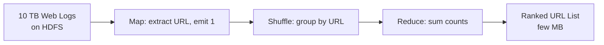
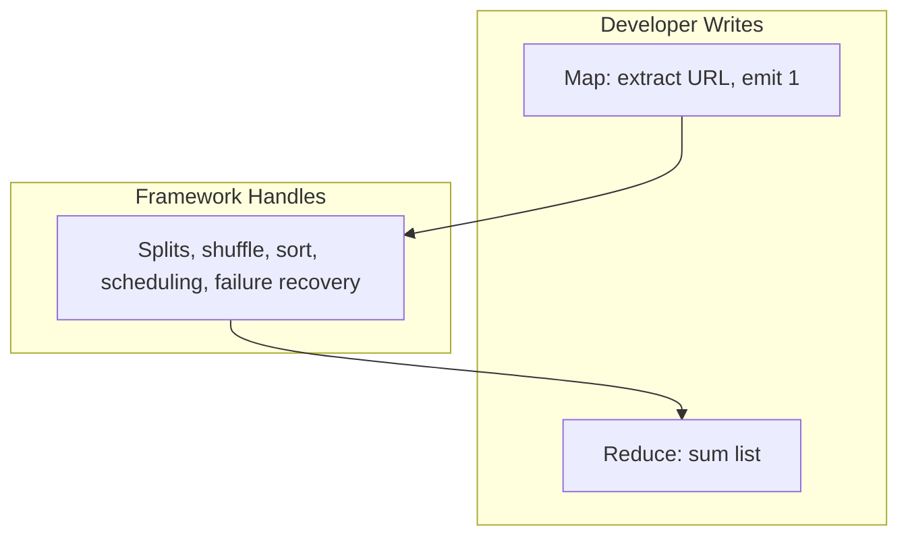

# Case Study: Analyzing Web Logs with MapReduce

## A Real Business Problem at Petabyte Scale

**Goal**: Find the most popular URLs from 10 terabytes of raw server logs.

Opening a 10 TB file in a spreadsheet is impossible. With MapReduce, it becomes a straightforward three-step process — map logic, shuffle (automatic), and reduce logic.



---

## Setup: Data on HDFS

The 10 TB of web logs sit in HDFS, split into thousands of 128 MB chunks. Each log line contains:

| Field | Example |
|-------|---------|
| IP address | `192.168.1.1` |
| Timestamp | `2024-06-05T14:30:00Z` |
| URL | `/products/laptop` |
| Browser info | `Chrome/120.0` |

The framework assigns one mapper per chunk.

---

## Step 1: Map Logic

For every single line in the log file, the mapper performs one task: **extract the URL** and emit a key-value pair.

$\text{map}(\text{log line}) \rightarrow (\text{URL},\ 1)$

| Log Line (simplified) | Map Output |
|-----------------------|------------|
| `... GET /google.com ...` | `("google.com", 1)` |
| `... GET /bits-pilani.ac.in ...` | `("bits-pilani.ac.in", 1)` |
| `... GET /google.com ...` | `("google.com", 1)` |

The mapper ignores IP, timestamp, and browser info. It does this **millions of times in parallel** across the cluster. By the end of the map phase, there is a sea of billions of ones associated with different URLs.

```python
# Pseudocode — map function
def map(log_line):
    url = extract_url(log_line)
    emit(url, 1)
```

---

## Step 2: Shuffle Logic (Framework-Handled)

This is **not code the developer writes**. The framework automatically ensures every pair with the same key is sent to the **exact same reducer**.

| Key | Routed To |
|-----|-----------|
| All `google.com` pairs | Reducer A |
| All `bits-pilani.ac.in` pairs | Reducer B |
| All `/products/laptop` pairs | Reducer C |

This is the moment of **coordination** — distributed noise from mappers becomes organized piles ready for the final count.

---

## Step 3: Reduce Logic

Each reducer receives a manageable list. Reducer A gets:

- **Key**: `google.com`
- **Values**: `[1, 1, 1, \ldots]` (millions of ones)

$\text{reduce}(\text{URL},\ [1, 1, \ldots, 1]) \rightarrow (\text{URL},\ \text{total count})$

The reducer sums the list and outputs one final result: `("google.com", 50000000)`.

```python
# Pseudocode — reduce function
def reduce(url, counts):
    total = sum(counts)
    emit(url, total)
```

**Result**: 10 TB of raw text reduced to a tiny ranked list of URL popularity.

---

## What This Case Study Achieves

| Achievement | How |
|-------------|-----|
| **Scalability** | Handled 10 TB by adding more nodes — not faster hardware |
| **Simplicity** | Developer wrote only extract-and-sum logic (~10 lines) |
| **Resilience** | If one mapper failed, framework restarted it without failing the whole job |



---

## Extending the Pattern

The same three-step pattern applies to countless analytics problems:

| Problem | Map Emits | Reduce Computes |
|---------|-----------|-----------------|
| Word count | `(word, 1)` | Sum → frequency |
| Error rate by endpoint | `(endpoint, 1)` if error | Sum → error count |
| Revenue by product | `(product_id, price)` | Sum → total revenue |
| Max response time | `(endpoint, latency)` | Max → worst case |

The map-reduce abstraction turns domain-specific problems into a uniform processing pattern.

---

## Common Pitfalls / Exam Traps

- Writing shuffle logic manually — the **framework** handles partitioning and routing
- Emitting the full log line as the key — keys should be the **aggregation dimension** (URL)
- Forgetting to emit `1` as value — without a numeric value, reduce cannot sum
- Filtering only in reduce — filter in **map** to reduce shuffle volume
- Assuming the developer manages HDFS splits — the framework creates splits automatically
- Stating Excel/spreadsheet tools can handle TB-scale logs — that is precisely the problem MapReduce solves

---

## Quick Revision Summary

- Case study: find most popular URLs from 10 TB web logs on HDFS
- Map: extract URL from each line, emit `(url, 1)`
- Shuffle: framework groups all pairs with same URL to one reducer
- Reduce: sum list of ones → `(url, total_count)`
- 10 TB raw text → few MB ranked URL list
- Three wins: scalability (add nodes), simplicity (two functions), resilience (auto-restart)
- Same pattern applies to word count, error rates, revenue aggregation
- Developer writes map + reduce only; framework handles everything else
