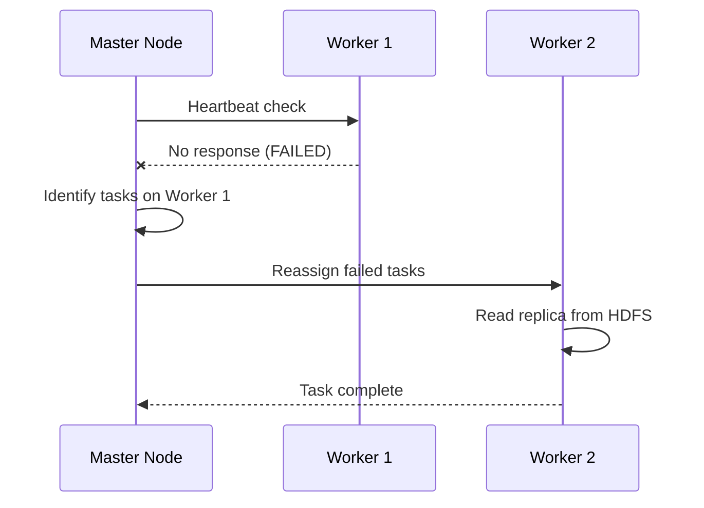
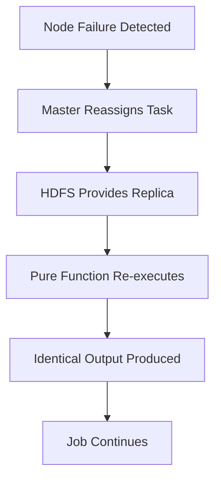

# Fault Tolerance in MapReduce: Handling Node Failures

## Failure Is a Statistical Guarantee

In a cluster of 1,000 commodity servers, hardware failure is not a possibility — it is a **statistical certainty**. At any moment, a hard drive may crash, a power supply may fail, or a network cable may be unplugged. MapReduce implements the **design for failure** mindset to keep a 10 TB job running even when nodes go dark.

$\text{Cluster of 1000 nodes} \Rightarrow \text{Multiple failures per day are expected}$

---

## Mechanism 1: Task Reassignment

The **master node** (also called JobTracker or driver) acts as a vigilant project manager. It maintains constant communication with every worker via **heartbeats**.

### What Happens on Failure

| Step | Action |
|------|--------|
| 1 | Master detects heartbeat failure |
| 2 | Master does **not** cancel the whole job |
| 3 | Master checks metadata to find which tasks the failed node was running |
| 4 | Master reassigns those exact tasks to available nodes |
| 5 | New worker reads data from HDFS replica (3x replication) |

Because HDFS replicates data 3 times, the master knows exactly where to find a backup copy of the data split. The new worker picks up where the old one left off.

---

## Mechanism 2: Functional Purity and Determinism

If a task restarts halfway, won't that **mess up the final count**? No — because map and reduce functions are designed to be **pure and deterministic**.

### What Is a Pure Function?

| Property | Definition |
|----------|------------|
| Deterministic | Same input always produces the exact same output |
| No side effects | Does not modify external state or depend on hidden variables |

Think of a calculator: typing $5 + 5$ always yields $10$, regardless of which calculator you use or whether the previous one crashed.

$\text{map}(\text{same 128 MB split}) = \text{identical key-value pairs every time}$

### Why Determinism Enables Reliability

| Without Purity | With Purity |
|----------------|-------------|
| Re-running a task may produce different results | Re-running produces identical results |
| Duplicate execution corrupts counts | Duplicate execution is harmless (idempotent) |
| Failure = data loss or inconsistency | Failure = temporary delay only |

This determinism ensures **total reliability** across a messy, unpredictable cluster.

---

## The Full Fault Tolerance Model

| Component | Role in Fault Tolerance |
|-----------|------------------------|
| Master node | Detect failure, reassign tasks |
| HDFS 3x replication | Data survives node loss |
| Pure map/reduce functions | Re-execution produces consistent results |
| Heartbeat monitoring | Early failure detection |

---

## Software-Defined Resilience

MapReduce achieves fault tolerance **not** by using expensive, unbreakable hardware, but by using **smart software**:

- Cheap commodity servers that fail frequently
- Intelligent scheduling that reroutes work
- Deterministic functions that make retries safe
- Replicated storage that survives disk crashes

This is the same philosophy behind cloud-native systems: assume failure, design around it.

---

## The Performance Cost of Safety

Fault tolerance comes with a price. Because intermediate results must survive node failure, MapReduce writes all map output to **disk** (with 3x replication). This disk I/O penalty is the subject of the next note — and it is precisely what motivated Apache Spark's in-memory approach.

---

## Common Pitfalls / Exam Traps

- Believing node failure kills the entire job — only **failed tasks** are reassigned
- Assuming re-execution produces different results — **pure functions** guarantee identical output
- Confusing master failure with worker failure — master failure is a separate (harder) problem
- Forgetting HDFS replication is what makes reassignment possible — without replicas, data is lost
- Stating MapReduce uses expensive fault-tolerant hardware — it uses **commodity hardware + smart software**
- Thinking impure map functions are acceptable — randomness or side effects break re-execution safety

---

## Quick Revision Summary

- Hardware failure in 1000-node clusters is a statistical certainty, not an edge case
- Master node detects heartbeat failures and reassigns tasks to healthy workers
- HDFS 3x replication ensures backup copies exist for reassigned tasks
- Map and reduce functions must be **pure and deterministic**
- Same input → same output → safe to re-execute without corrupting results
- Fault tolerance via smart software on commodity hardware, not expensive machines
- Reassignment + purity + replication = job survives multiple node failures
- Disk writes for intermediate state are the performance cost of this safety
