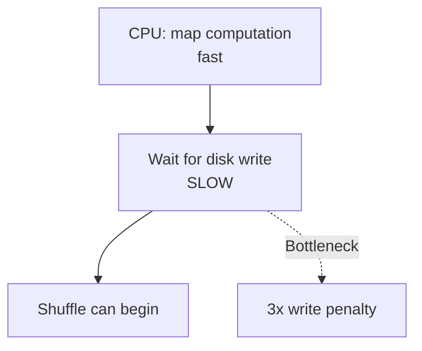

# The Cost of Disk-Based Intermediate State

## No Free Lunch in Distributed Systems

MapReduce's resilience — functional purity, task reassignment, HDFS replication — is powerful. But achieving that level of fault tolerance requires paying a significant **performance tax**. The biggest bottleneck in the MapReduce model is the cost of **disk-based intermediate state**: the **3x write penalty**.

---

## How Intermediate Data Flows

In MapReduce, data does not flow directly from mapper memory to reducer memory. To ensure progress is not lost if a node fails, the framework writes **all intermediate data** (map phase output) to physical disk.

| Stage | What Gets Written | Where |
|-------|-------------------|-------|
| Post-map | Intermediate key-value pairs | Local disk + HDFS replicas |
| Post-reduce | Final results | HDFS (3x replicated) |

---

## The 3x Write Penalty

HDFS automatically replicates every block **3 times** across the cluster for safety. This means:

$\text{Physical disk writes} = 3 \times \text{logical intermediate data size}$

| Intermediate Data Produced | Actual Disk Writes |
|---------------------------|-------------------|
| 1 TB | 3 TB |
| 10 TB | 30 TB |

This write penalty consumes massive storage space and, more importantly, **takes a lot of time**.

---

## Why Disk I/O Is the Bottleneck

Disk I/O is the **slowest component** of a computer relative to CPU and memory:

| Component | Typical Latency |
|-----------|----------------|
| CPU register | Nanoseconds |
| RAM | ~100 nanoseconds |
| SSD | ~100 microseconds |
| HDD | ~10 milliseconds |
| Network (cross-rack) | ~1 millisecond |

Every time a map task finishes, the CPU must **stop and wait** for the disk to finish writing 3 copies before the shuffle phase can begin. This **stop-and-copy rhythm** creates a massive bottleneck.

---

## Impact on Multi-Stage Jobs

| Job Type | Disk Penalty Impact |
|----------|-------------------|
| Single map-reduce | One round of disk writes — tolerable |
| Multi-stage pipeline (2+ map-reduce passes) | Disk writes at **every stage** — severe |
| Iterative algorithms (ML training loops) | Read/write cycle per iteration — prohibitive |

MapReduce is **incredibly reliable** but **significantly slower** for jobs that pass data through multiple stages. This is a fundamental architectural limit, not a tuning issue.

---

## Performance Tuning: Minimize Intermediate State

The engineer's job is to reduce the volume of data hitting disk:

| Technique | Effect |
|-----------|--------|
| Filter early in map | Fewer pairs emitted → less shuffle → less disk |
| Use combiners | Pre-aggregate locally before shuffle |
| Narrow map output | Emit only necessary fields |
| Reduce number of job stages | Fewer disk round-trips |

**Goal**: turn 10 TB of logs into a tiny stream of results as quickly as possible. The less intermediate state, the less time spent waiting on disk.

---

## MapReduce's Central Trade-Off

| Strength | Cost |
|----------|------|
| Resilient (saves everything to disk) | Slow (saves everything to disk) |
| Survives node failures | Pays 3x write penalty per stage |
| Simple programming model | Poor fit for iterative/multi-pass workloads |

$\text{Resilience} \uparrow \Leftrightarrow \text{Speed} \downarrow \text{ (for disk-bound workloads)}$

---

## The Spark Motivation

This exact disk overhead problem led to the creation of **Apache Spark**. Spark performs computation **in memory**, avoiding the 3x write penalty for intermediate stages. It still uses disk for fault tolerance (RDD lineage recomputation) but keeps hot data in RAM across pipeline stages.

| Aspect | MapReduce | Spark |
|--------|-----------|-------|
| Intermediate storage | Disk (always) | Memory (preferred) |
| Multi-stage pipelines | Disk write per stage | In-memory pipelining |
| Iterative algorithms | Re-read from disk each iteration | Cache in memory |
| Fault tolerance | Re-execute from disk snapshot | Recompute from lineage |

Understanding this trade-off is vital for choosing the right processing engine.

---

## Common Pitfalls / Exam Traps

- Claiming MapReduce keeps intermediate data in memory — it **always writes to disk**
- Forgetting the 3x factor comes from **HDFS replication**, not triple processing
- Stating disk I/O is fast enough — it is the **slowest hardware component**
- Believing tuning eliminates the disk penalty — it only **reduces volume**, not the fundamental model
- Confusing this limitation with shuffle network cost — both are bottlenecks, but disk penalty is per-map-task
- Assuming Spark eliminated fault tolerance — Spark trades disk snapshots for **lineage recomputation**

---

## Quick Revision Summary

- MapReduce writes all intermediate map output to disk for fault tolerance
- HDFS 3x replication means physical writes = 3x logical data size
- Disk I/O is the slowest hardware component — creates stop-and-copy bottleneck
- Multi-stage and iterative jobs suffer most from repeated disk round-trips
- Tuning goal: minimize intermediate data volume (filter early, use combiners)
- Core trade-off: resilient because of disk writes; slow because of disk writes
- This disk overhead directly motivated Apache Spark's in-memory architecture
- Spark pipelines stages in RAM; MapReduce materializes every stage to disk
