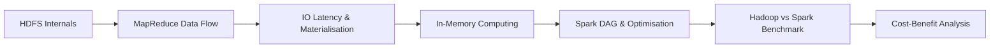

# Hadoop vs Spark: The Shift from Disk-Bound to In-Memory Batch Processing

## Why This Architectural Shift Matters

Big data systems must balance three competing forces: **durability** (data must survive hardware failure), **throughput** (process terabytes in acceptable time), and **cost** (commodity hardware vs premium RAM). For over a decade, Hadoop dominated batch analytics by optimising for durability and cost on spinning disks. As workloads evolved — especially iterative machine learning — the disk-bound model became the bottleneck. Apache Spark emerged by treating **RAM as the primary workspace**, not secondary cache.

Understanding both architectures is essential for designing production pipelines: Hadoop remains relevant for archival storage and one-pass ETL; Spark wins for repeated access to the same dataset.

---

## Module Roadmap

| Topic | Core Question |
|-------|---------------|
| HDFS blocks & replication | How is data physically stored and protected? |
| MapReduce on HDFS | How does computation interact with storage? |
| Materialisation cost | Why is disk I/O the bottleneck? |
| In-memory computing | How does Spark eliminate repeated disk access? |
| K-Means benchmark | When does Spark justify higher RAM investment? |

---

## 1. Hadoop Foundation: Reliability Through Storage

Hadoop's design philosophy treats **disk as the system of record**. The Hadoop Distributed File System (HDFS) breaks files into large blocks (typically 128 MB or 256 MB) and replicates each block three times across rack-aware node placement. This architecture assumes:

- Hardware failure is inevitable at cluster scale
- Sequential disk reads deliver high throughput for batch scans
- Intermediate results can be spilled to local disk without expensive replication

**Real-world analogy:** HDFS behaves like a warehouse with three copies of every pallet stored in different buildings — slow to retrieve, but virtually impossible to lose.

---

## 2. The Bottleneck: High I/O Latency

Every MapReduce stage that writes intermediate results to disk incurs **materialisation cost** — the latency of making data physically real on storage before the next stage can begin. Disk I/O is orders of magnitude slower than RAM:

| Storage Tier | Typical Latency | Relative Speed |
|--------------|-----------------|----------------|
| L1 CPU cache | ~1 ns | Baseline (fastest) |
| RAM | ~100 ns | ~100× slower than cache |
| SSD | ~100 μs | ~100,000× slower than RAM |
| HDD (seek + read) | ~10 ms | ~10,000,000× slower than RAM |

For multi-stage or **iterative** workloads (K-Means, PageRank, gradient descent), this "disk tax" compounds with every iteration.

---

## 3. The Spark Revolution: RAM as Workspace

Spark inverts Hadoop's assumption. Instead of writing after every transformation, Spark:

- Keeps working datasets in **executor memory**
- Builds a **Directed Acyclic Graph (DAG)** of the full computation before executing
- Uses **lazy evaluation** to pipeline operations in memory
- Supports **persistence/caching** so reused datasets skip re-reads from HDFS

**Performance impact:** Iterative workloads can see **10× to 100×** speedups when data stays in RAM across iterations.

**Trade-off:** RAM is more expensive per gigabyte than disk. The architectural choice is not "which is faster" but "does my workload repeatedly touch the same data?"

---

## 4. Evaluation Framework

When choosing between Hadoop MapReduce and Spark, evaluate:

| Criterion | Favour Hadoop | Favour Spark |
|-----------|---------------|--------------|
| Workload type | One-pass batch ETL, archival | Iterative ML, interactive analytics |
| Data reuse | Single scan per job | Same data accessed many times |
| Budget | Minimise hardware cost | Invest in RAM for speed |
| Fault model | Replication-based durability | Lineage-based recomputation |
| Storage role | Primary workspace | HDFS/S3 as source; RAM as workspace |

---

## Common Pitfalls / Exam Traps

- **Trap:** "Spark replaces HDFS entirely." **Reality:** Spark commonly reads from HDFS/S3; it replaces MapReduce's *execution model*, not distributed storage.
- **Trap:** "In-memory means no disk I/O ever." **Reality:** Spark still reads initial data from disk and may spill to disk when memory is exhausted.
- **Trap:** "Hadoop is obsolete." **Reality:** Hadoop remains cost-effective for massive cold storage and simple one-pass jobs.
- **Trap:** Confusing **materialisation** with **replication**. Materialisation = writing intermediate results to disk between stages; replication = storing multiple durable copies of HDFS blocks.
- **Trap:** Assuming speed gains apply uniformly. Spark's advantage is largest for **iterative** algorithms, not necessarily for single-pass MapReduce-style jobs.

---

## Quick Revision Summary

- Hadoop prioritises **durability and cost** via HDFS block storage with 3× rack-aware replication.
- MapReduce's disk-bound intermediate writes create **high I/O latency** — the primary Hadoop bottleneck.
- **Materialisation cost** forces read-process-write cycles that devastate iterative algorithms.
- Spark treats **RAM as the primary workspace**, keeping data in memory across transformations and iterations.
- Spark uses **DAG planning, lazy evaluation, and caching** to minimise disk read-write cycles.
- Iterative workloads like **K-Means** can run up to **100× faster** on Spark vs Hadoop MapReduce.
- The trade-off: Spark requires **RAM-heavy clusters** at higher hardware cost.
- Choose Spark when algorithms **repeatedly access the same data**; choose Hadoop for cost-effective archival and one-pass batch jobs.
