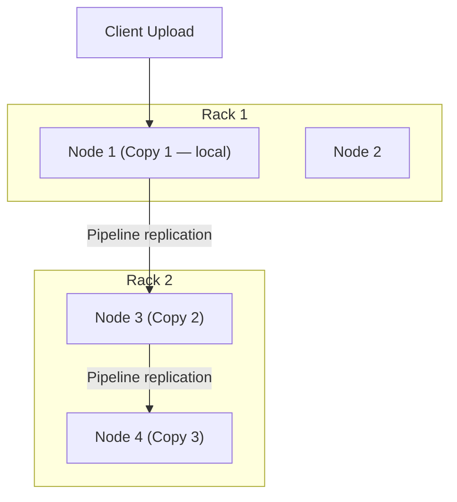
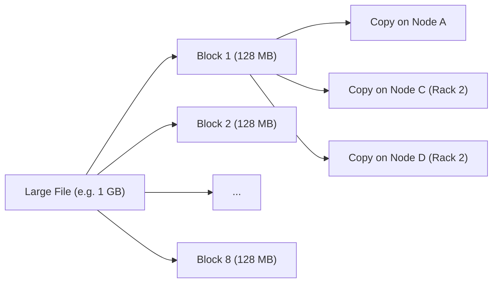

# HDFS Deep Dive: Blocks, Replication, and Rack-Aware Fault Tolerance

## Why HDFS Storage Design Matters

Before optimising computation, you must understand how data is physically laid out. HDFS (Hadoop Distributed File System) is the storage layer underpinning the Hadoop ecosystem. Its design choices — enormous block sizes, triple replication, rack-aware placement — directly explain why Hadoop excels at sequential batch reads but struggles with low-latency, iterative access patterns.

---

## 1. The Block: HDFS's Fundamental Unit

Unlike desktop file systems that use 4 KB or 8 KB blocks, HDFS uses **large blocks** — typically **128 MB** or **256 MB**.

### Intuition: Optimising for Throughput, Not Latency

Disk access has two cost components:

1. **Seek time** — physically moving the read head to the correct track (milliseconds)
2. **Transfer time** — reading data once the head is positioned (proportional to data size)

With tiny blocks, seek time dominates: most time is spent finding data, not reading it. With large blocks, transfer time dominates: once the head is positioned, megabytes stream sequentially.

$\text{Efficiency} \propto \frac{\text{Transfer Time}}{\text{Seek Time} + \text{Transfer Time}}$

Large blocks push this ratio toward 1, maximising **sequential read throughput** — ideal for batch analytics scanning entire files.

| Property | Desktop FS (~4 KB blocks) | HDFS (~128 MB blocks) |
|----------|---------------------------|------------------------|
| Optimised for | Random access, many small files | Sequential scans of massive files |
| Seek overhead | High relative to read | Low relative to read |
| Best workload | OS files, configs | Log files, sensor dumps, data lakes |
| Metadata burden | Many blocks per file | Few blocks per file |

**Real-world example:** A 10 GB web server log stored in HDFS at 128 MB block size creates ~80 blocks. Each block is a contiguous sequential read — perfect for MapReduce mappers scanning line by line.

---

## 2. Replication: Surviving Inevitable Hardware Failure

### The Certainty of Failure

In a cluster of thousands of commodity servers, component failure is not a risk — it is a **mathematical certainty**. A single server might have a 1% annual failure rate; at 1,000 nodes, multiple failures per week are expected. HDFS addresses this through **replication**, not RAID or specialised hardware.

### The 3× Replication Rule

By default, HDFS stores **three copies** of every block. When a file is uploaded:

1. Block 1 copy → **local node** (the node receiving the upload)
2. Block 1 copy → **different node on a different rack**
3. Block 1 copy → **another node on that same remote rack**

### Rack-Aware Placement Strategy

| Failure Scenario | Copies Surviving | Data Available? |
|------------------|------------------|-----------------|
| Single disk/node fails | 2 of 3 | Yes |
| Entire rack loses power | 1 of 3 (on different rack) | Yes |
| Two simultaneous node failures (different racks) | 1 of 3 | Yes |
| Loss of 2 copies | 0 of 3 | No — requires re-replication from remaining copy |

**Why not put all 3 copies on one rack?** A top-of-rack switch failure or power outage would destroy all copies simultaneously. Spreading copies across racks provides **fault domain isolation**.

**Trade-off:** 3× replication triples storage cost. For a petabyte dataset, you need ~3 PB of raw disk capacity. This is the price of durability without expensive enterprise storage arrays.

---

## 3. How Blocks and Replication Interact

Key properties:

- **Blocks are the unit of replication** — not entire files
- **Blocks are immutable** once written (append-only for HDFS files)
- **NameNode** maintains metadata mapping: file → list of block locations
- **DataNodes** store actual block replicas and report health to NameNode

---

## 4. Why This Design Enables MapReduce

The block-replicate model creates a foundation for reliable batch processing:

- **Data locality:** Mappers can run on nodes that already hold block replicas
- **Fault tolerance:** Lost blocks are re-replicated from surviving copies automatically
- **Parallelism:** Different blocks are processed independently by different mappers

However, this same model imposes constraints explored in subsequent topics: large blocks favour sequential access, and replication overhead applies to **final outputs** but not intermediate MapReduce spills.

---

## Common Pitfalls / Exam Traps

- **Trap:** "HDFS block size = OS block size." HDFS blocks (128 MB) are logical units managed by the NameNode, unrelated to the underlying ext4/XFS 4 KB sectors.
- **Trap:** "3 copies means 3× processing speed." Replication provides **durability**, not parallelism for reads (though HDFS can use closest replica for locality).
- **Trap:** Forgetting **rack awareness**. Exam questions often test that copies 2 and 3 go to a *different rack*, not just different nodes on the same rack.
- **Trap:** "Small files are efficient in HDFS." Many small files create NameNode metadata bloat — HDFS is designed for **few large files**.
- **Trap:** Confusing **block** (storage unit) with **split** (MapReduce input unit). A MapReduce split may span one or more HDFS blocks.

---

## Quick Revision Summary

- HDFS uses **large blocks (128/256 MB)** to minimise seek overhead and maximise sequential read throughput.
- The design optimises for **batch processing**, not low-latency random access.
- Default **3× replication** ensures durability when individual disks or entire racks fail.
- **Rack-aware placement** puts copy 1 locally, copy 2 on a different rack, copy 3 on the same rack as copy 2.
- Hardware failure at scale is **expected**, not exceptional — replication is the primary defence.
- Block-replicate model is the **bedrock of Hadoop reliability** but triples storage requirements.
- Blocks are the unit of **replication and parallel processing**, managed by NameNode metadata and DataNode storage.
