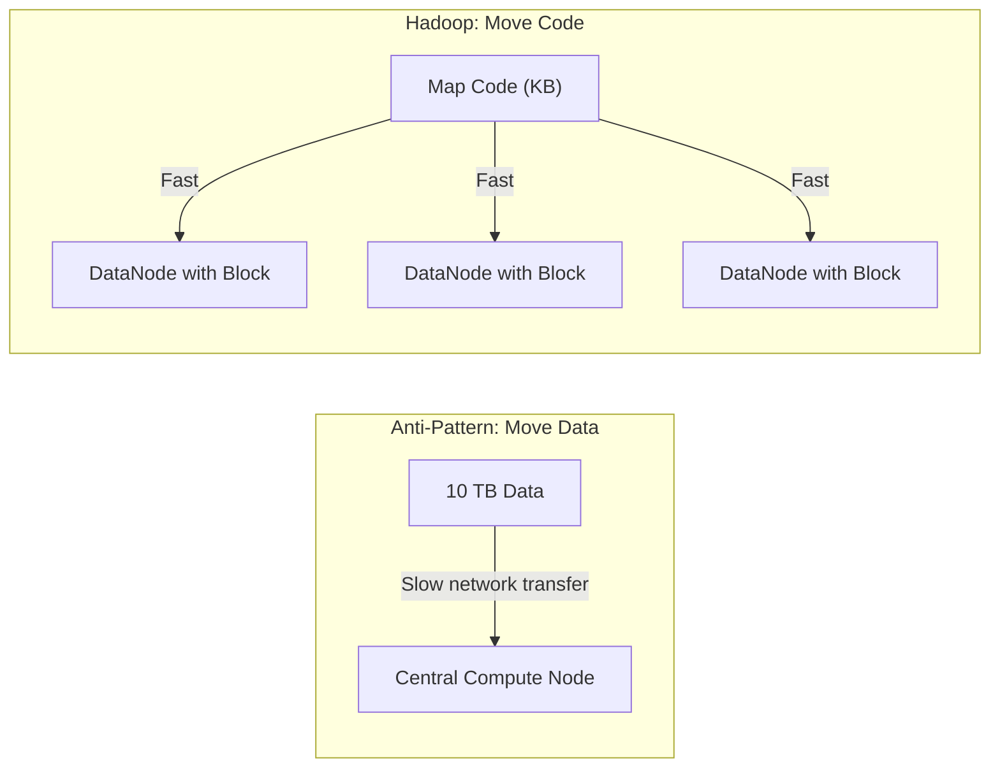
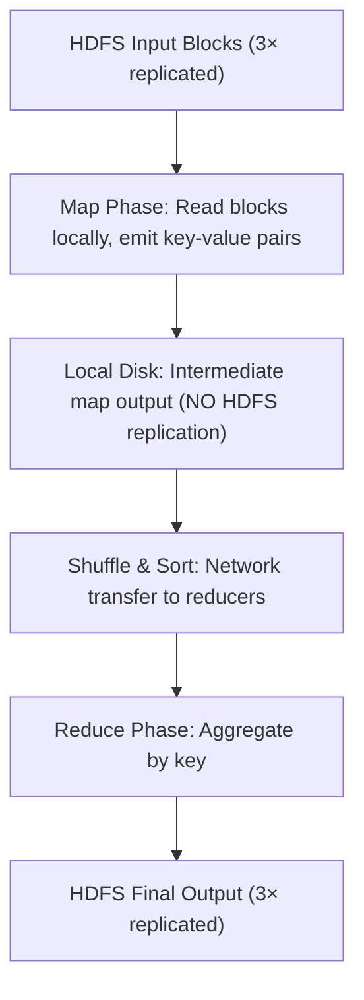

# MapReduce Data Flow on HDFS: From Blocks to Final Output

## Why Trace the Full Data Path?

Knowing how HDFS stores blocks is only half the picture. MapReduce defines *how computation flows* across those blocks — where data moves, what gets written to HDFS vs local disk, and where network bottlenecks emerge. This end-to-end trace is the foundation for understanding why Hadoop incurs high I/O costs and why Spark's in-memory model is transformative.

---

## 1. Data Locality: Move Code, Not Data

### The Network Bottleneck Principle

Moving terabytes across a cluster network is prohibitively slow. A 10 Gbps link transfers ~1.25 GB/s theoretically; reading 10 TB would take hours of pure network transfer before any computation begins.

**Hadoop's solution:** Send the **map function** (kilobytes of code) to the **DataNode** that already holds the HDFS block (gigabytes of data).

| Approach | What Moves | Volume | Speed |
|----------|-----------|--------|-------|
| Traditional | Data → Code | Terabytes | Slow (network-bound) |
| Hadoop/Spark | Code → Data | Kilobytes | Fast (compute starts immediately) |

This principle — **"don't move data, move code"** — is shared by both Hadoop MapReduce and Apache Spark.

---

## 2. The Complete MapReduce Pipeline

### Phase 1: Map

- Each mapper is assigned one or more **input splits** (typically aligned with HDFS blocks)
- Mapper runs on (or near) the node holding the block replica — **data-local execution**
- Reads records sequentially from HDFS block
- Emits intermediate **key-value pairs** (e.g., `(word, 1)` for word count)

### Phase 2: Intermediate Write (Critical Detail)

Intermediate map output is written to the **local disk of the DataNode** — **not** back to HDFS.

**Why local disk, not HDFS?**

| Factor | HDFS Write | Local Disk Write |
|--------|-----------|------------------|
| Replication | 3× copies across network | Single copy, no replication |
| Durability needed? | No — intermediate data is temporary | Correct — discard after reduce |
| Speed | Slower (replication pipeline) | Faster (single local write) |
| Fault recovery | N/A for temp data | Re-run failed map task from HDFS input |

### Phase 3: Shuffle and Sort

The **most network-intensive** phase:

- Intermediate data is **partitioned by key** and transferred across the network to reducer nodes
- Each reducer receives all values for its assigned key subset
- Data is sorted by key at the reducer input

**Cost:** Full shuffle of potentially terabytes of intermediate data across the cluster fabric.

### Phase 4: Reduce

- Reducer processes sorted key-value groups
- Produces **final output**
- Final output is written to **HDFS** with full **3× replication**

---

## 3. The Read-Write Cycle Summary

| Stage | Read From | Write To | Replicated? |
|-------|-----------|----------|-------------|
| Map input | HDFS blocks | — | N/A (read) |
| Map output | — | Local disk | No |
| Shuffle | Local disks (remote) | Reducer memory | No |
| Reduce output | — | HDFS | Yes (3×) |

The core Hadoop engine cycle:

$\text{HDFS read} \rightarrow \text{local disk write} \rightarrow \text{network shuffle} \rightarrow \text{HDFS write}$

Every MapReduce job with multiple reduce groups pays this full cycle. Multi-stage jobs (chained MapReduce jobs) repeat it entirely — reading the previous job's HDFS output as the next job's input.

---

## 4. Real-World Example: Web Log Analysis

**Input:** 500 GB of web server logs in HDFS (≈ 4,000 blocks at 128 MB each)

1. **4,000 map tasks** launch data-locally across the cluster
2. Each mapper parses log lines, emits `(URL, 1)` pairs → spills to local disk (~200 GB total intermediate)
3. **Shuffle** moves URL counts to ~200 reducers based on URL hash
4. **200 reducers** sum counts, write final `url_counts/` to HDFS with 3× replication

**Bottleneck identification:** If shuffle takes 60% of job time, the problem is network redistribution — not map computation. This pattern repeats identically in every chained job.

---

## Common Pitfalls / Exam Traps

- **Trap:** "Intermediate map output goes to HDFS." **Wrong** — it goes to **local disk** without replication to avoid 3× overhead on temporary data.
- **Trap:** "Shuffle is optional." Shuffle is **mandatory** whenever reducers need all values for a key from all mappers.
- **Trap:** Confusing **input split** with **HDFS block**. A split is a logical MapReduce division; it is usually block-aligned but not identical.
- **Trap:** "Data locality means zero network traffic." Shuffle phase still moves massive data across the network.
- **Trap:** Only final output is durable. Intermediate local disk data is **lost if the node fails** before shuffle completes — the map task must re-run.

---

## Quick Revision Summary

- Hadoop follows **data locality**: send map code to nodes holding HDFS blocks, not data to a central processor.
- **Map phase** reads HDFS blocks locally and emits intermediate key-value pairs.
- Intermediate results go to **local disk** (not HDFS) — no 3× replication for temporary data.
- **Shuffle & sort** is the most network-intensive phase, redistributing data to reducers by key.
- **Reduce phase** aggregates shuffled data and writes **final output to HDFS** with full replication.
- The cycle — HDFS read → local write → shuffle → HDFS write — is Hadoop's core engine.
- Every disk write in this cycle contributes to the **I/O latency** bottleneck explored next.
