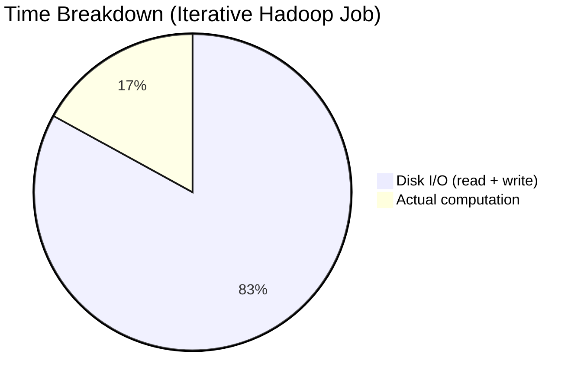

# High I/O Latency and Materialisation Cost: Hadoop's Performance Bottleneck

## Why Hadoop Jobs Feel Slow

MapReduce is architecturally sound for fault-tolerant batch processing, yet complex jobs can run for hours. The root cause is not CPU inadequacy — modern clusters have enormous compute capacity sitting idle, **waiting for disk I/O**. Understanding materialisation cost explains why and identifies the workloads most affected.

---

## 1. The Physics of Disk I/O

### RAM vs Disk: Orders of Magnitude Apart

| Operation | Approximate Latency |
|-----------|---------------------|
| L1 cache reference | ~1 ns |
| Main memory (RAM) reference | ~100 ns |
| SSD random read | ~100 μs |
| HDD seek + read | ~10 ms |

Disk I/O is roughly **100,000× slower than RAM** for random access patterns. Even SSDs, while faster than HDDs, cannot match memory bandwidth for repeated read-write cycles.

### What Is Materialisation?

**Materialisation** means persisting data to physical storage — making intermediate results "real" on disk before the next processing step can begin. In Hadoop MapReduce:

- Every map task **materialises** its output to local disk
- Every reduce task **materialises** its output to HDFS
- Every chained job **reads** the previous job's materialised output from HDFS

The system cannot proceed until the disk write completes. This blocking wait is **high latency**.

---

## 2. Where Materialisation Hurts Most: Iterative Algorithms

### One-Pass vs Iterative Workloads

| Workload Type | Disk Access Pattern | Materialisation Impact |
|---------------|--------------------|-----------------------|
| One-pass ETL (filter, aggregate once) | Read input once, write output once | Moderate |
| Multi-stage pipeline (3 MapReduce jobs) | 3 full read-write cycles | High |
| Iterative ML (K-Means, PageRank, GD) | Same data read-written every iteration | **Devastating** |

### Iterative Algorithm Pattern

Algorithms like **K-Means clustering** or **PageRank** repeat the same logic on the same dataset until convergence:

$\text{Iteration } k: \quad \text{Read data} \rightarrow \text{Compute} \rightarrow \text{Write results} \rightarrow \text{Repeat}$

In Hadoop, **each iteration is a separate MapReduce job**:

- Iteration 1 ends → write cluster assignments to HDFS
- Iteration 2 begins → read those assignments back from HDFS
- Repeat for 50, 100, or more iterations

**Cost formula for iterative jobs:**

$\text{Total I/O Cost} \approx N_{\text{iterations}} \times (\text{Read Cost} + \text{Write Cost})$

For 50 iterations on a 100 GB dataset, the cluster may spend **more time on disk I/O than actual computation**.

### The Book-Writing Analogy

Imagine writing a book where you must **print, bind, and ship every single page to a warehouse** before writing the next page. The writing itself takes minutes; the print-bind-ship cycle takes hours. That is materialisation cost in iterative MapReduce.

---

## 3. Quantifying the Bottleneck

Consider a K-Means job on 200 GB of data with 50 iterations:

| Phase | Time per Iteration | Total (50 iter) |
|-------|-------------------|-----------------|
| HDFS read | 2 min | 100 min |
| Computation | 1 min | 50 min |
| HDFS write + local spill | 3 min | 150 min |
| **Total** | **6 min** | **300 min (5 hours)** |

In this scenario, **83% of time** is I/O — not computation. Adding more CPU cores does not help because cores wait on disk.

---

## 4. Why Hadoop Accepts This Trade-off

Hadoop's design prioritises:

1. **Fault tolerance** — materialised data survives node failures
2. **Simplicity** — each stage is independent, easy to reason about
3. **Cost** — disk is cheap; no need for massive RAM clusters

These were correct trade-offs for 2005-era batch ETL. They become liabilities for 2015+ era machine learning pipelines that iterate hundreds of times on the same training data.

---

## 5. The Path Forward: Eliminate Unnecessary Materialisation

The solution is not faster disks — it is **avoiding disk round-trips** for data that will be immediately reused:

- Keep intermediate results in **memory** across stages
- Pipeline multiple transformations in a **single pass**
- **Cache** datasets that multiple operations or iterations will access

This is precisely the architectural shift Apache Spark introduces.

---

## Common Pitfalls / Exam Traps

- **Trap:** "Slow Hadoop = slow CPUs." The bottleneck is almost always **I/O latency**, not compute.
- **Trap:** "Materialisation = HDFS replication." Materialisation means writing **intermediate results to disk** (local or HDFS); replication is a separate durability mechanism.
- **Trap:** "Iterative algorithms are just slow by nature." They are slow on **disk-bound** architectures; they are fast when data stays in RAM.
- **Trap:** Assuming more nodes linearly speeds up iterative jobs. If each iteration re-reads from HDFS, adding nodes helps computation but **not the repeated I/O tax**.
- **Trap:** Forgetting that **each MapReduce iteration is a separate job** with its own full read-write cycle.

---

## Quick Revision Summary

- **High I/O latency** means the system spends most time waiting for disk reads and writes, not computing.
- **Materialisation** = saving intermediate results to physical disk before the next step can proceed.
- Disk I/O is **orders of magnitude slower** than RAM access.
- **Iterative algorithms** (K-Means, PageRank) pay the disk tax on every iteration — often 50–100 times.
- The read → process → write → repeat cycle creates **massive overhead** for ML workloads.
- In iterative jobs, disk I/O time frequently **exceeds computation time**.
- Hadoop accepts this trade-off for **durability and cost** on one-pass batch jobs.
- The fix: keep reused data in **memory** — the foundation of Spark's in-memory computing model.
