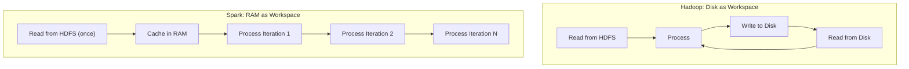

# Introduction to In-Memory Computing: RAM as Spark's Primary Workspace

## Why Memory Speed Changes Everything

The "disk tax" identified in Hadoop — materialising intermediate results to storage between every stage — is not a tuning problem. It is an **architectural constraint**. In-memory computing attacks the root cause by changing *where* the system does its work: from disk to RAM.

---

## 1. Two Philosophies of Data Processing

| Aspect | Hadoop MapReduce | Apache Spark |
|--------|------------------|--------------|
| Primary workspace | Disk (HDFS + local spill) | RAM (executor memory) |
| Data lifecycle | Read → process → write → repeat | Read once → keep in memory → process repeatedly |
| Optimised for | One-pass batch, durability | Iterative, interactive, multi-pass analytics |
| Fault tolerance | Replication (storage copies) | Lineage (recomputation) |
| Hardware profile | Disk-heavy, cost-efficient | RAM-heavy, performance-oriented |

---

## 2. The Speed Difference: Why RAM Wins

Accessing data in RAM is **thousands of times faster** than reading from a traditional hard drive. The gap is not marginal — it is architectural:

- **RAM bandwidth:** 50–100 GB/s per socket
- **HDD sequential read:** 100–200 MB/s
- **Network (10 Gbps):** ~1.25 GB/s

Once data resides in executor memory, subsequent operations access it at memory speed — no disk seek, no network re-fetch, no serialisation overhead.

**Golden rule of Spark:** Keep data in memory to keep processing moving.

---

## 3. How In-Memory Computing Works in Practice

### First Read from Durable Storage

Spark still reads initial data from HDFS, S3, or other persistent storage. The in-memory advantage begins **after** the first load:

1. Data is read from HDFS into executor RAM
2. Transformations operate on in-memory partitions
3. Optionally, data is **cached/persisted** for reuse
4. Subsequent operations or iterations access RAM directly

### Iterative Algorithm Transformation

For an algorithm requiring 100 iterations on the same dataset:

| Phase | Hadoop | Spark |
|-------|--------|-------|
| Iteration 1 | Read HDFS → compute → write HDFS | Read HDFS → cache in RAM → compute |
| Iterations 2–100 | Read HDFS → compute → write HDFS (each) | Compute in RAM only |
| Disk reads (middle iterations) | 99 | 0 |
| Disk writes (middle iterations) | 99 | 0 |

The CPU's working set stays in the high-speed memory hierarchy — L3 cache and RAM — rather than round-tripping through storage.

---

## 4. Performance Gains and Scope

In-memory computing does not make processing "a little faster." For complex, iterative workloads:

- Typical speedup: **10× to 100×** over disk-bound MapReduce
- Greatest gains: algorithms that **repeatedly touch the same data**
- Modest gains: single-pass ETL where data is read once and discarded

**Real-world examples where in-memory wins:**

- K-Means clustering (repeated centroid updates)
- Logistic regression / gradient descent (epoch-based training)
- Graph algorithms like PageRank (repeated edge traversals)
- Interactive data exploration (multiple queries on same dataset)

---

## 5. The Trade-off: Memory Is Expensive

Speed comes at a cost:

| Resource | Relative Cost (per GB) | Role in Spark |
|----------|------------------------|---------------|
| HDD | Lowest | Archival, cold storage |
| SSD | Medium | Spill, shuffle, local cache |
| RAM | Highest | Primary working set |

A Spark cluster needs sufficient aggregate RAM to hold working datasets (or partitions thereof). If data exceeds available memory, Spark **spills to disk** — partially losing the in-memory advantage.

**Cost-benefit decision framework:**

- Invest in RAM when: iterative ML, interactive dashboards, repeated feature engineering on same data
- Stay disk-heavy when: archival storage, one-time batch transforms, budget-constrained cold pipelines

---

## Common Pitfalls / Exam Traps

- **Trap:** "In-memory = all data fits in RAM always." Spark handles datasets larger than memory via **spilling** and **partitioning** — but performance degrades when spilling occurs.
- **Trap:** "Spark never touches disk." Initial reads from HDFS and shuffle spills still use disk.
- **Trap:** "In-memory computing eliminates fault tolerance." Spark uses **lineage-based recomputation**, not memory replication, for fault recovery.
- **Trap:** Assuming 100× speedup for all workloads. Single-pass jobs see modest gains; **iterative** jobs see dramatic gains.
- **Trap:** Ignoring the **cost trade-off**. RAM-heavy clusters cost more per terabyte of working set than disk-heavy Hadoop clusters.

---

## Quick Revision Summary

- **In-memory computing** treats RAM as the primary workspace, not disk.
- Hadoop uses disk as workspace; Spark uses RAM — a fundamental architectural shift.
- RAM access is **thousands of times faster** than disk I/O.
- After the first HDFS read, Spark keeps data in executor memory for subsequent operations.
- Iterative algorithms benefit most: iterations 2–N run entirely in RAM with **zero disk reads/writes**.
- Performance gains of **10×–100×** are common for iterative ML workloads.
- Trade-off: RAM is **more expensive** than disk; Spark clusters need adequate memory capacity.
- **Golden rule:** Keep reused data in memory to keep processing moving.
