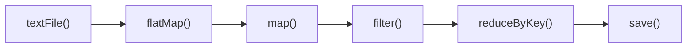
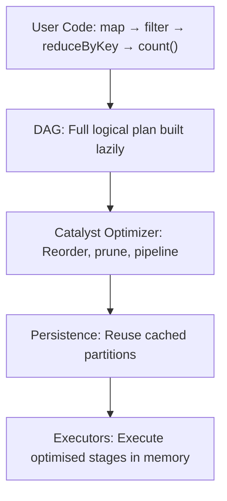

# How Spark Minimises Disk Read-Write Cycles: DAG, Lazy Evaluation, and Persistence

## Why Spark Avoids the Disk Tax

Knowing that RAM is faster than disk is necessary but not sufficient. Spark achieves its speed through three coordinated mechanisms that **minimise the number of times data touches disk**: the DAG execution model, lazy evaluation, and explicit persistence. Together, they replace Hadoop's rigid read-write-read cycle with intelligent in-memory pipelining.

---

## 1. The DAG: A Logical Plan for the Entire Pipeline

### Hadoop's Rigid Sequence

MapReduce sees every job as a fixed pipeline:

$\text{Map} \rightarrow \text{Shuffle} \rightarrow \text{Reduce}$

Each stage materialises output before the next begins. Chained jobs repeat the full cycle.

### Spark's DAG Model

Spark builds a **Directed Acyclic Graph (DAG)** — a logical plan of *all* transformations before executing anything.



Properties of the DAG:

- **Directed:** Data flows in one direction (parent → child RDDs)
- **Acyclic:** No loops — each RDD is computed once per action
- **Global view:** Spark sees the entire pipeline, not isolated stages

Because Spark knows the full series of transformations upfront, it can:

- **Pipeline** narrow operations in a single memory pass
- **Prune** unnecessary steps from the graph
- **Reorder** operations for efficiency (e.g., push filters earlier)
- Avoid materialising intermediate results to disk

---

## 2. Lazy Evaluation: Wait for the Full Order

### The Restaurant Analogy

When you order appetiser, main course, and dessert at a restaurant, the kitchen does not start cooking the appetiser the moment you mention it. It waits for the **complete order** to coordinate cooking times and kitchen resources efficiently.

Spark operates identically:

| Step | What Happens | Data Touched? |
|------|-------------|---------------|
| `rdd.map(f)` | Record transformation in DAG | No |
| `rdd.filter(g)` | Record transformation in DAG | No |
| `rdd.reduceByKey(h)` | Record transformation in DAG | No |
| `rdd.count()` **(action)** | Optimise DAG, execute entire plan | **Yes** |

**Transformations are lazy** — they build the recipe (lineage) without touching data.

**Actions are eager** — they trigger execution of the entire optimised plan.

### Benefits of Waiting

1. **Combine steps:** `map` + `filter` execute in one pass over data, not two
2. **Predicate pushdown:** A filter at the end of the script can be moved to the beginning
3. **Skip unused branches:** If only one column is needed, Spark avoids loading others
4. **Global optimisation:** Catalyst optimizer evaluates multiple physical strategies

---

## 3. Persistence (Caching): Lock Data in RAM

### The Problem Persistence Solves

In Hadoop, using the same dataset for two different tasks requires **two full disk reads**. In Spark, you can explicitly persist a dataset in memory:

```python
rdd = sc.textFile("hdfs://data/logs/*")
processed = rdd.map(parse).filter(valid)
processed.persist(StorageLevel.MEMORY_ONLY)

# First action — reads HDFS, caches in RAM
processed.count()

# Second action — reads from RAM, not HDFS
processed.saveAsTextFile("hdfs://output/")
```

| Storage Level | Behaviour |
|---------------|-----------|
| `MEMORY_ONLY` | Keep in RAM; recompute if evicted |
| `MEMORY_AND_DISK` | Spill to disk if RAM full |
| `DISK_ONLY` | Persist on disk (faster re-read than HDFS) |

### When to Persist

- Dataset used in **multiple actions** or **iterations**
- Iterative algorithms (K-Means loops)
- Interactive exploration (repeated queries on same base data)

**Caution:** Persisting everything wastes memory. Persist only datasets with proven reuse.

---

## 4. How the Three Mechanisms Work Together



**Combined effect:**

- DAG provides the **global view**
- Lazy evaluation enables **pipelining and optimisation**
- Persistence eliminates **re-reads from durable storage**

The result: Spark virtually eliminates the constant disk chatter that slows traditional batch processing.

---

## Common Pitfalls / Exam Traps

- **Trap:** "Lazy means slow." Lazy means **deferred** — execution is faster because of optimisation, not slower.
- **Trap:** "Every RDD is automatically cached." Caching requires explicit `.persist()` or `.cache()` — otherwise Spark recomputes from lineage.
- **Trap:** "DAG and lineage are unrelated." The DAG **is** the lineage graph of RDD dependencies.
- **Trap:** Confusing **lazy transformations** with **lazy actions**. Actions always trigger immediate execution.
- **Trap:** "Persistence replaces fault tolerance." Persisted data can be lost if the executor fails; Spark **recomputes from lineage** as fallback.

---

## Quick Revision Summary

- Spark builds a **DAG** (Directed Acyclic Graph) representing the entire data pipeline before execution.
- Unlike MapReduce's rigid map-shuffle-reduce, the DAG enables **global optimisation** across all transformations.
- **Lazy evaluation:** transformations are recorded but not executed until an **action** is called.
- Laziness allows **pipelining** multiple narrow operations in a single memory pass.
- **Persistence/caching** keeps datasets in executor RAM for reuse across actions or iterations.
- Together, DAG + laziness + persistence **virtually eliminate** unnecessary disk read-write cycles.
- Persist only datasets with **proven reuse** to avoid wasting cluster memory.
