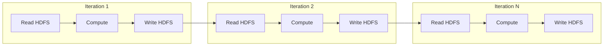
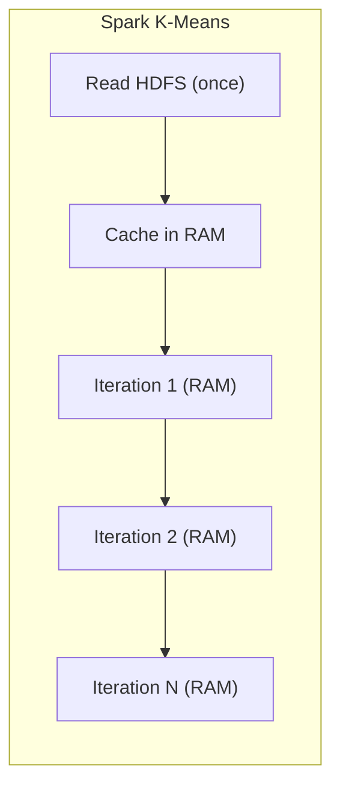

# Hadoop vs Spark for Iterative Algorithms: A K-Means Performance Benchmark

## Why Benchmark with K-Means?

Theoretical arguments about RAM speed are convincing but abstract. K-Means clustering provides a **controlled, reproducible benchmark** that exposes the architectural difference between Hadoop and Spark. K-Means is iterative (10–100+ passes over the same data), computationally moderate, and widely used — making it the canonical test case for comparing disk-bound vs in-memory architectures.

---

## 1. K-Means: The Iterative Pattern

K-Means partitions data into $k$ clusters by repeatedly:

1. Assign each point to the nearest centroid
2. Recompute centroids as the mean of assigned points
3. Repeat until centroids converge

$\text{centroid}_j^{(t+1)} = \frac{1}{|C_j|} \sum_{x \in C_j} x$

Each iteration reads the full dataset and current centroids. Convergence typically requires **10–100 iterations** — the same data accessed repeatedly.

---

## 2. Hadoop MapReduce Execution of K-Means

Each iteration is a **separate MapReduce job**:

**Hadoop's cycle per iteration:**

$\text{Read HDFS} \rightarrow \text{Process} \rightarrow \text{Write HDFS} \rightarrow \text{Repeat}$

For $N$ iterations on dataset $D$:

$\text{Total I/O} \approx N \times (|D|_{\text{read}} + |D|_{\text{write}})$

**Observed result:** Disk I/O time frequently **exceeds computation time**. The cluster's CPUs idle while waiting for storage.

---

## 3. Spark Execution of K-Means

**Spark's cycle:**

- **Iteration 1:** Read from HDFS → cache in executor RAM → compute
- **Iterations 2–N:** Compute entirely in RAM — **zero disk reads, zero disk writes**

| Metric | Hadoop (100 iterations) | Spark (100 iterations) |
|--------|------------------------|------------------------|
| HDFS reads (middle iterations) | 99 | 0 |
| HDFS writes (middle iterations) | 99 | 0 |
| Data in RAM after iter 1 | No | Yes |
| Typical speedup | Baseline | **10×–100×** |

---

## 4. Benchmark Results Interpretation

Typical K-Means benchmark on a multi-GB dataset with 20–100 iterations:

| Platform | Execution Time | Dominant Cost |
|----------|---------------|---------------|
| Hadoop MapReduce | Hours | Disk I/O (>60% of time) |
| Apache Spark | Minutes | Computation |

The speedup is not from faster algorithms — both run identical K-Means logic. The speedup is purely **architectural**: eliminating repeated materialisation.

---

## 5. Cost-Benefit Analysis

| Factor | Hadoop (Disk-Heavy) | Spark (RAM-Heavy) |
|--------|-------------------|-------------------|
| Hardware cost per TB | Lower (commodity HDD) | Higher (RAM investment) |
| Performance (iterative) | Slow | Fast (10×–100×) |
| Performance (one-pass ETL) | Adequate | Good (modest gains) |
| Scalability model | Add disks cheaply | Add RAM expensively |
| Best for | Archival, cold storage, simple batch | ML training, interactive analytics |

### Decision Framework

$\text{Choose Spark if: } \underbrace{N_{\text{iterations}} \times |D|}_{\text{repeated data access}} \gg \text{single-pass cost}$

$\text{Choose Hadoop if: } \text{storage cost} > \text{performance requirement and data is accessed once}$

**The question is not "which is faster?" but "does my algorithm need to touch the same data repeatedly?"**

- **Yes** → Spark is the clear architectural winner
- **No** → Hadoop remains cost-effective for storage and one-pass processing

---

## 6. Broader Applicability

The K-Means benchmark generalises to all iterative workloads:

| Algorithm | Iterative Pattern | Spark Advantage |
|-----------|-------------------|-----------------|
| PageRank | Repeated edge propagation | High |
| Gradient descent | Repeated epoch over training set | High |
| EM algorithm | Repeated expectation-maximisation | High |
| Single SQL aggregation | One pass | Low |
| Log parsing ETL | One pass | Low |

---

## Common Pitfalls / Exam Traps

- **Trap:** "Spark is always 100× faster." The 100× figure applies to **iterative** workloads, not all jobs.
- **Trap:** "Hadoop cannot run K-Means." It can — just slowly, because each iteration is a separate MapReduce job with full disk I/O.
- **Trap:** Ignoring **RAM requirements**. Spark's speed requires sufficient cluster memory to cache working datasets.
- **Trap:** "Faster = cheaper." Spark's speed requires **higher hardware investment** in RAM.
- **Trap:** Assuming the algorithm differs between platforms. The **algorithm is identical**; only the execution architecture differs.

---

## Quick Revision Summary

- **K-Means** is the canonical benchmark: iterative, repeated data access, moderate computation.
- Hadoop runs each iteration as a **separate MapReduce job** with full HDFS read-write cycles.
- Disk I/O time often **exceeds computation time** in Hadoop iterative jobs.
- Spark reads HDFS **once**, caches in RAM, and runs iterations 2–N entirely in memory.
- Middle iterations have **zero disk reads and zero disk writes** in Spark.
- Spark achieves **10×–100× speedup** for iterative workloads like K-Means.
- Trade-off: Spark requires **RAM-heavy clusters** at higher cost than disk-heavy Hadoop.
- Choose Spark when algorithms **repeatedly access the same data**; choose Hadoop for cost-effective one-pass batch and archival storage.
