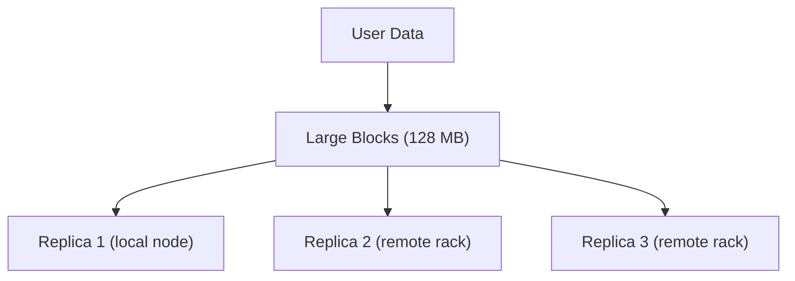
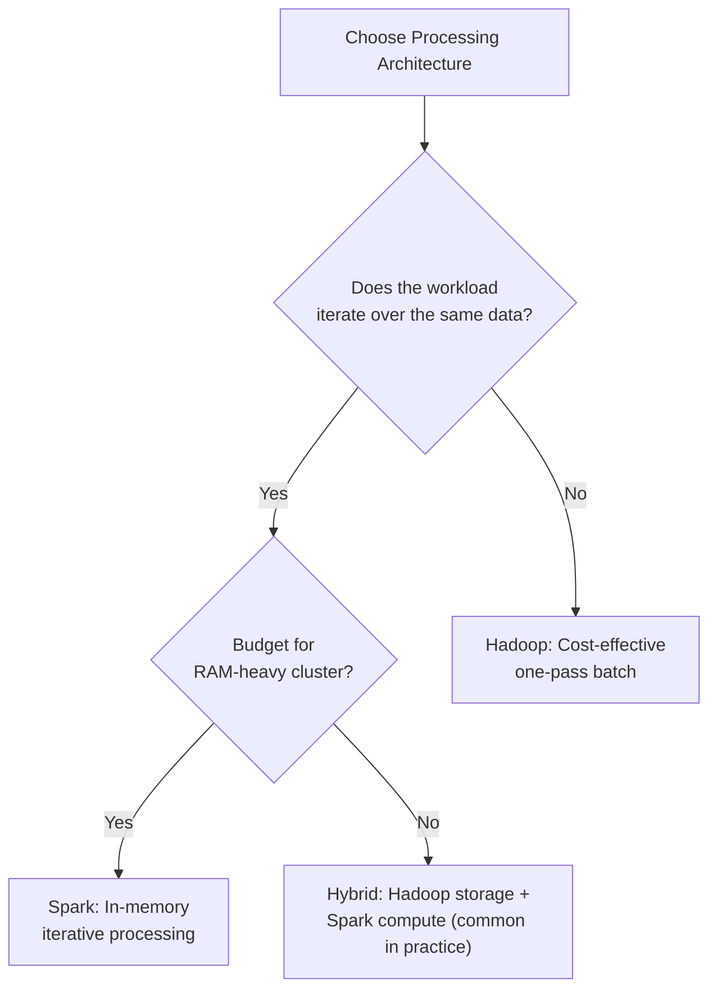

# Module Summary: Hadoop vs Spark — Batch Processing Architecture Evolution

## The Architectural Arc

This module traced the evolution of batch processing from Hadoop's disk-bound reliability model to Spark's in-memory performance model. The central tension — **durability vs speed** — resolves differently depending on workload characteristics and budget constraints.

---

## 1. Hadoop Foundation: HDFS Reliability

HDFS prioritises **data durability** through its block-and-replicate strategy:

- Files split into **large blocks** (128 MB / 256 MB) for sequential throughput
- **3× replication** with rack-aware placement across fault domains
- Survives individual disk failures and entire rack outages

**Strength:** Cost-effective, durable storage on commodity hardware.
**Weakness:** Optimised for sequential batch reads, not iterative or low-latency access.

---

## 2. The Achilles' Heel: Materialisation Cost

Hadoop MapReduce's requirement to write intermediate results to physical disk creates **high I/O latency**:

| Concept | Definition | Impact |
|---------|-----------|--------|
| Materialisation | Persisting intermediate data to disk between stages | Blocks next stage until write completes |
| High I/O latency | Time spent waiting for disk reads/writes | Dominates job runtime for multi-stage and iterative workloads |
| Disk tax | Repeated read-write cycles per iteration | Compounds linearly with iteration count |

For iterative ML algorithms, the cluster spends more time on I/O than computation.

---

## 3. The Spark Revolution

Apache Spark addresses the bottleneck through three pillars:

| Mechanism | Purpose |
|-----------|---------|
| **In-memory computing** | RAM as primary workspace, not disk |
| **DAG execution** | Global logical plan enabling pipelining and optimisation |
| **Lazy evaluation + persistence** | Defer execution for optimisation; cache reused datasets |

**K-Means benchmark result:** Up to **100× performance gain** for iterative workloads when data stays in RAM across iterations.

---

## 4. Trade-off Matrix

| Dimension | Hadoop | Spark |
|-----------|--------|-------|
| Primary storage | Disk (HDFS) | RAM (with HDFS/S3 as source) |
| Fault tolerance | Replication (3× copies) | Lineage (recomputation) |
| Hardware cost | Lower (disk-heavy) | Higher (RAM-heavy) |
| Iterative ML | Poor (repeated disk I/O) | Excellent (in-memory iterations) |
| One-pass ETL | Good | Good (modest advantage) |
| Archival storage | Excellent | Not designed for this role |
| Best use case | Massive cold storage, simple batch | Repeated data access, ML, interactive |

---

## 5. Decision Framework

**Evaluation criteria:**

1. **Performance requirements** — latency-sensitive or iterative?
2. **Data access pattern** — single scan or repeated access?
3. **Budget constraints** — RAM investment justified by time savings?
4. **Storage role** — is HDFS the workspace or just the data lake source?

---

## 6. Key Concepts Checklist

- [ ] HDFS block size rationale (throughput over seek time)
- [ ] 3× rack-aware replication placement
- [ ] MapReduce data flow: HDFS read → local disk → shuffle → HDFS write
- [ ] Materialisation cost and high I/O latency
- [ ] In-memory computing with RAM as primary workspace
- [ ] DAG, lazy evaluation, and persistence
- [ ] K-Means benchmark: Hadoop read-process-write vs Spark cache-and-iterate
- [ ] Cost-benefit: disk-heavy (cheap) vs RAM-heavy (fast)

---

## Common Pitfalls / Exam Traps

- **Trap:** Presenting Hadoop and Spark as mutually exclusive. Production systems commonly use **HDFS for storage + Spark for compute**.
- **Trap:** "Spark replaced Hadoop." Spark replaced **MapReduce as the execution engine**; HDFS remains widely used.
- **Trap:** Citing 100× speedup without qualifying it applies to **iterative workloads**.
- **Trap:** Forgetting materialisation applies to **intermediate results**, not HDFS block replication.
- **Trap:** "In-memory = no fault tolerance." Spark uses **lineage-based recomputation**, a different but effective fault model.

---

## Quick Revision Summary

- Hadoop ensures durability via **HDFS large blocks + 3× rack-aware replication**.
- MapReduce's disk materialisation creates **high I/O latency** — the primary bottleneck.
- **Materialisation cost** devastates iterative workloads (K-Means, PageRank, gradient descent).
- Spark uses **RAM as primary workspace** with DAG planning, lazy evaluation, and caching.
- K-Means benchmarks show up to **100× speedup** for Spark on iterative workloads.
- Hadoop is **cost-effective** for archival storage and one-pass batch; Spark is **fast** for repeated data access.
- The architectural choice depends on **performance needs, data access patterns, and budget** — not raw speed alone.
