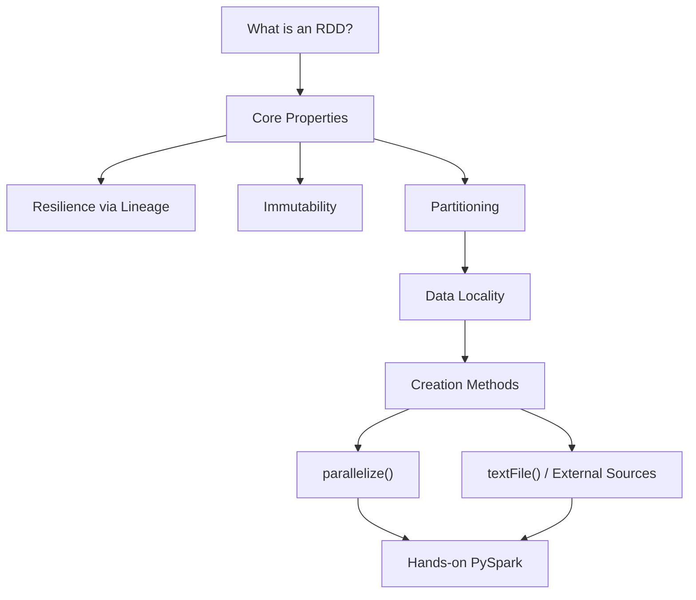

# Spark Core and RDD Fundamentals: Module Overview

## Why RDDs Are the Foundation of Spark

Spark's higher-level APIs — DataFrames, Datasets, Spark SQL, MLlib, Structured Streaming — all compile down to the same execution engine. At the heart of that engine lies the **Resilient Distributed Dataset (RDD)**, Spark's original and most fundamental abstraction. Understanding RDDs means understanding how Spark represents data, achieves fault tolerance, enables parallelism, and interfaces with storage systems.

Without RDD fundamentals, performance tuning, debugging failed jobs, and reasoning about shuffle boundaries remain opaque.

---

## Module Roadmap

---

## Learning Objectives

By the end of this module, you should be able to:

| # | Objective | Key Skill |
|---|-----------|-----------|
| 1 | Define RDD and explain each word (Resilient, Distributed, Dataset) | Conceptual foundation |
| 2 | Explain resilience through lineage vs replication | Fault tolerance reasoning |
| 3 | Explain immutability and its role in safe distributed computing | Concurrency and recovery |
| 4 | Describe partitioning as the unit of parallelism | Performance scaling |
| 5 | Apply data locality ("move code, not data") | Cluster efficiency |
| 6 | Create RDDs via `parallelize()` and `textFile()` | Practical PySpark skills |
| 7 | Choose the right creation method for a given scenario | Production decision-making |

---

## 1. What and Why: The RDD Abstraction

An RDD is Spark's answer to: *"How do you represent a dataset too large for one machine, that must survive node failures, and be processed in parallel?"*

The answer combines three properties:

- **Resilient** — self-healing through lineage-based recomputation
- **Distributed** — partitioned across cluster nodes, operated on as one logical collection
- **Dataset** — a collection of typed objects (numbers, log lines, records)

Think of an RDD as a **virtual list** that feels like a single Python collection but physically spans hundreds of machines.

---

## 2. How: Core Properties

### Immutability

Once created, an RDD **never changes**. Transformations produce **new RDDs** rather than modifying existing ones. This eliminates locking, simplifies recovery, and enables safe parallel reads.

### Partitioning

Data is divided into **partitions** — the atomic units of parallelism. One partition is typically processed by one CPU core. More partitions → more parallel work → faster completion (up to cluster capacity).

---

## 3. Building RDDs: Two Creation Paths

| Method | Source | Scale | Use Case |
|--------|--------|-------|----------|
| `sc.parallelize(collection)` | In-memory Python list/array | Limited by driver RAM | Prototyping, testing, synthetic data |
| `sc.textFile(path)` | External files (HDFS, S3, local) | Petabyte-scale | Production pipelines |

---

## 4. From Theory to Practice

The module culminates in hands-on PySpark sessions:

- Creating a `SparkSession` and `SparkContext`
- Building RDDs from local collections and external files
- Verifying RDD types and inspecting partition contents
- Demonstrating immutability through chained transformations

---

## Common Pitfalls / Exam Traps

- **Trap:** "RDDs are obsolete — only use DataFrames." DataFrames compile to RDDs internally; understanding RDDs is essential for debugging and performance tuning.
- **Trap:** Treating this module as purely theoretical. The creation methods (`parallelize`, `textFile`) are production-relevant skills.
- **Trap:** Confusing **SparkSession** (Spark 2.x+ unified entry point) with **SparkContext** (RDD API entry point). Both coexist in PySpark.
- **Trap:** Assuming immutability wastes memory. Spark's lineage graph avoids storing redundant copies — only transformations that are cached or actioned materialise data.

---

## Quick Revision Summary

- **RDD** (Resilient Distributed Dataset) is the core building block of Spark's execution engine.
- Module covers: definition, properties (resilience, immutability, partitioning), locality, and creation.
- **Immutability** ensures safe parallel access and simplifies fault recovery.
- **Partitioning** divides data into chunks processed in parallel — one partition per core.
- Two creation methods: `parallelize()` for local collections, `textFile()` for external files.
- Hands-on PySpark skills bridge theory to production distributed applications.
- Higher-level APIs (DataFrames, Spark SQL) build on RDD foundations.
