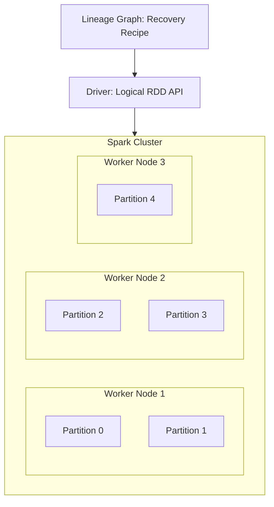

# Resilient Distributed Datasets (RDDs): Definition and Anatomy

## Why Spark Needed a New Abstraction

Before Spark, distributed processing meant MapReduce jobs with rigid map-shuffle-reduce stages, disk-bound intermediates, and no way to express complex multi-step pipelines efficiently. Spark's creators needed an abstraction that was:

- **Fault-tolerant** without expensive replication at every step
- **Distributed** across thousands of nodes yet programmable as a single collection
- **Composable** — chain transformations without materialising to disk

The RDD satisfies all three requirements. It is the data structure that made in-memory distributed computing practical.

---

## 1. Breaking Down the Acronym

### R — Resilient (Fault Tolerant)

In a cluster of hundreds or thousands of machines, **something will fail** — a disk crashes, a network cable disconnects, an executor runs out of memory. "Resilient" means Spark can **automatically recover** lost data without permanent job failure.

Recovery mechanism: **lineage** (covered in depth in the next topic) — Spark remembers how each partition was computed and can recompute it on a surviving node.

**Analogy:** A resilient system is like a baker who keeps the recipe, not just the cake. If the cake is dropped, bake another from the recipe.

### D — Distributed (Spread Across the Cluster)

A dataset too large for one machine — perhaps a petabyte of web logs — is **split into partitions** and spread across the RAM and disk of many cluster nodes. Despite physical distribution, Spark presents the RDD as **one logical collection** that you manipulate with single operations like `.map()` or `.filter()`.

**Analogy:** A distributed dataset is like a library where books are shelved in different buildings, but the catalog system lets you search the entire collection as one.

### D — Dataset (A Collection of Objects)

At its core, an RDD is simply a **collection of elements**:

- A list of integers: `[1, 2, 3, 4, 5]`
- Rows of text from a log file
- Complex customer records with multiple fields

The "dataset" part grounds the abstraction in familiar programming — it is data you transform, filter, aggregate, and analyse.

---

## 2. The Complete Picture

$\text{RDD} = \underbrace{\text{Collection of objects}}_{\text{Dataset}} \times \underbrace{\text{Spread across nodes}}_{\text{Distributed}} \times \underbrace{\text{Self-healing via lineage}}_{\text{Resilient}}$



---

## 3. RDD vs Familiar Data Structures

| Property | Python List | Pandas DataFrame (single machine) | Spark RDD |
|----------|-------------|-----------------------------------|-----------|
| Location | One machine's RAM | One machine's RAM | Distributed across cluster |
| Max size | RAM of one machine | RAM of one machine | Cluster aggregate RAM + disk |
| Fault tolerance | None | None | Lineage-based recomputation |
| Mutability | Mutable | Mutable (mostly) | **Immutable** |
| Parallelism | Single-threaded (GIL) | Single-threaded | Partition-level parallelism |
| API | `append`, `sort` | `df.filter()` | `rdd.map()`, `rdd.filter()` |

---

## 4. Why RDDs Were a Game Changer

Before RDDs, expressing a 5-step data pipeline in MapReduce required **5 separate jobs**, each with full disk I/O. With RDDs:

```python
result = (sc.textFile("hdfs://logs/*")
    .flatMap(lambda line: line.split())
    .map(lambda word: (word, 1))
    .reduceByKey(lambda a, b: a + b)
    .filter(lambda pair: pair[1] > 100))
```

Five transformations, **one logical pipeline**, executed in memory with automatic parallelism and fault tolerance. This composability — chaining operations on a distributed collection — is what made Spark transformative.

---

## 5. RDDs in the Modern Spark Stack

While DataFrames and Datasets are now the recommended APIs for most workloads, they compile to RDDs under the hood. Understanding RDDs means understanding:

- Why shuffle boundaries form where they do
- How lineage enables fault recovery
- What partitioning controls parallelism
- Why immutability eliminates concurrency bugs

---

## Common Pitfalls / Exam Traps

- **Trap:** "Resilient means replicated." Resilience comes from **lineage (recomputation)**, not storing multiple copies.
- **Trap:** "Distributed means replicated 3×." Distribution means **partitioned across nodes**; replication is an HDFS concept, not an RDD property.
- **Trap:** "RDD = DataFrame." DataFrames add schema, Catalyst optimisation, and a SQL interface; RDDs are untyped collections of objects.
- **Trap:** "One RDD = one machine." One RDD spans **many partitions on many machines**.
- **Trap:** Forgetting that RDDs are **immutable** — you never modify an existing RDD, only create new ones.

---

## Quick Revision Summary

- **RDD** = Resilient Distributed Dataset — Spark's fundamental data abstraction.
- **Resilient:** fault-tolerant via lineage-based automatic recomputation on failure.
- **Distributed:** data spread across cluster nodes as partitions, operated on as one logical unit.
- **Dataset:** a collection of objects (numbers, strings, records) — the actual data being processed.
- RDDs enable **composable, in-memory, parallel** processing impossible with chained MapReduce jobs.
- Modern DataFrames/Datasets compile to RDDs — understanding RDDs is essential for debugging and tuning.
- RDDs are **immutable** — transformations always create new RDDs.
