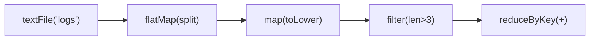
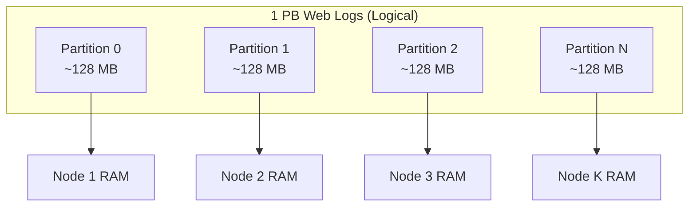

# RDD Resilience and Distribution: Lineage vs Replication

## Why Fault Tolerance Without Replication?

In a cluster of thousands of commodity servers, hardware failure is routine — not exceptional. Traditional fault tolerance copies data to multiple locations (replication), which is expensive in both storage and network bandwidth. Spark's RDD model achieves equivalent reliability through a fundamentally different mechanism: **lineage-based recomputation**. This design is what makes in-memory processing economically viable at scale.

---

## 1. Resilience Through Lineage

### The Replication Problem

Traditional systems (HDFS, databases) ensure durability by storing **multiple physical copies**:

$\text{Fault tolerance cost} = N_{\text{copies}} \times \text{Storage size} \times \text{Network bandwidth for sync}$

For in-memory data replicated 3× across a cluster, RAM requirements triple — prohibitively expensive.

### Spark's Lineage Solution

Instead of copying data, Spark records **how data was created** — a directed graph of transformations from source to current RDD:

This graph is the **lineage** (also called the RDD lineage graph or dependency graph).

**On failure:** If a worker node crashes and partition data is lost, Spark:

1. Identifies which partition was lost
2. Traces lineage back to the nearest reliable source (HDFS block or cached parent)
3. **Recomputes** only the lost partition on a different node
4. Continues the job without user intervention

$\text{Recovery cost} = \text{Recompute lost partition only, not entire dataset}$

### Lineage vs Replication Comparison

| Aspect | Replication | Lineage (Spark) |
|--------|-------------|-----------------|
| Fault tolerance mechanism | Store N copies | Record computation history |
| Storage overhead | $N \times$ data size | Minimal (graph metadata only) |
| Recovery action | Read from backup copy | Recompute from parent |
| Best for | Durable storage (HDFS) | Intermediate computations (RDDs) |
| Recovery speed | Fast (read copy) | Depends on recomputation cost |
| Risk | None if copies intact | Long lineage chains → expensive recovery |

**Analogy:** Replication is photocopying every draft of a document. Lineage is keeping the edit history so you can regenerate any version.

---

## 2. Distribution: Divide and Conquer at Scale

### The Scale Problem

A petabyte of web logs cannot fit on any single machine. Even if it could, processing it sequentially would take days or weeks.

### Spark's Distribution Model

Spark divides the dataset into **partitions** and spreads them across cluster nodes:

Each node holds a small portion in its RAM (or spills to local disk). Operations like `.map()` or `.filter()` execute **simultaneously** on all partitions across all nodes.

### Performance Impact

| Setup | Processing Time (example) |
|-------|--------------------------|
| Single machine | Days |
| 100-node cluster, 100 partitions | Minutes |
| 1,000-node cluster, 1,000 partitions | Seconds to minutes |

This is the **divide and conquer** strategy: harness collective cluster power to shrink wall-clock time from days to minutes.

---

## 3. How Resilience and Distribution Complement Each Other

| Property | Provides | Enables |
|----------|----------|---------|
| **Resilience (lineage)** | Safety | Run on thousands of unreliable machines without fear of permanent data loss |
| **Distribution (partitioning)** | Power | Process datasets of any scale by adding nodes |
| **Together** | Scale + reliability | Petabyte pipelines on commodity hardware |

Without resilience, a single node failure kills the entire job. Without distribution, the dataset cannot fit or be processed in reasonable time. RDDs provide both simultaneously.

---

## 4. Lineage Recovery Walkthrough

**Scenario:** Node 7 fails during a `reduceByKey` operation. Partition 42 (on Node 7) is lost.

1. **Detect:** Cluster manager reports Node 7 heartbeat timeout
2. **Identify:** DAG scheduler marks tasks on partition 42 as failed
3. **Trace lineage:** Partition 42 of the current RDD was produced by `map(f)` on partition 42 of parent RDD
4. **Recompute:** Re-run `map(f)` on partition 42 of parent (recomputing parent partition if also lost, recursively)
5. **Resume:** Re-execute failed `reduceByKey` task on a surviving node

Only **lost partitions** are recomputed — not the entire dataset, not unaffected partitions.

---

## Common Pitfalls / Exam Traps

- **Trap:** "Resilient = data is replicated in memory." Spark uses **lineage**, not in-memory replication, for RDD fault tolerance.
- **Trap:** "Lineage means no data loss ever." If the **source data** (HDFS) is lost and no cache exists, lineage cannot help.
- **Trap:** "Longer lineage = better resilience." Longer lineage means **more expensive recovery** — checkpointing exists to truncate lineage chains.
- **Trap:** Confusing **HDFS replication** (storage layer) with **RDD lineage** (compute layer). They operate at different levels.
- **Trap:** "Distribution requires replication." Distribution requires **partitioning**, not replication.

---

## Quick Revision Summary

- **Resilience** = fault tolerance through **lineage** (computation history), not replication.
- Lineage records every transformation as a DAG from source to current RDD.
- On failure, Spark **recomputes only lost partitions** from lineage — self-healing through computation.
- Lineage is more storage-efficient than replication for intermediate data.
- **Distribution** spreads data across cluster nodes as partitions for parallel processing.
- Divide and conquer: tasks that take days on one machine complete in minutes on thousands.
- Resilience provides **safety**; distribution provides **power** — together they enable petabyte-scale processing.
- HDFS replication protects **source data**; RDD lineage protects **computed data**.
