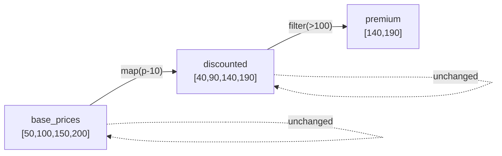

# RDD Immutability: Why Spark Data Never Changes

## Why Immutability Is Non-Negotiable

In a distributed system with dozens of machines reading and writing the same data simultaneously, mutable state is a recipe for corruption, race conditions, and unrecoverable failures. Spark's insistence that RDDs **never change after creation** is not a stylistic preference — it is a foundational design decision that enables fault tolerance, eliminates locking overhead, and simplifies reasoning about distributed computation.

---

## 1. What Immutability Means in Practice

Once an RDD is created, its contents are **frozen**. Any operation that appears to "modify" data actually creates a **new RDD**:

```python
base_prices = sc.parallelize([50, 100, 150, 200])

# Transformation: creates NEW RDD, base_prices unchanged
discounted = base_prices.map(lambda p: p - 10)
# discounted = [40, 90, 140, 190]

# Another transformation: creates ANOTHER new RDD
premium = discounted.filter(lambda p: p > 100)
# premium = [140, 190]

# base_prices is STILL [50, 100, 150, 200]
# discounted is STILL [40, 90, 140, 190]
```



Three separate RDDs coexist. The original is never touched.

---

## 2. Why Spark Enforces Immutability

### Reason 1: Fault Tolerance via Lineage

If a worker node crashes and loses partition data from the `premium` RDD, Spark needs to recompute it. Because `base_prices` and `discounted` were **never modified**, their lineage is intact and deterministic:

$\text{premium partition} = \text{filter}_{>100}(\text{map}_{-10}(\text{base\_prices partition}))$

Recomputation produces **identical results** because inputs never changed. If RDDs were mutable, a concurrent write during recovery could produce different results — corrupting the pipeline.

### Reason 2: Zero Concurrency Issues

Imagine 50 executors simultaneously reading and updating the same RDD:

| Mutable RDD | Immutable RDD |
|-------------|---------------|
| Need locks/mutexes to prevent corruption | No locks needed — data never changes |
| Race conditions possible | Concurrent reads are always safe |
| Complex coordination protocol | Trivial: read-only access |
| Deadlock risk | No deadlock possible |

With immutability, every node reads data knowing it **will never suddenly change underneath them**. This eliminates an entire class of distributed systems bugs.

---

## 3. Immutability and Memory: Not Wasteful

A common misconception: "Creating new RDDs for every transformation must waste memory."

**Reality:** Spark does not duplicate data unless necessary:

- **Narrow transformations** (map, filter) can pipeline without materialising intermediate RDDs
- **Lineage graph** stores transformation functions (kilobytes), not data copies (gigabytes)
- Data is materialised only when an **action** triggers execution or `.persist()` is called
- Unreferenced RDDs are **garbage collected** by the JVM

$\text{Memory cost} \approx \text{Cached/persisted RDDs only, not every intermediate}$

---

## 4. Immutability in the Transformation-Action Model

| Operation Type | Creates New RDD? | Executes Immediately? | Example |
|----------------|-----------------|----------------------|---------|
| Transformation | Yes (new RDD) | No (lazy) | `.map()`, `.filter()`, `.flatMap()` |
| Action | No (returns value or writes) | Yes (triggers execution) | `.count()`, `.collect()`, `.save()` |

Transformations on immutable RDDs build the **lineage graph** lazily. Actions trigger computation of the entire graph.

---

## 5. Real-World Analogy

Immutable RDDs behave like **Git commits**:

- Each transformation is a new commit (new RDD)
- Previous commits (RDDs) are never altered
- You can always reconstruct any version from the history (lineage)
- Multiple branches (RDDs) can reference the same parent without conflict

---

## 6. Practical Implications for Developers

```python
# WRONG mental model: modifying in place
rdd = sc.parallelize([1, 2, 3])
rdd.map(lambda x: x * 2)  # Result discarded! rdd is still [1, 2, 3]

# CORRECT: capture the new RDD
rdd = sc.parallelize([1, 2, 3])
doubled = rdd.map(lambda x: x * 2)  # doubled = [2, 4, 6]
result = doubled.collect()           # Action triggers execution
```

Always assign transformation results to a new variable (or chain them). The original RDD remains available for other branches of computation.

---

## Common Pitfalls / Exam Traps

- **Trap:** "Immutability means Spark copies all data on every transformation." Spark pipelines narrow transformations and stores **functions in lineage**, not data copies.
- **Trap:** "I can update an RDD with `.map()`." `.map()` returns a **new RDD**; the original is unchanged.
- **Trap:** Forgetting to capture transformation results — the most common beginner bug.
- **Trap:** "Immutability prevents all concurrency issues in Spark." It prevents **read-write races on RDD data**; shuffle coordination still requires synchronisation.
- **Trap:** "Mutable DataFrames contradict immutable RDDs." DataFrame operations also create new logical plans; the immutability principle persists in the underlying execution model.

---

## Quick Revision Summary

- RDDs are **immutable** — once created, they never change.
- Transformations create **new RDDs**; the original remains untouched.
- Immutability enables **deterministic lineage-based recovery** — recomputation produces identical results.
- No **locks needed** — concurrent reads are always safe on immutable data.
- Spark stores **transformation functions** in lineage, not redundant data copies.
- Only **persisted/cached** RDDs and action-triggered results materialise data in memory.
- Always **assign transformation results** to a new variable — discarding them loses the computation.
- Immutability is foundational to Spark's fault tolerance and concurrency safety.
