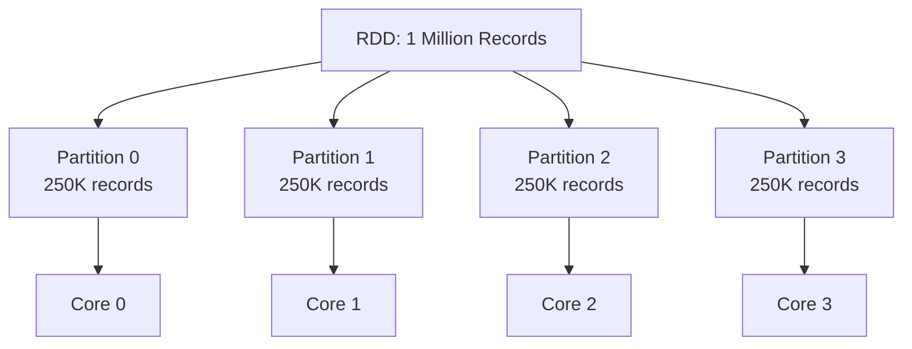
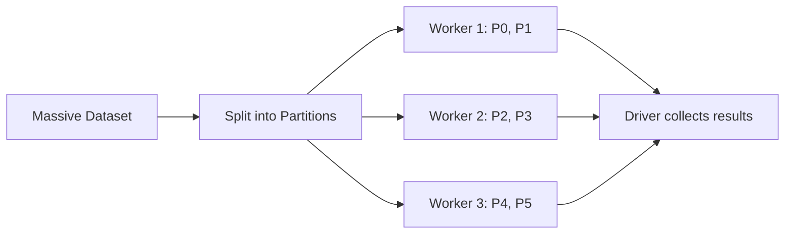

# RDD Partitioning: The Atomic Unit of Parallelism in Spark

## Why Partitioning Determines Spark's Speed

An RDD spread across a 100-node cluster is useless if only one node does the work. **Partitioning** is the mechanism that converts a logically unified dataset into physically independent chunks, each processable by a separate CPU core. Without correct partitioning, cluster resources sit idle and jobs run no faster than on a single machine.

---

## 1. What Is a Partition?

A **partition** is a logical slice of an RDD's data — the smallest unit of work in Spark. Each partition is a contiguous subset of elements that can be processed independently.

**Rule of thumb:** One partition is typically processed by **one CPU core** in one task.

---

## 2. The Library Analogy

Imagine scanning a massive library of 100,000 books:

| Approach | Workers | Time |
|----------|---------|------|
| One person scans all books | 1 | 10 hours |
| Split into 10 piles, 10 people scan in parallel | 10 | 1 hour |
| Split into 100 piles, 100 people scan in parallel | 100 | 6 minutes |

Partitions are the "piles." More piles with more workers → proportionally faster completion.

---

## 3. Partitioning and Parallelism

### The Core-Partition Relationship

| Cluster Cores | Partitions | Result |
|---------------|-----------|--------|
| 100 cores | 1 partition | 99 cores idle; ~same speed as 1 core |
| 100 cores | 10 partitions | 90 cores idle; 10× speedup |
| 100 cores | 100 partitions | All cores busy; ~100× speedup |
| 100 cores | 500 partitions | All cores busy; slight scheduling overhead |

**Target:** Partitions $\approx$ number of available cores (typically 2–4× for I/O-bound workloads).

### Linear Scalability

Spark's core value proposition is **linear scalability** — doubling partitions and cores roughly halves processing time (until I/O or shuffle bottlenecks dominate):

$\text{Time} \propto \frac{\text{Data size}}{\text{Partitions} \times \text{Processing rate per core}}$

| Configuration | Relative Time (example) |
|---------------|------------------------|
| 1 core, 1 partition | 10 hours (baseline) |
| 10 cores, 10 partitions | 1 hour (10× faster) |
| 100 cores, 100 partitions | 6 minutes (~100× faster) |

---

## 4. How Partitions Are Created

| Creation Method | Default Partitioning |
|----------------|---------------------|
| `sc.parallelize(data, numSlices=N)` | `N` partitions (user-specified) |
| `sc.textFile(path, minPartitions=N)` | One partition per HDFS block (or `minPartitions`, whichever is larger) |
| `rdd.repartition(N)` | Exactly `N` partitions (triggers shuffle) |
| `rdd.coalesce(N)` | Reduce to `N` partitions (narrow, no shuffle if reducing) |
| Transformations (map, filter) | Same number as parent (narrow) |
| Wide transformations (groupByKey) | Configurable via `spark.default.parallelism` |

---

## 5. Partitioning and the Divide-and-Conquer Strategy

Each worker processes its assigned partitions independently. Results are combined only when necessary (actions, wide transformations).

---

## 6. Partitioning Pitfalls in Practice

| Problem | Symptom | Fix |
|---------|---------|-----|
| Too few partitions | Cores idle, slow job | `repartition()` or increase `minPartitions` |
| Too many partitions | Task scheduling overhead, small tasks | `coalesce()` to reduce |
| Skewed partitions | One task takes 10× longer (straggler) | Custom partitioner, salting (covered later) |
| Wrong partition count after filter | Remaining cores underutilised | `repartition()` after heavy filtering |

---

## Common Pitfalls / Exam Traps

- **Trap:** "More partitions always means faster." Too many tiny partitions create **scheduling overhead** without benefit.
- **Trap:** "Partition = HDFS block." Partitions are **logical** Spark units; they may span or share HDFS blocks.
- **Trap:** "Partitioning is automatic and always optimal." Default partitioning may be suboptimal — tuning is often required.
- **Trap:** Confusing `repartition()` (always shuffles) with `coalesce()` (narrow when reducing count).
- **Trap:** "100 cores guarantees 100× speedup." Shuffle, I/O, and stragglers limit real-world scaling.

---

## Quick Revision Summary

- **Partitions** are logical chunks of an RDD — the atomic units of parallelism in Spark.
- **One partition ≈ one CPU core** in one task during execution.
- More partitions with more cores enable **linear scalability** (hours → minutes).
- Default partition count depends on creation method (HDFS blocks for `textFile`, user-specified for `parallelize`).
- Too few partitions leave cores **idle**; too many create scheduling overhead.
- Partitioning enables Spark's **divide-and-conquer** strategy across the cluster.
- Partition count should be tuned to match **available cluster cores** (typically 2–4× core count).
