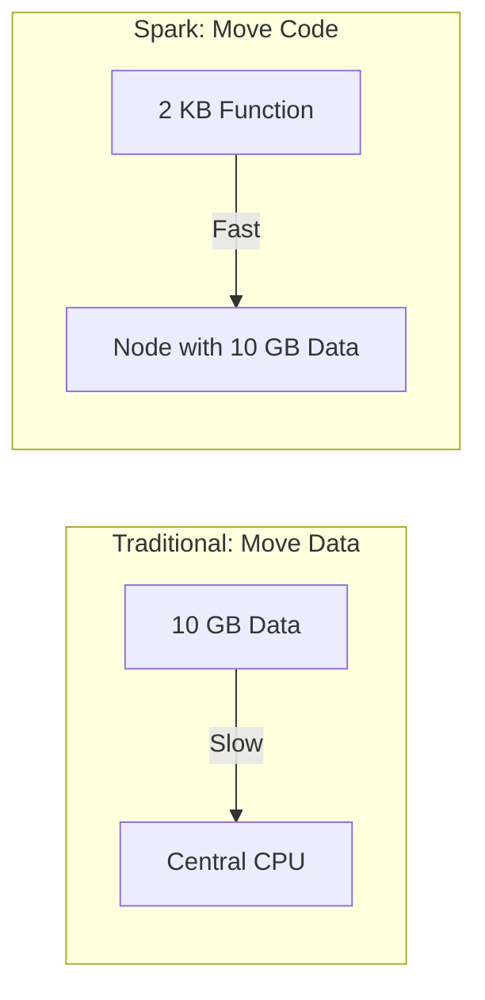
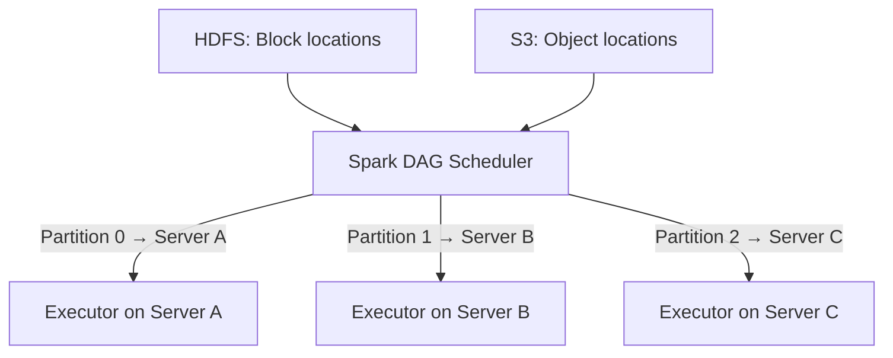

# Data Locality and the Spark Cluster: Move Code, Not Data

## Why Locality Is the Second Half of Parallelism

Partitioning divides work across cores, but **where** that work executes determines whether the cluster achieves peak throughput or wastes time waiting on network transfers. Data locality — scheduling computation on the node that already holds the data — is the principle that prevents network bandwidth from becoming the bottleneck in petabyte-scale processing.

---

## 1. The Traditional Model: Bring Data to Code

In conventional programming, data is small and code is complex:

```python
data = read_from_database()  # Megabytes
result = process(data)       # Code runs locally
```

The data moves to where the programme runs. This works when data fits in one machine's memory.

### When Data Is Terabytes

Moving 10 TB across a 10 Gbps network:

$\text{Transfer time} = \frac{10 \text{ TB}}{1.25 \text{ GB/s}} \approx 2.3 \text{ hours}$

Before a single line of computation executes, hours are spent on transfer. CPUs sit idle. This is the **network bottleneck**.

---

## 2. Spark's Inversion: Move Code to Data

Spark flips the model:

| What | Size | Movement Cost |
|------|------|---------------|
| Data (partition) | Megabytes to gigabytes | Expensive to move |
| Code (map/filter function) | Kilobytes | Cheap to move |

**Motto:** "Don't move your data — move code."



The computation task (serialized function + partition metadata) ships to the executor that already holds — or is nearest to — the data partition.

---

## 3. How Spark Achieves Data Locality

### Storage-Aware Scheduling

Spark's DAG scheduler communicates with the cluster manager and storage system (HDFS, S3) to determine **where each partition lives**:

1. Query HDFS NameNode: "Which DataNode holds block replica for partition 3?"
2. Answer: "Server A, Rack 1"
3. Schedule partition 3's task on an executor running on Server A



### Locality Levels

Spark prefers scheduling in this order:

| Level | Description | Performance |
|-------|-------------|-------------|
| `PROCESS_LOCAL` | Data in same JVM as executor | Best |
| `NODE_LOCAL` | Data on same node, different JVM | Good |
| `RACK_LOCAL` | Data on same rack | Acceptable |
| `NO_PREF` | No preference | Neutral |
| `ANY` | Data anywhere in cluster | Worst (network transfer) |

---

## 4. Data Locality + Partitioning = Cluster Efficiency

| Mechanism | Solves | Analogy |
|-----------|--------|---------|
| **Partitioning** | Divides work for parallelism | Splitting books into piles |
| **Data locality** | Places work near data | Assigning each pile to the librarian nearest its shelf |

Together they ensure:

- Every core has work (partitioning)
- Every task runs where data already lives (locality)
- Network pipes carry kilobytes of code, not gigabytes of data

---

## 5. When Locality Breaks Down: The Shuffle

Data locality applies to **narrow transformations** where each output partition depends on exactly one input partition. **Wide transformations** (groupByKey, join) require a **shuffle** — redistributing data across the network by key. During shuffle, data locality is intentionally violated to colocate related keys.

This is why wide dependencies are the primary performance boundaries (covered in the execution model module).

---

## 6. Real-World Example

**Scenario:** 1 TB log file in HDFS across a 50-node cluster.

1. `sc.textFile("hdfs://logs/")` creates ~8,000 partitions (one per HDFS block)
2. Spark queries NameNode for block locations
3. Tasks scheduled on nodes holding block replicas
4. Each executor reads its local HDFS blocks — **zero network transfer for input**
5. `map()` and `filter()` execute locally on each partition
6. Only the final `reduceByKey()` shuffle moves data across the network

---

## Common Pitfalls / Exam Traps

- **Trap:** "Data locality means zero network traffic." **Shuffles** deliberately move data across the network for wide transformations.
- **Trap:** "Spark always achieves PROCESS_LOCAL." If the preferred executor is busy, Spark may schedule on a less local node.
- **Trap:** "`parallelize()` benefits from data locality." Data starts on the **driver** and is shipped to workers — no locality advantage.
- **Trap:** Confusing data locality (compute scheduling) with **HDFS replication** (storage durability).
- **Trap:** "S3 has the same locality as HDFS." S3 is remote object storage; locality is weaker — HDFS block locality is superior for on-premise clusters.

---

## Quick Revision Summary

- Moving terabytes across a network creates a **network bottleneck** — CPUs wait for data.
- Spark's principle: **"Move code, not data"** — ship kilobytes of functions to gigabytes of data.
- Spark is **data-aware** — queries HDFS/S3 for block locations before scheduling tasks.
- Tasks are scheduled on executors **nearest to the data partition** (PROCESS_LOCAL > NODE_LOCAL > RACK_LOCAL).
- **Partitioning** provides parallelism; **data locality** ensures efficient execution.
- External file loading (`textFile`) respects locality; `parallelize()` does not (data starts on driver).
- **Wide transformations (shuffle)** intentionally break locality to colocate keys.
