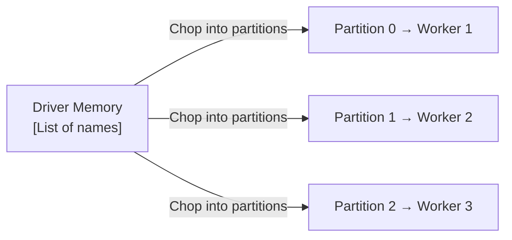

# Creating RDDs from Local Collections: parallelize()

## When and How to Use parallelize()

Not all data starts in HDFS or S3. During development, testing, and prototyping, you need to convert small in-memory Python collections into distributed RDDs. The `parallelize()` method is Spark's bridge from local code to the cluster — fast, simple, and deliberately limited in scale.

---

## 1. The Concept

`sc.parallelize()` takes a collection already in your Python programme (list, tuple, range) and distributes it across the cluster as an RDD:

```python
from pyspark.sql import SparkSession

spark = SparkSession.builder.appName("demo").getOrCreate()
sc = spark.sparkContext

names = ["Alice", "Bob", "Charlie", "Diana", "Eve"]
names_rdd = sc.parallelize(names)

print(names_rdd.collect())   # ['Alice', 'Bob', 'Charlie', 'Diana', 'Eve']
print(type(names_rdd))         # <class 'pyspark.rdd.RDD'>
```

### What Happens Behind the Scenes



1. Spark takes the list from the **driver's memory**
2. Splits it into **partitions** (default: total cores in cluster)
3. **Serialises and ships** each partition to a worker node
4. Returns an RDD reference to the driver

---

## 2. Specifying Partition Count

```python
# Default: one partition per core
rdd = sc.parallelize(range(1000))

# Explicit: 4 partitions
rdd = sc.parallelize(range(1000), numSlices=4)
```

| Parameter | Effect |
|-----------|--------|
| `numSlices` omitted | Defaults to `spark.default.parallelism` (usually total cores) |
| `numSlices=1` | Entire collection on one partition (no parallelism) |
| `numSlices=N` | N partitions distributed across workers |

---

## 3. Use Cases

| Use Case | Example |
|----------|---------|
| **Prototyping** | Test a `.map()` / `.filter()` logic before running on production data |
| **Unit testing** | Verify transformation correctness with known small inputs |
| **Synthetic data** | Generate test datasets for simulations |
| **Broadcast alternatives** | Distribute small lookup tables (though `broadcast()` is preferred for joins) |
| **Learning / demos** | Hands-on PySpark exercises without HDFS setup |

---

## 4. Limitations: Driver Memory Ceiling

**Critical constraint:** Data must fit in the **driver machine's RAM** before distribution.

| Data Size | `parallelize()` | `textFile()` |
|-----------|----------------|--------------|
| 100 elements | Works perfectly | Overkill |
| 1 GB list | Risky — driver may OOM | Use external loading |
| 1 TB | **Will crash the driver** | Correct approach |

Attempting `sc.parallelize()` on a 1 TB list will crash the driver JVM with an OutOfMemoryError before any data reaches the cluster.

$\text{Max data size for parallelize()} \leq \text{Driver RAM}$

---

## 5. parallelize() vs textFile(): Decision Guide

| Criterion | `sc.parallelize()` | `sc.textFile()` |
|-----------|-------------------|-----------------|
| Data origin | Python list/array in code | File on disk (local/HDFS/S3) |
| Scale limit | Driver RAM | Cluster-scale (petabytes) |
| Data locality | None (ships from driver) | Yes (reads where data lives) |
| Speed for large data | N/A (crashes) | Fast (distributed reads) |
| Best for | Testing, prototyping | Production pipelines |

---

## 6. Complete Example

```python
from pyspark.sql import SparkSession

spark = SparkSession.builder.appName("prices").getOrCreate()
sc = spark.sparkContext

# Create RDD from local list
prices = [50, 100, 150, 200]
prices_rdd = sc.parallelize(prices, numSlices=2)

# Transform (lazy — no execution yet)
discounted = prices_rdd.map(lambda p: p - 10)

# Action — triggers execution
print(discounted.collect())  # [40, 90, 140, 190]
```

---

## Common Pitfalls / Exam Traps

- **Trap:** "parallelize() works for any data size." It is **limited by driver RAM** — only for small collections.
- **Trap:** "parallelize() provides data locality." Data originates on the driver and is **shipped to workers** — no locality benefit.
- **Trap:** Forgetting to create `SparkContext` (`sc`) before calling `parallelize()`.
- **Trap:** Using `parallelize()` in production for large datasets instead of `textFile()` / `read.parquet()`.
- **Trap:** Not specifying `numSlices` when testing parallelism behaviour — default may not match expectations.

---

## Quick Revision Summary

- `sc.parallelize(collection, numSlices=N)` converts a local Python collection into a distributed RDD.
- Spark chops the collection into partitions and **ships them from driver to workers**.
- Primary use cases: **prototyping, testing, synthetic data, learning exercises**.
- **Scale limit:** data must fit in **driver RAM** — not suitable for large datasets.
- Specify `numSlices` to control partition count and parallelism.
- For production-scale data, use **`textFile()` or DataFrame readers** instead.
- `parallelize()` does **not** benefit from data locality (unlike external file loading).
