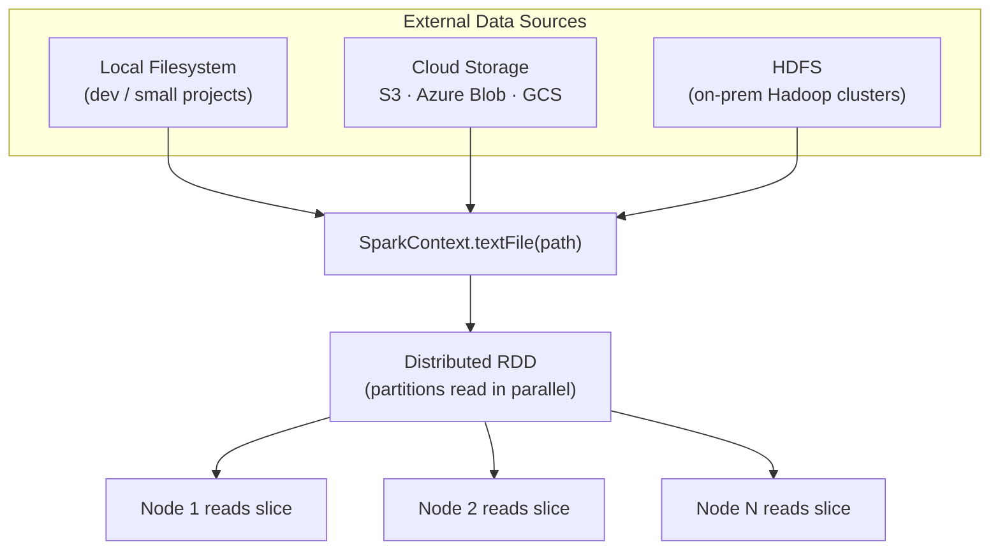
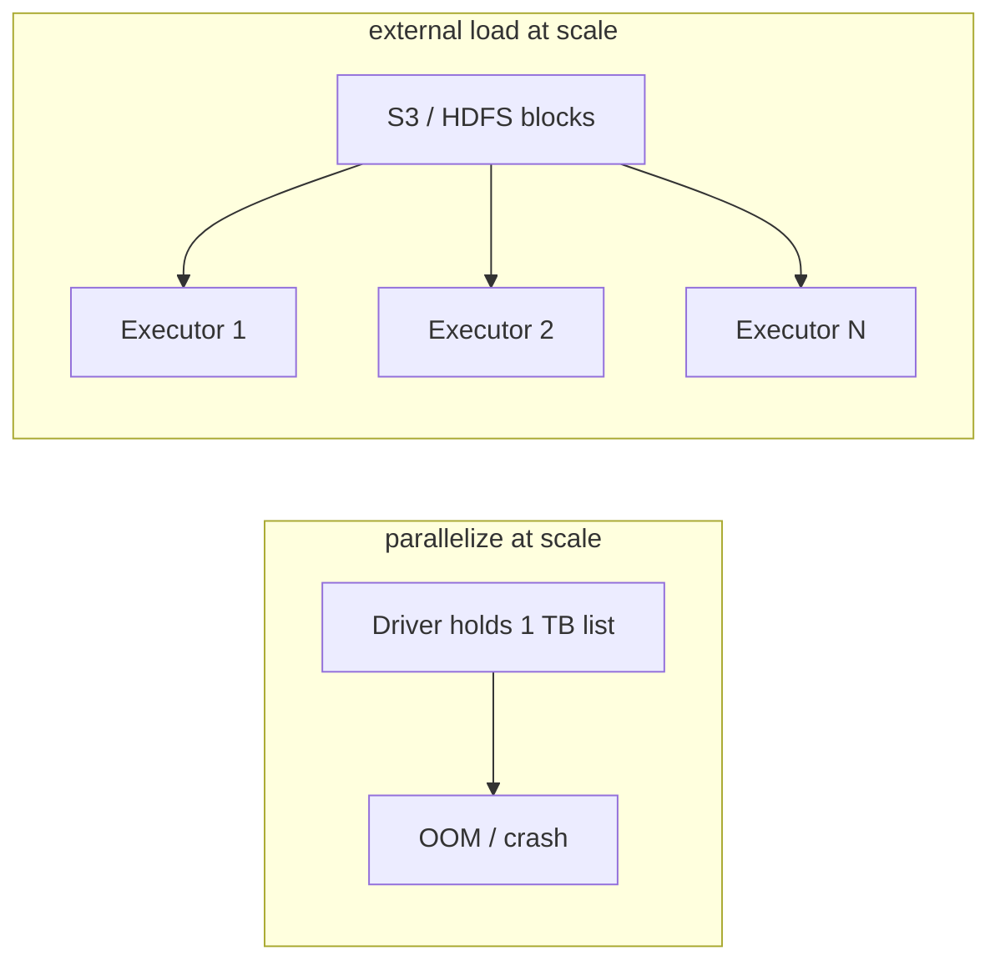

# Loading External Data: HDFS, S3, and Local Filesystems

## Why External Data Sources Matter

Most production datasets do not start as Python lists in memory. They live in distributed filesystems, cloud object stores, or databases — often at terabyte or petabyte scale. Spark's ability to read directly from these **external data sources** without pulling everything onto a single machine is what makes it viable for real-world pipelines.

The core idea: when you call `sc.textFile(path)`, Spark does **not** load the entire file into the driver's RAM. It creates a distributed RDD whose partitions are read **in parallel** by cluster nodes, each responsible for its own slice of the data.

---

## 1. Three Common Data Locations



| Source | Typical Use | Scale |
|--------|-------------|-------|
| **Local filesystem** | Development, unit tests, small datasets on your laptop | MB–low GB |
| **Cloud storage (S3, Azure Blob, GCS)** | Cloud-native data lakes, modern production pipelines | TB–PB |
| **HDFS** | Traditional on-premise Hadoop clusters, legacy enterprise data | TB–PB |

### Local Filesystem

Paths like `/home/user/data/logs.txt` or `file:///path/to/data`. Suitable when the dataset fits comfortably on one machine and you are prototyping logic.

### Cloud Object Storage

Amazon S3, Azure Blob Storage, and Google Cloud Storage buckets are the default home for modern **data lakes**. Spark reads via URI schemes such as `s3a://bucket/path/` (preferred over deprecated `s3n://`). Data stays in the cloud; executors pull only the blocks they need.

### HDFS (Hadoop Distributed File System)

The classic standard for large on-premise clusters. Files are split into blocks (typically 128 MB) and replicated across DataNodes. Spark on YARN or a Hadoop cluster reads via `hdfs://namenode:8020/path/to/file`.

---

## 2. The Primary API: `sc.textFile`

```python
rdd = sc.textFile("hdfs://cluster/data/logs/*.txt")
# or
rdd = sc.textFile("s3a://my-bucket/raw/events/")
# or
rdd = sc.textFile("file:///tmp/sample.txt")
```

**What happens under the hood:**

1. Spark parses the path and determines input format (text, by default one line per record).
2. It computes how many partitions to create (based on file size, `minPartitions`, or cluster defaults).
3. Each partition is assigned to an executor task that reads **only its byte range** from the source.
4. No single node holds the full dataset — work is spread across the cluster.

This design directly supports **data locality**: tasks run on (or near) nodes that already store the HDFS blocks, minimising network transfer.

---

## 3. `parallelize` vs External Loading

Choosing the right creation method is one of the most common design decisions in Spark jobs.

| Criterion | `sc.parallelize(local_list)` | External load (`textFile`, etc.) |
|-----------|------------------------------|----------------------------------|
| **Data origin** | Data already in driver memory as a Python/Scala collection | Data stored as files on disk or object store |
| **Scalability** | Limited by **driver RAM** — a 1 TB list will crash the driver | Scales to **petabytes** — work distributed across cluster |
| **Use case** | Quick tests, small samples, teaching examples | Production pipelines, batch analytics, ETL |
| **Performance (large data)** | Poor — entire dataset must fit on one machine first | Fast — parallel reads, respects data locality |
| **Network / I/O** | Data must be serialised from driver to executors | Executors read directly from where data lives |



**Rule of thumb:** Use `parallelize` for tiny in-memory fixtures during development. Use external sources for anything that would not fit comfortably in your laptop's RAM.

---

## 4. Reading Patterns and Practical Tips

### Glob patterns

`sc.textFile("hdfs://data/logs/2024-*.txt")` reads all matching files as one logical RDD. Each file contributes partitions.

### Partition count

Default partitioning follows input split size. For very small files, you may get too many tiny partitions (task overhead) or too few huge ones (under-utilised cores). Tune with:

```python
rdd = sc.textFile(path, minPartitions=200)
```

### Other external readers

Beyond `textFile`, Spark supports structured sources (Parquet, JSON, JDBC, etc.) via `spark.read` in Spark SQL / DataFrames — but the RDD-level pattern of **distributed parallel read without driver bottleneck** is the same principle.

---

## Common Pitfalls / Exam Traps

- **Assuming `textFile` loads everything into the driver** — it creates a lazy RDD; data is read partition-by-partition when an action runs.
- **Using `parallelize` on large production datasets** — driver memory becomes the hard ceiling; this is a classic exam trap contrasting the two creation methods.
- **Ignoring data locality for external loads** — performance gains come from reading HDFS blocks on the same node; cross-rack reads are slower.
- **Confusing cloud URI schemes** — `s3a://` (Hadoop AWS connector) vs legacy `s3n://`; wrong scheme causes runtime failures.
- **Forgetting that external reads are lazy** — like all transformations, `textFile` records lineage; nothing is read until an action (`count`, `collect`, `save`) triggers execution.
- **Collecting massive external datasets back to the driver** — loading from S3 efficiently does not protect you from `collect()` on a 100 GB result.

---

## Quick Revision Summary

- Production data lives in **local FS**, **cloud buckets (S3/Azure/GCS)**, or **HDFS** — not in driver memory.
- `sc.textFile(path)` creates a **distributed RDD**; each node reads its own partition in parallel.
- **`parallelize`**: data already in code; limited by driver RAM; good for testing.
- **External load**: data on disk/object store; scales to petabytes; respects **data locality**.
- For real pipelines, almost always load from **S3 or HDFS**, not `parallelize`.
- External loading is faster at scale because executors read where data already lives.
- Spark supports glob paths and configurable `minPartitions` for tuning parallelism.
- The choice of creation method is fundamentally a **scale and data-location** decision, not a syntax preference.
