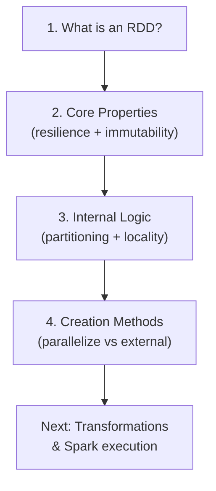
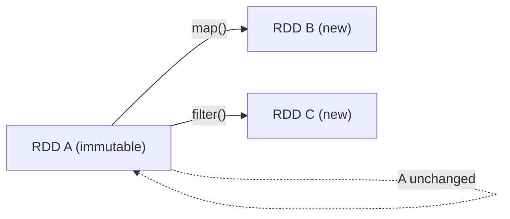
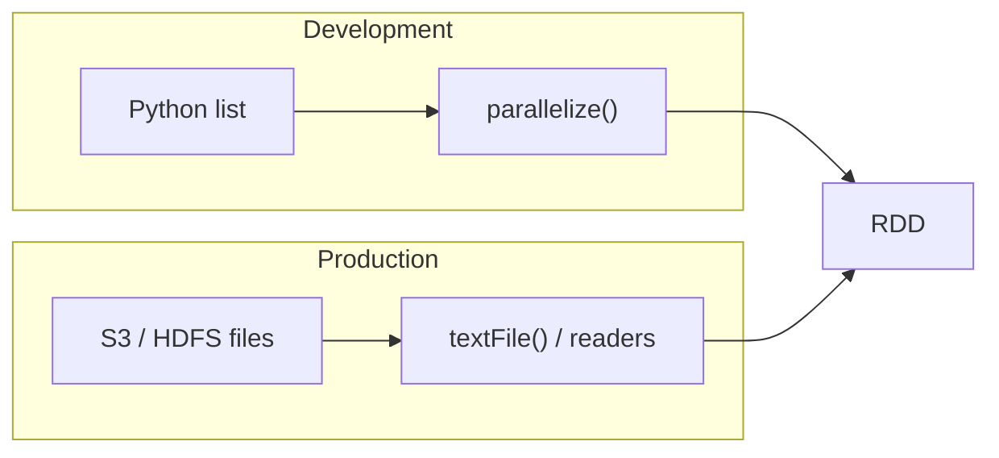
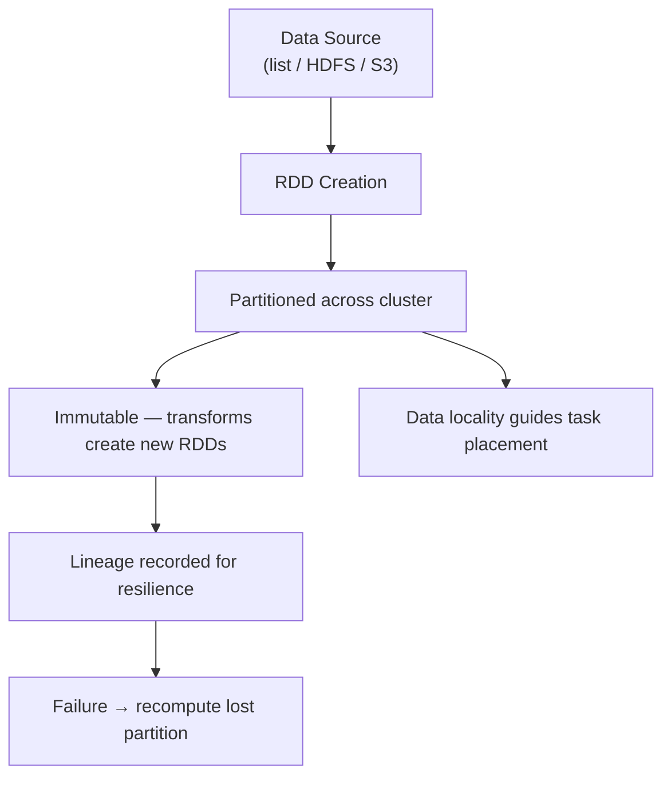

# Module Summary: RDD Fundamentals

## From Theory to Practice

This module established the **static foundation** of Apache Spark — how data is represented, stored, partitioned, and brought into the cluster. Before manipulating data with transformations and actions (covered next), you need a solid mental model of what an RDD is and why Spark organises data the way it does.

---

## Milestone 1: What Is an RDD?

A **Resilient Distributed Dataset (RDD)** is Spark's core abstraction — a virtual collection that **behaves like a single list** but is physically **spread across the entire cluster**.

| Property | Meaning |
|----------|---------|
| **Resilient** | Can recover from node failures |
| **Distributed** | Partitions live on many machines |
| **Dataset** | A collection of records (strings, tuples, objects, etc.) |

Think of an RDD as a logical tablecloth draped over many tables — you interact with one unified view, but the fabric is woven from independent pieces on different servers.

---

## Milestone 2: Core Properties

### Resilience via Lineage

RDDs do not rely on expensive replication of every intermediate result. Instead, Spark records **lineage** — the graph of transformations from source to current RDD. If a partition is lost, Spark **recomputes** only that partition from the nearest reliable ancestor (e.g., an HDFS block or cached parent).

$\text{Fault tolerance cost} \approx \text{recompute lost partitions, not replicate entire dataset}$

### Immutability

Once created, an RDD **never changes**. Transformations produce **new** RDDs; the original remains untouched. This eliminates an entire class of distributed concurrency bugs (race conditions, inconsistent reads) and makes lineage-based recovery deterministic.

---

## Milestone 3: Internal Logic — Speed Mechanics

### Partitioning Enables Parallelism

Data is chopped into **partitions** (typically 128 MB chunks). Each partition can be processed by a separate CPU core on a separate node simultaneously. Without partitioning, a cluster of 1,000 cores would idle while one core did all the work.

| Without partitioning | With partitioning |
|---------------------|-------------------|
| 1 task, 1 core | $N$ tasks, up to $N$ cores in parallel |
| Bottleneck on one machine | Work spread across cluster |

### Data Locality

Moving terabytes over a network is slow and expensive. Spark's strategy: **move computation to data**, not data to computation. Tasks are preferentially scheduled on nodes that already hold the relevant HDFS blocks or cached partitions.

**Priority order (simplified):** PROCESS_LOCAL → NODE_LOCAL → RACK_LOCAL → ANY

This is why external loading from HDFS/S3 paired with locality-aware scheduling dramatically outperforms pulling everything to a central machine.

---

## Milestone 4: Creation Methods

Two primary ways to bring data into Spark:

| Method | When to Use | Scale Limit |
|--------|-------------|-------------|
| `sc.parallelize(collection)` | Small in-memory lists for testing | Driver RAM |
| `sc.textFile(path)` / external sources | Production files on HDFS, S3, local FS | Cluster + storage size |

---

## Concept Map: How the Pieces Connect

---

## What Comes Next

This module covered the **storage and organisation** side of Spark. Data is not meant to sit idle — the next module introduces **transformations, actions, lazy evaluation, and the DAG execution model**: how Spark actually processes RDDs to produce insights.

---

## Common Pitfalls / Exam Traps

- **Confusing resilience with replication** — RDDs use lineage/recomputation, not 3× in-memory copies like HDFS blocks.
- **Thinking RDDs are mutable** — operations like `map` return new RDDs; the original is unchanged.
- **Ignoring partition count** — too few partitions under-utilise the cluster; too many create task-scheduling overhead.
- **Using `parallelize` in production at scale** — exam questions often contrast driver-RAM limits with distributed external loading.
- **Assuming data locality is automatic magic** — it works best when data is on HDFS/colocated storage; reading remote S3 always involves network I/O.
- **Forgetting that RDD fundamentals are prerequisite to execution concepts** — partitioning and locality directly affect stage boundaries and shuffle cost in later modules.

---

## Quick Revision Summary

- An **RDD** is a fault-tolerant, partitioned, immutable distributed collection.
- **Resilience** comes from **lineage** — lost partitions are recomputed, not restored from replicas.
- **Immutability** ensures consistency and safe parallel processing across the cluster.
- **Partitioning** splits data so every CPU core can work in parallel.
- **Data locality** schedules tasks where data already lives, minimising network transfer.
- **`parallelize`**: in-memory collections, driver-RAM limited, for testing.
- **`textFile` / external sources**: HDFS, S3, local files — production scale, distributed reads.
- This module is the **static foundation**; next up is dynamic processing via transformations and Spark's execution engine.
