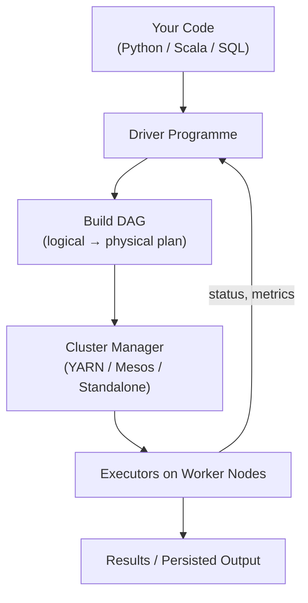
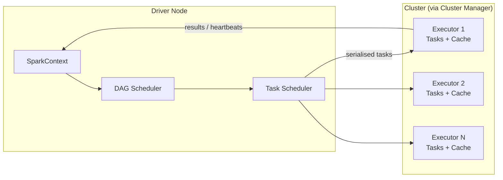
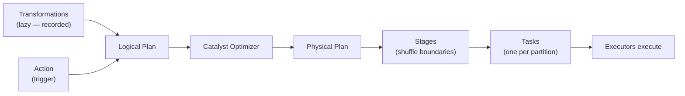

# Spark Execution Engine: Architecture Overview

## Why the Execution Model Matters

Writing Spark code is only half the story. The same logical pipeline can run in seconds or hours depending on how Spark **plans, schedules, and executes** work across a cluster. This module moves from "what is an RDD" to **how Spark turns your code into a high-performance distributed machine**.

Three questions drive everything that follows:

1. **Why does Spark wait** before running transformations?
2. **What makes some operations slow** (shuffles) while others are fast (pipelined)?
3. **How does code become stages and tasks** that executors run in parallel?

---

## Module Objectives

| Objective | What You Will Master |
|-----------|---------------------|
| **Lazy evaluation** | Why Spark delays execution and how that enables global optimisation |
| **Narrow vs wide dependencies** | Which operations stay local vs trigger expensive shuffles |
| **DAG and stage decomposition** | How the driver builds a plan and breaks it into parallel tasks |

Core concepts: **lazy evaluation**, **dependencies**, and the **DAG (Directed Acyclic Graph) with stages**.

---

## The Spark Execution Engine

The execution engine is the **central nervous system** of a Spark application. It coordinates work across the entire cluster, transforming high-level Python, Scala, or SQL into a **physical execution plan**.

---

## Three Primary Components

### 1. Driver Programme (The Conductor)

- Hosts the **SparkContext** (or SparkSession in unified APIs).
- Orchestrates the entire job lifecycle.
- Builds the **DAG** — the master plan of transformations and dependencies.
- Converts actions into stages and tasks; monitors progress and handles failures.
- Runs on a single machine (often called the "driver node") — **not** where bulk data processing happens.

### 2. Cluster Manager (The Resource Broker)

- Allocates **CPU, memory, and executors** across the cluster.
- Options: **YARN** (Hadoop ecosystem), **Mesos**, **Kubernetes**, or Spark's **Standalone** mode.
- Does not understand Spark logic — it only provides hardware slots when the driver requests them.

### 3. Executors (The Workers)

- JVM processes on individual cluster nodes.
- Execute **tasks** (the smallest units of work).
- Store **cached** RDD/DataFrame partitions in memory or on disk.
- Report results and metrics back to the driver.

---

## Component Responsibilities at a Glance

| Component | Role | Analogy |
|-----------|------|---------|
| **Driver** | Plan, schedule, coordinate, recover | Orchestra conductor |
| **Cluster Manager** | Allocate cores and RAM | Venue manager assigning stages |
| **Executor** | Run tasks, hold cached data | Musicians playing their parts |

---

## The Execution Pipeline (Preview)

The full pipeline this module unpacks:

Transformations are recorded lazily. An **action** triggers optimisation, stage construction, task dispatch, and parallel execution.

---

## Common Pitfalls / Exam Traps

- **Confusing driver with workers** — the driver plans and coordinates; executors do the heavy data processing. Putting `collect()` on huge data overwhelms the **driver**, not executors.
- **Thinking the cluster manager runs Spark logic** — it only allocates resources; the driver owns the DAG.
- **Assuming one executor equals one node** — a node can run multiple executors depending on configuration.
- **Skipping execution-model knowledge for "just write map/filter"** — performance bottlenecks (shuffles) are invisible without understanding dependencies and stages.
- **Mixing up DAG Scheduler and Task Scheduler** — DAG Scheduler cuts stages at shuffle boundaries; Task Scheduler assigns tasks within stages to executors.

---

## Quick Revision Summary

- This module covers Spark's **execution model**: lazy evaluation, dependencies, DAG, stages, and tasks.
- The **driver** hosts SparkContext, builds the DAG, and orchestrates the job.
- The **cluster manager** (YARN/Mesos/Standalone/K8s) allocates CPU and RAM.
- **Executors** run tasks, cache data, and report back to the driver.
- The engine transforms high-level code into a **physical execution plan** executed in parallel.
- Three core learning goals: **lazy evaluation**, **narrow vs wide dependencies**, **DAG/stage decomposition**.
- Understanding architecture is prerequisite to diagnosing slow jobs and shuffle bottlenecks.
