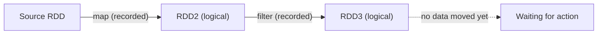
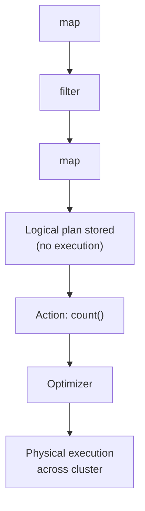

# Lazy Evaluation: Why Spark Waits

## The Surprising First Experience

Run a chain of Spark transformations — `map`, `filter`, `flatMap` on a large dataset — and the console returns almost instantly. No fan spin, no progress bar, no cluster activity. This is **lazy evaluation** in action: Spark has not touched your data yet.

Understanding laziness is essential because it explains both Spark's speed and its mental model. Transformations build a **recipe**; something else must order the kitchen to start cooking.

---

## 1. The Core Concept: Record, Don't Execute

In Spark, **transformations are not executed immediately**.

When you call:

```python
rdd2 = rdd1.map(lambda x: x.lower())
rdd3 = rdd2.filter(lambda x: len(x) > 3)
```

Spark does **not** read data, apply `map`, or apply `filter`. It **records** these operations as steps in a **lineage graph** — a **logical plan** describing what to do when execution finally happens.



### Restaurant Analogy

You tell the waiter: appetiser, main course, dessert. The kitchen does **not** start cooking after the first item. It waits for the **complete order** so it can coordinate timing, shared prep, and oven space. Spark waits for the full transformation chain (plus an action) before touching data.

---

## 2. What Triggers Execution: Actions

If transformations are the recipe, **actions** are the order to serve.

**Actions** are operations that either:
- Return a result **to the driver** (`count`, `collect`, `take`, `reduce`), or
- **Write data** to external storage (`saveAsTextFile`, `save`, etc.)

The moment an action is invoked:

1. The **driver** reads the accumulated logical plan (lineage).
2. The **Catalyst optimizer** (for DataFrame/SQL) converts it into a **physical execution plan**.
3. The **DAG Scheduler** splits the plan into **stages** at shuffle boundaries.
4. **Tasks** are serialised and sent to **executors** for parallel execution.



---

## 3. Why Wait? Global Optimisation

Eager systems (execute each step immediately, often spilling to disk between steps) cannot see the full pipeline. Spark's delay enables **whole-program optimisation**.

### Predicate Pushdown Example

```python
# Written in this order:
raw = sc.textFile("hdfs://data/logs/")
parsed = raw.map(parse_line)
filtered = parsed.filter(lambda r: r["status"] == "ERROR")
result = filtered.count()
```

Spark can **push the filter earlier** — even toward the read stage — so irrelevant rows are never loaded or parsed. An eager engine might parse every line first because `filter` comes after `map` in the script.

| Eager execution | Lazy execution |
|-----------------|----------------|
| Step 1 runs → materialise → Step 2 runs | Entire chain visible before any step runs |
| Local optimisations only | Global reordering, fusion, pushdown |
| Often repeated disk I/O | Pipelining in memory where possible |

---

## 4. Transformations vs Actions (Quick Reference)

| Type | Examples | Executes immediately? | Output |
|------|----------|----------------------|--------|
| **Transformation** | `map`, `filter`, `flatMap`, `join`, `groupByKey` | No — lazy | New RDD/DataFrame |
| **Action** | `count`, `collect`, `take`, `save`, `reduce` | Yes — triggers job | Value or side effect |

**Exam rule:** If it returns an RDD/DataFrame, it is (almost always) lazy. If it returns a scalar, collection to driver, or writes out, it is an action.

---

## Common Pitfalls / Exam Traps

- **Expecting immediate feedback after transformations** — nothing runs until an action; "instant" return means the plan was recorded, not executed.
- **Calling multiple actions on the same pipeline without caching** — each action **re-executes** the entire lineage from scratch unless you `cache()` or `persist()`.
- **Using `collect()` for debugging on large data** — actions that pull data to the driver can OOM; use `take(5)` instead.
- **Confusing lazy with "Spark is slow to start"** — laziness is strategic delay for optimisation, not startup overhead.
- **Assuming Catalyst runs on RDD API** — classic RDD transformations build lineage; Catalyst optimises Spark SQL / DataFrame logical plans (both share the lazy action-trigger model).

---

## Quick Revision Summary

- **Lazy evaluation**: transformations are **recorded**, not executed immediately.
- Spark builds a **logical plan** (lineage/recipe) while you chain transformations.
- **Actions** (`count`, `collect`, `save`, etc.) trigger conversion to a physical plan and cluster execution.
- Laziness enables **global optimisation** — predicate pushdown, filter reordering, join strategy selection.
- Analogy: complete order before cooking, not dish-by-dish on partial orders.
- Without an action, Spark holds an "unfulfilled promise" — no cluster work occurs.
- Multiple actions without caching can **recompute** the full pipeline each time.
