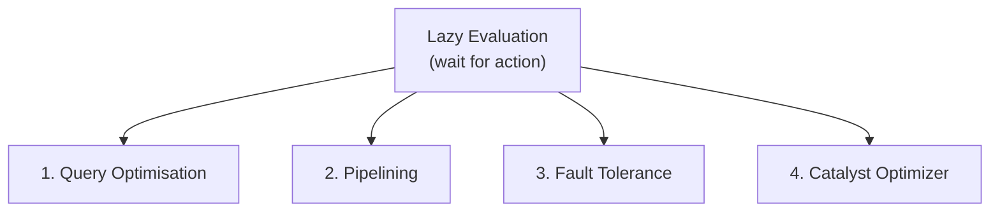
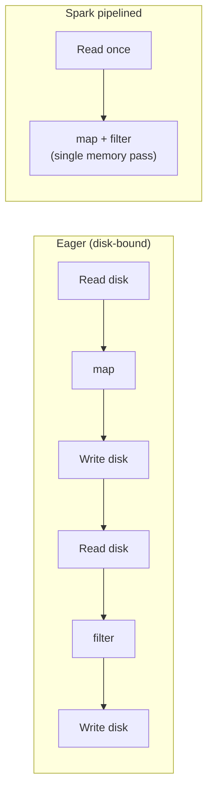
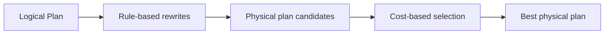

# Benefits of Lazy Evaluation: Optimisation and Pipelining

## Why Laziness Beats Eagerness

Lazy evaluation is not procrastination — it is a **deliberate architectural choice** that unlocks four optimisation pillars impossible in naive eager systems. Each pillar exists **because** Spark waits until an action before executing.

---

## Four Pillars of Spark Optimisation

---

## Pillar 1: Query Optimisation

Because Spark sees the **entire logical plan** before execution, it can reorder and simplify operations globally.

**Example scenario:** You join two 1 TB tables but only need 3 columns from each, with a filter applied late in the script.

| Without global view | With lazy global view |
|---------------------|----------------------|
| Join full wide rows → then filter | Push filter **before** join → smaller shuffle |
| Shuffle billions of columns | Shuffle only needed columns/rows |

Optimisations include:
- **Filter pushdown / predicate pushdown** — apply filters as early as possible.
- **Projection pruning** — read only required columns (especially in Parquet/ORC).
- **Join reordering** — pick smaller/build side for broadcast joins when beneficial.

This is **smart execution**: the written order of your code is not necessarily the executed order.

---

## Pillar 2: Pipelining

In traditional eager MapReduce-style systems, each transformation often **writes intermediate results to disk**, then the next step reads them back — read-map-write-read-filter-write.

Spark **fuses** multiple **narrow** transformations into a **single in-memory pass** within one stage:

**Result:** Eliminates unnecessary I/O. A chain of `map` → `filter` → `map` on the same partition runs as one fused iterator pipeline — data flows through without materialising intermediate RDDs to disk.

Rough speedup intuition: if eager execution takes $T_{\text{eager}} = \sum_i (\text{read}_i + \text{compute}_i + \text{write}_i)$, pipelining collapses many read/write pairs into one read and one write per stage boundary.

---

## Pillar 3: Fault Tolerance via Lineage

Lazy recording stores not just data pointers but the **full recipe** (lineage) to recreate any partition.

On worker failure:
1. Identify lost partition(s).
2. Walk lineage to nearest reliable source (HDFS block, checkpoint, cached parent).
3. **Recompute only** the lost partition(s).

| Checkpointing (traditional) | Lineage (Spark) |
|----------------------------|-----------------|
| Periodically snapshot full state to disk | Store transformation graph metadata |
| Recovery = restore snapshot | Recovery = re-run lost slice of graph |
| High storage I/O | Low metadata overhead; pay recompute cost on failure |

This pairs naturally with laziness: the plan always knows **how** to rebuild any partition without maintaining redundant copies of every intermediate.

---

## Pillar 4: Catalyst Optimizer

**Catalyst** is Spark's rule-based and cost-based optimizer engine (primary for Spark SQL / DataFrame API). It:

1. Takes the **logical plan** built from your API calls or SQL.
2. Applies rewrite rules (constant folding, predicate pushdown, etc.).
3. Generates multiple **candidate physical plans**.
4. Selects the most efficient strategy (e.g., broadcast hash join vs sort-merge join).

You do not manually reorder joins and filters — Catalyst explores the search space automatically.

---

## Combined Impact

| Pillar | Primary savings |
|--------|----------------|
| Query optimisation | Less data shuffled and processed |
| Pipelining | Less disk I/O per stage |
| Fault tolerance | Cheaper recovery than full replication |
| Catalyst | Automatic join/filter ordering and strategy pick |

Together, lazy evaluation transforms Spark from a **step-by-step executor** into an **intelligent optimiser** that treats your script as a whole program.

---

## Common Pitfalls / Exam Traps

- **Assuming pipelining applies across shuffles** — pipelining works **within** a stage (narrow deps only); wide deps break the pipeline.
- **Thinking lineage eliminates all recovery cost** — long lineage chains make recomputation expensive; `cache()` or `checkpoint()` may be needed.
- **Believing Catalyst optimises all RDD code equally** — Catalyst is central to DataFrame/SQL; RDD API gets lineage and pipelining but not the full Catalyst rule set.
- **Confusing lazy with "no work until the very end"** — optimisation happens at action time; the plan is compiled then, not incrementally per line at runtime.
- **Ignoring that filter-after-join in code may not execute that way** — exam questions often test whether you know Spark can reorder operations.

---

## Quick Revision Summary

- Lazy evaluation enables **four optimisation pillars**: query optimisation, pipelining, fault tolerance, Catalyst.
- **Query optimisation**: bird's-eye view → push filters early, prune columns, reorder joins.
- **Pipelining**: fuse narrow transforms → single in-memory pass, no intermediate disk writes.
- **Fault tolerance**: lineage stores the recipe → recompute lost partitions only.
- **Catalyst**: automates logical → physical plan selection for DataFrame/SQL workloads.
- Pipelining stops at **shuffle boundaries** (wide dependencies).
- Spark delays execution to optimise globally, not to defer work arbitrarily.
