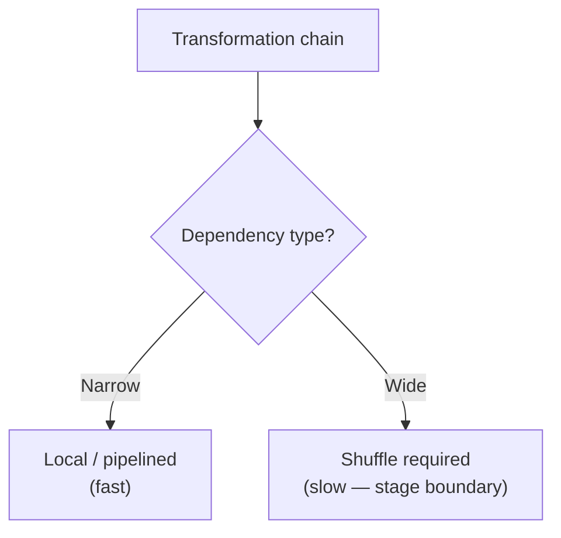
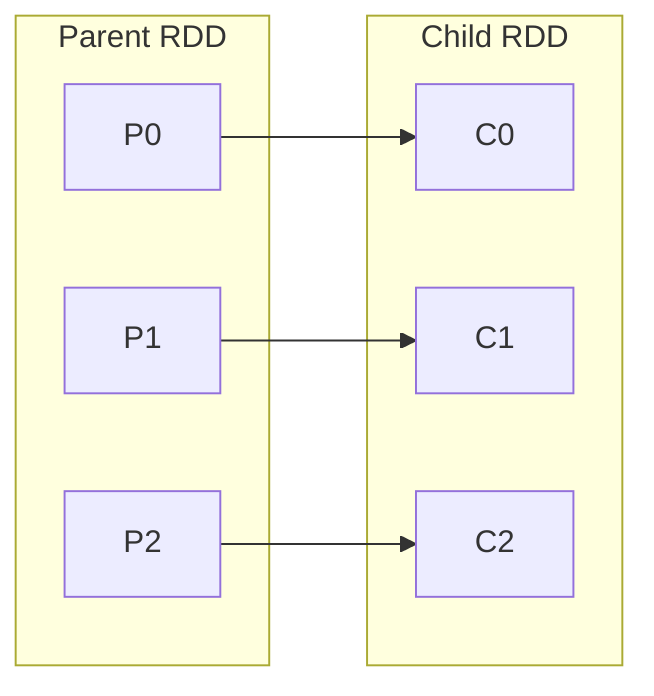
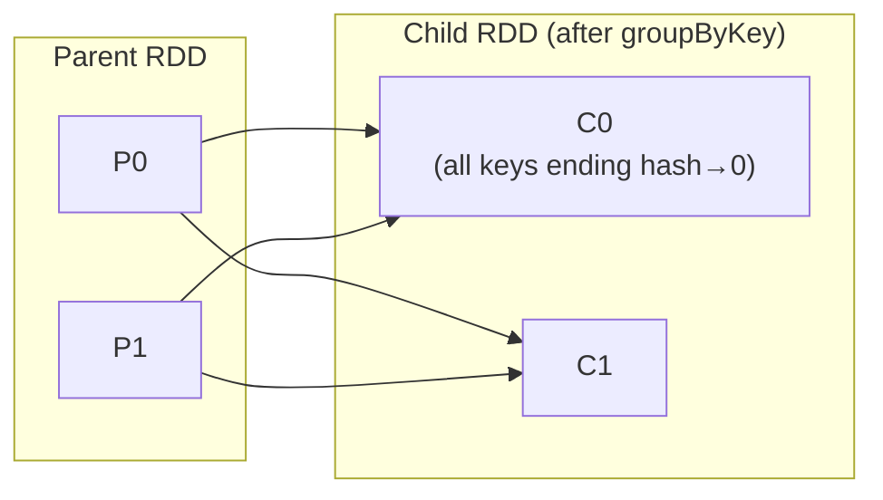

# Narrow vs Wide Dependencies: The Performance Skeleton

## Why Dependencies Dictate Performance

When you chain transformations, each parent RDD connects to child RDDs through **dependencies**. The dependency type — **narrow** or **wide** — is the single most important predictor of job performance because it determines whether data stays local or must be **shuffled** across the network.



---

## 1. Narrow Dependencies

In a **narrow dependency**, each partition of the parent RDD contributes to **at most one** partition of the child RDD.

Relationship patterns:
- **One-to-one**: `map`, `filter`, `flatMap` — each parent partition maps to exactly one child partition.
- **Many-to-one**: `union` — multiple parent partitions may feed one child, but no parent partition splits across multiple children.



**Properties:**
- No **shuffle** — all required data is already in the parent partition.
- Operations can be **pipelined** in a single memory sweep.
- Tasks run in parallel, one per partition, with minimal network I/O.

| Operation | Dependency | Shuffle? |
|-----------|------------|----------|
| `map` | Narrow (1:1) | No |
| `filter` | Narrow (1:1) | No |
| `flatMap` | Narrow (1:1) | No |
| `mapPartitions` | Narrow (1:1) | No |
| `union` | Narrow (many:1) | No |

---

## 2. Wide Dependencies

In a **wide dependency**, a single parent partition may be needed by **multiple** child partitions. Spark must **redistribute** data so related records (typically sharing a key) land on the same node.



The cross-partition pattern (one parent → many children) forces a **shuffle**: data is serialized, written to local disk buffers, transferred over the network, and read by receiving tasks.

| Operation | Why wide? | Shuffle? |
|-----------|-----------|----------|
| `groupByKey` | All values for a key must colocate | Yes |
| `reduceByKey` | Aggregations require key colocation | Yes |
| `join` | Matching keys must be on same partition | Yes |
| `distinct` | Global dedup requires redistribution | Yes |
| `repartition(n)` | Explicit reshuffle | Yes |

**Cost components of a shuffle:**
- Disk I/O (shuffle write/read files)
- Network bandwidth
- Serialization/deserialization overhead
- Potential skew if keys are unevenly distributed

---

## 3. Shuffle Boundaries and Stages

Every **wide dependency** creates a **shuffle boundary** — the point where one **stage** ends and the next begins.

```mermaid
flowchart LR
    subgraph Stage1["Stage 1 (pipelined)"]
        READ["textFile"] --> MAP["map"]
        MAP --> FILT["filter"]
    end
    FILT --> SHUFFLE["Shuffle\n(wide dep boundary)"]
    SHUFFLE --> subgraph Stage2["Stage 2"]
        RED["reduceByKey"]
    end
    RED --> ACT["count() action"]
```

**Execution flow:**
1. **Narrow transformations** queue up in the lineage within one stage.
2. **Wide dependency** encountered → Spark stops, shuffles data, starts new stage.
3. Stages decompose into **tasks** (one per partition) scheduled on executors.

Think of stages as "everything we can do locally before we must talk to the network."

---

## 4. Narrow vs Wide Comparison

| Aspect | Narrow | Wide |
|--------|--------|------|
| Parent → child partitions | ≤ 1 child per parent partition | 1 parent → many children possible |
| Network traffic | Minimal | High (shuffle) |
| Pipelining | Yes, within stage | Breaks pipeline |
| Stage boundary | No | Yes |
| Performance tuning priority | Low | **High — primary bottleneck** |
| Examples | `map`, `filter`, `union` | `groupByKey`, `join`, `repartition` |

---

## 5. Performance Tuning Intuition

**Prefer narrow chains where possible.** When you must shuffle:
- Use `reduceByKey` instead of `groupByKey` + map (combines locally before shuffle).
- Filter **before** wide operations to reduce shuffle volume.
- Avoid unnecessary `repartition` calls.
- Watch for **data skew** after shuffles (covered in later modules).

---

## Common Pitfalls / Exam Traps

- **Calling `groupByKey` when `reduceByKey` suffices** — `groupByKey` shuffles all values; `reduceByKey` pre-aggregates locally first.
- **Assuming `union` causes a shuffle** — `union` is narrow; no redistribution (but may produce uneven partition sizes).
- **Thinking all joins are equal cost** — join type and size determine broadcast vs sort-merge shuffle strategies.
- **Missing that every wide dep = new stage** — exam questions often ask how many stages a pipeline has.
- **Confusing partition count change with shuffle** — `coalesce` (narrow, reduces partitions) vs `repartition` (wide, always shuffles).

---

## Quick Revision Summary

- **Narrow dependency**: each parent partition feeds at most one child partition — **no shuffle**, pipelined.
- **Wide dependency**: parent data needed by multiple children — **shuffle required**, new stage boundary.
- Examples narrow: `map`, `filter`, `flatMap`, `union`.
- Examples wide: `groupByKey`, `reduceByKey`, `join`, `repartition`.
- Shuffles are expensive: disk I/O + network + serialization.
- Wide dependencies are the **primary performance boundaries** to watch in tuning.
- Stage = maximal pipeline between shuffle boundaries.
