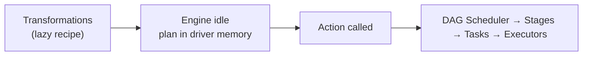
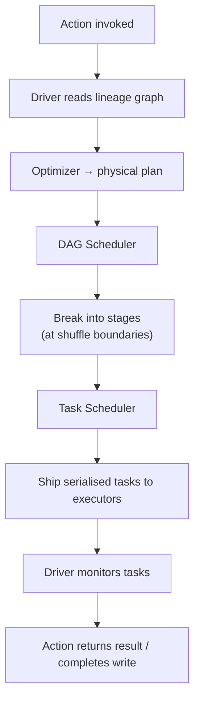

# Actions: Triggering Execution

## The Ignition Switch

Transformations build the plan lazily — a growing lineage graph stored in the driver's memory. But a plan that never runs produces no value. **Actions** are the **spark plug**: they tell Spark to stop recording and start executing.

Without an action, the engine idles. With an action, the full pipeline — optimisation, stage construction, task dispatch — fires in one coordinated burst.



---

## 1. What Is an Action?

An **action** is any operation that either:

1. **Returns a value to the driver programme**, or
2. **Writes data to external storage**

This distinguishes actions from transformations, which only produce a **new RDD/DataFrame** (another lazy node in the graph).

### Common Actions

| Action | Returns to driver? | Writes externally? | Typical use |
|--------|-------------------|-------------------|-------------|
| `count()` | Yes (integer) | No | Row/record count |
| `collect()` | Yes (full dataset) | No | **Dangerous at scale** |
| `take(n)` | Yes (n rows) | No | Safe sampling |
| `first()` | Yes (one row) | No | Peek at data |
| `reduce(func)` | Yes (aggregated value) | No | Global aggregate |
| `saveAsTextFile(path)` | No | Yes (HDFS/S3/local) | Production output |
| `save(path)` | No | Yes (Parquet, etc.) | Structured export |
| `foreach(func)` | No | Side effect per row | External writes per record |

---

## 2. What Happens When an Action Runs

The lazy period ends. The driver executes this sequence:



1. **Lineage graph** handed to the DAG Scheduler.
2. **Shuffle boundaries** (wide dependencies) define stage cuts.
3. Each stage splits into **tasks** (typically one task per partition).
4. Tasks are **serialised** and sent to executor JVMs.
5. Executors run tasks in parallel; driver tracks completion and handles retries on failure.

---

## 3. Transformations vs Actions

| | Transformations | Actions |
|---|----------------|---------|
| **Execution** | Lazy — recorded only | Eager — triggers job |
| **Return type** | New RDD/DataFrame | Scalar, collection, or Unit (write) |
| **Cluster work** | None until action | Full pipeline executes |
| **Examples** | `map`, `filter`, `join` | `count`, `collect`, `save` |

**Mnemonic:** Transformations define the **path**; actions **start the journey**.

---

## 4. Strategic Action Placement in Production

Because actions trigger the **entire** engine, placement matters:

### Avoid `collect()` on large datasets

`collect()` pulls **all** partitions to the driver JVM. A 100 GB result will exhaust driver memory → OOM crash.

**Safer alternatives:**
- `take(10)` for inspection
- `save()` to distributed storage for full output
- Aggregations (`count`, `reduce`) that return small results

### Prefer distributed writes

End pipelines with `save` / `saveAsTextFile` rather than collecting and writing locally. Keep data distributed through the last mile.

### Multiple actions = multiple jobs (without cache)

Each action re-executes lineage from scratch unless intermediate RDDs are `cache()`'d or `persist()`'d.

```python
rdd = sc.textFile("hdfs://big-data/").map(...).filter(...)
rdd.cache()          # materialise after first action
rdd.count()          # Job 1 — computes and caches
rdd.saveAsTextFile() # Job 2 — reads from cache, not full recompute
```

---

## Common Pitfalls / Exam Traps

- **Debugging with `collect()` on production-scale data** — classic driver OOM cause.
- **Assuming transformations show data** — you need an action (or `show()` on DataFrames) to see results.
- **Chaining many actions without caching** — redundant full recomputation each time.
- **Confusing `foreach` with lazy** — `foreach` is an action; it executes immediately.
- **Thinking one action = one task** — one action triggers a **job** containing multiple **stages** and **tasks**.

---

## Quick Revision Summary

- **Actions** trigger execution; transformations alone keep the engine idle.
- Actions return values to the driver (`count`, `collect`, `take`) or write externally (`save`).
- On action: driver → DAG Scheduler → stages → tasks → executors.
- Transformations = path; actions = ignition.
- Never `collect()` massive datasets — use `take`, `save`, or aggregates.
- Production pipelines typically end with **save**, not collect.
- Multiple actions without cache cause **full lineage recomputation** each time.
