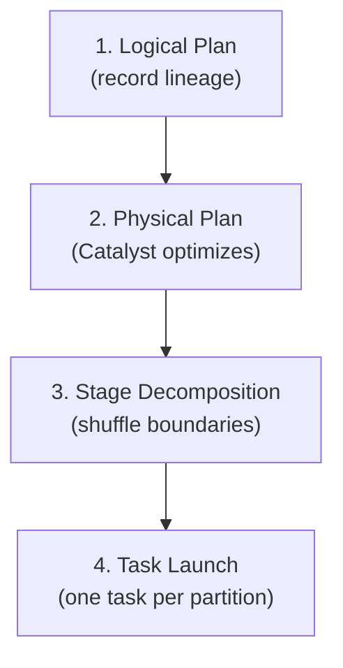
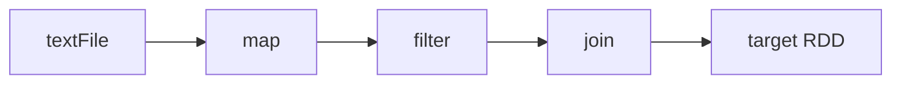
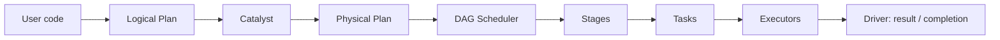

# Building the Directed Acyclic Graph (DAG)

## The Master Plan

While transformations accumulate lazily, Spark constructs an internal **master plan** — the **Directed Acyclic Graph (DAG)**. This graph is the blueprint that turns your high-level code into parallel work on a cluster.

**Directed:** data and dependencies flow in one direction (sources → transformations → actions).

**Acyclic:** no loops — you cannot have circular dependencies between RDDs. Each node is computed from its ancestors, never from its descendants.

---

## Four-Step Plan Construction



---

## Step 1: Logical Plan

When you write Python, Scala, or SQL, Spark parses it into an **abstract representation of operations** — not lines of text, but a tree/graph of what you want to compute.

At this stage:
- Spark knows **what** operations to apply (`map`, `filter`, `join`, etc.).
- It records **lineage**: the sequence of transformations from source to result.
- It has **not** decided **how** to execute (which join algorithm, which read strategy).



The logical plan is the "intent layer" — pure semantics, no hardware binding yet.

---

## Step 2: Physical Plan (Catalyst Optimizer)

The **Catalyst optimizer** converts the logical plan into a **physical execution plan** — a concrete blueprint specifying:

- Which **algorithms** to use (broadcast hash join vs sort-merge join).
- How **data will be accessed** (column pruning, partition filtering).
- Optimal **operator ordering** (filters before joins, etc.).

Catalyst may generate **multiple candidate physical plans**, estimate costs, and pick the most efficient route.

| Logical plan says | Physical plan decides |
|-------------------|----------------------|
| "Join tables A and B" | Broadcast small B vs shuffle both sides |
| "Filter where status=ERROR" | Push filter to Parquet reader |
| "Select 3 columns" | Skip reading other columns |

Output: a specific, hardware-aware blueprint ready for scheduling.

---

## Step 3: Stage Decomposition (DAG Scheduler)

The **DAG Scheduler** receives the physical plan and **splits it into stages** using shuffle boundaries.

**Rule:** Everything between two wide dependencies (shuffles) becomes **one stage**.

Within a stage:
- Narrow transformations are **pipelined** together.
- Data stays in memory as long as possible before network movement.

```mermaid
flowchart TB
    subgraph S1["Stage 0"]
        A1["Read"] --> A2["map"] --> A3["filter"]
    end
    A3 --> SH["Shuffle"]
    SH --> subgraph S2["Stage 1"]
        B1["reduceByKey"]
    end
    S2 --> subgraph S3["Stage 2"]
        C1["map (format output)"]
    end
```

Why stages matter: tasks within a stage can fuse operations; crossing a stage always implies shuffle I/O.

---

## Step 4: Task Launch

Each stage is divided into **tasks** — the **smallest unit of work** in Spark.

- Typically **one task per partition** in that stage.
- Each task runs a specific set of transformations on one data slice.
- Tasks are **serialised** and shipped to **executors**.
- The **driver monitors** task completion, retries failed tasks, and reports stragglers.

$\text{Tasks in stage} \approx \text{number of partitions processed in that stage}$

When all tasks for all stages complete, the **action** returns its result (count, saved files, collected sample, etc.).

---

## End-to-End Flow



---

## DAG Properties and Implications

| Property | Implication |
|----------|-------------|
| Directed | Clear data flow from sources to sinks |
| Acyclic | No infinite recomputation loops; lineage is a DAG |
| Lazy construction | Graph grows with each transformation; executed only on action |
| Shuffle cuts stages | Number of wide deps ≈ number of stage boundaries |

---

## Common Pitfalls / Exam Traps

- **Confusing logical and physical plans** — logical = what; physical = how.
- **Thinking the DAG executes incrementally per transformation** — the DAG is built lazily but **run** only when an action fires.
- **Assuming one stage = one job** — a single job (one action) can contain **multiple stages**.
- **Forgetting tasks are partition-scoped** — doubling partitions roughly doubles tasks (and scheduling overhead).
- **DAG vs lineage** — lineage is the RDD-level dependency graph; the execution DAG includes stage/task scheduling view derived from it.

---

## Quick Revision Summary

- The **DAG** is Spark's master execution plan: directed, acyclic, built during lazy transformation recording.
- **Step 1 — Logical plan**: record operations and lineage (what to compute).
- **Step 2 — Physical plan**: Catalyst picks algorithms and access patterns (how to compute).
- **Step 3 — Stages**: DAG Scheduler splits at **shuffle boundaries** (wide dependencies).
- **Step 4 — Tasks**: one task per partition per stage, shipped to executors.
- Stages enable **pipelining** of narrow ops; shuffles **break** stages.
- Driver monitors tasks until the action completes.
