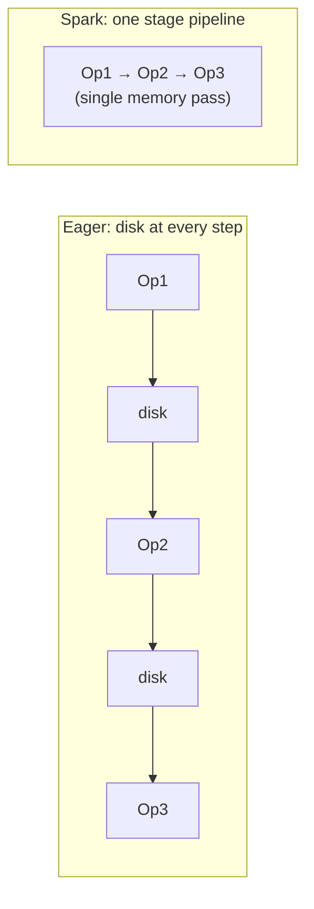

# Breaking the DAG into Stages and Tasks

## From Graph to Parallel Work

The DAG is an abstract plan. To run on hardware, Spark must decompose it into **stages** (shuffle-separated pipeline chunks) and **tasks** (partition-sized units of work). This decomposition is what converts a lazy graph into thousands of parallel operations across executors.

---

## 1. Lazy vs Eager: Why Decomposition Matters

| Aspect | Eager execution | Spark lazy + staged execution |
|--------|-----------------|------------------------------|
| Intermediate results | Written to disk after each step | Pipelined in memory within a stage |
| I/O pattern | Read-write-read-write per operation | Read once per stage, write at shuffle boundary |
| Global optimisation | Not possible | Full plan visible before execution |
| Typical runtime (illustrative) | ~100 s for multi-step ETL | ~30 s with pipelining (3×+ speedup possible) |

Speedup factor intuition:

$\text{Speedup} \approx \frac{T_{\text{eager (disk-bound)}}}{T_{\text{Spark (pipelined)}}}$

Performance gains come primarily from **minimising data movement** — both disk I/O and network shuffles.



---

## 2. Three Operation Categories

Every Spark command falls into one of three categories. How each interacts with the DAG determines performance.

### Category A: Narrow Transformations

| Property | Value |
|----------|-------|
| Examples | `map`, `filter`, `flatMap`, `mapPartitions` |
| Lazy? | Yes — recorded, not executed |
| DAG impact | Pipelined into **current stage** |
| Network | None — stays local to partition |
| Efficiency | **High** — fused in-memory |

### Category B: Wide Transformations (Wide Dependencies)

| Property | Value |
|----------|-------|
| Examples | `reduceByKey`, `groupByKey`, `join`, `repartition` |
| Lazy? | Yes — recorded, not executed |
| DAG impact | Creates **shuffle boundary** → **new stage** |
| Network | **Heavy** — cross-node redistribution |
| Efficiency | **Lower** — pipeline stops, data moves |

```mermaid
flowchart TB
    subgraph Stage0["Stage 0 — narrow ops pipelined"]
        M["map"] --> F["filter"] --> FM["flatMap"]
    end
    FM --> SH["SHUFFLE\n(stage boundary)"]
    SH --> subgraph Stage1["Stage 1"]
        RBK["reduceByKey"]
    end
```

### Category C: Actions

| Property | Value |
|----------|-------|
| Examples | `count`, `collect`, `save`, `take` |
| Lazy? | **No — immediate trigger** |
| DAG impact | Forces optimisation + full execution |
| Role | **Go signal** for the entire DAG |

---

## 3. Stage Construction Rules

The DAG Scheduler applies these rules:

1. Start a new stage at each **wide dependency** (shuffle).
2. **Fuse** all consecutive narrow transformations between shuffles into one stage.
3. Source reads (e.g., `textFile`) begin Stage 0 unless pushed down by optimizer.
4. The action runs after the final stage completes.

**Counting stages (exam technique):** Count wide dependencies in the pipeline. Typically:

$\text{Number of stages} = \text{Number of shuffle boundaries} + 1$

(Adjust if multiple shuffles are consecutive or if certain operators combine.)

---

## 4. Task Construction Rules

Within each stage:

- **One task per partition** (in most cases).
- Each task executes the same transformation code on a different data slice.
- Tasks in the same stage can run **fully in parallel** (limited by available cores).
- Tasks in later stages wait for **all** tasks in the prior stage to finish (barrier at shuffle).

```mermaid
flowchart TB
    subgraph Stage1["Stage 1: 4 partitions → 4 tasks"]
        T1["Task 1\nPartition 0"]
        T2["Task 2\nPartition 1"]
        T3["Task 3\nPartition 2"]
        T4["Task 4\nPartition 3"]
    end
    Stage1 --> SH["Shuffle barrier\n(all tasks must finish)"]
    SH --> subgraph Stage2["Stage 2: 4 tasks"]
        T5["Task 5"]
        T6["Task 6"]
        T7["Task 7"]
        T8["Task 8"]
    end
```

---

## 5. Operation Summary Table

| Operation type | Lazy? | Creates shuffle? | New stage? | Parallelism |
|----------------|-------|------------------|------------|-------------|
| `map`, `filter` | Yes | No | No | Per partition |
| `reduceByKey`, `join` | Yes | Yes | Yes | Per partition post-shuffle |
| `count`, `save` | No (action) | Depends on pipeline | Triggers all | Orchestrates full job |

---

## 6. Designing Performant Jobs

Use the hierarchy **narrow ops → wide ops → action** deliberately:

1. **Filter early** (narrow, cheap) before joins or group-bys (wide, expensive).
2. **Minimise stage count** where logically possible — each shuffle is a full cluster sync.
3. **Right-size partitions** — too many tasks → scheduling overhead; too few → idle cores.
4. **Inspect the Spark UI** — Stages tab shows shuffle read/write sizes and task duration skew.

---

## Common Pitfalls / Exam Traps

- **Assuming all lazy ops are equal cost** — narrow lazy ops are cheap to record; wide lazy ops imply future expensive shuffles.
- **Forgetting shuffle barrier synchronisation** — one slow task in Stage 0 delays all of Stage 1 (straggler problem).
- ** miscounting stages** — `map → filter → reduceByKey → map` = 2 stages, not 1 or 3.
- **Confusing tasks with stages** — a stage with 200 partitions may launch 200 tasks.
- **Multiple actions** — each action submits a new job with its own stage/task breakdown (unless cached).

---

## Quick Revision Summary

- Spark decomposes the DAG into **stages** (at shuffles) and **tasks** (per partition).
- **Eager** systems spill to disk each step; Spark **pipelines** narrow ops within a stage.
- Three categories: **narrow transforms** (pipelined), **wide transforms** (shuffle + new stage), **actions** (trigger).
- Wide deps stop the pipeline, redistribute data, and start a fresh stage.
- Tasks are the smallest work units; parallel count ≈ partition count per stage.
- Design jobs: filter early, minimise shuffles, tune partitions, read the Spark UI.
- Actions are the **go signal** that optimises and executes the entire DAG.
