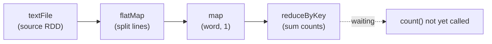
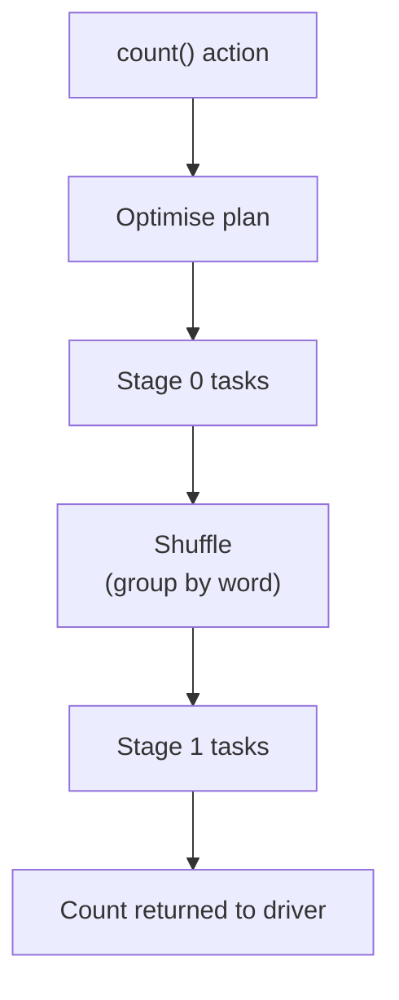
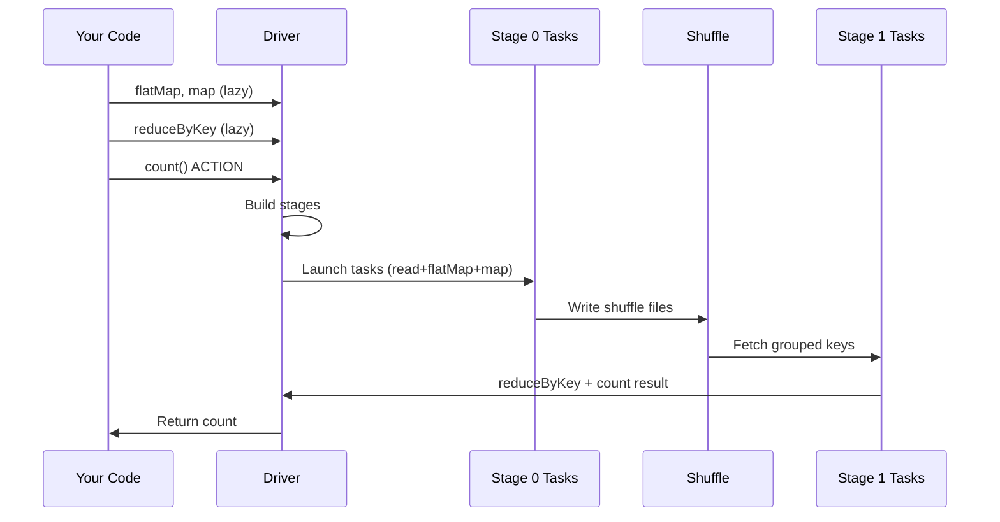

# Coding Walkthrough: Tracing a Job from Code to Tasks

## From Lines of Code to Cluster Execution

This walkthrough traces a classic **word count** pipeline — the "Hello World" of distributed computing — from the first line of code through DAG construction, stage boundaries, shuffle, and final task execution. The goal is to make the abstract execution model **concrete**.

---

## 1. The Word Count Pipeline

Typical PySpark word count logic:

```python
lines = sc.textFile("hdfs://data/input.txt")

words = lines.flatMap(lambda line: line.split(" "))

pairs = words.map(lambda w: (w, 1))

counts = pairs.reduceByKey(lambda a, b: a + b)

result = counts.count()   # action — triggers execution
```

Each line adds a node to the lineage graph. Nothing executes until `count()`.

---

## 2. Phase 1: Lazy DAG Construction

As transformations are registered, Spark **records** the DAG without running it.



| Step | Operation | Dependency type | Stage (when run) |
|------|-----------|-----------------|------------------|
| 1 | `textFile` | Source read | Stage 0 |
| 2 | `flatMap` | Narrow | Stage 0 (pipelined) |
| 3 | `map → (word, 1)` | Narrow | Stage 0 (pipelined) |
| 4 | `reduceByKey` | **Wide (shuffle)** | **Stage 1** |
| 5 | `count` | Action | Triggers both stages |

**Key insight:** `flatMap` and `map` are narrow — they chain in one pipeline. `reduceByKey` requires all values for the same key on one partition → **shuffle boundary**.

---

## 3. Phase 2: Action Triggers Execution

When `count()` is called:

1. Driver hands lineage to **DAG Scheduler**.
2. Optimizer produces physical plan.
3. Graph splits into **2 stages** separated by the shuffle before `reduceByKey`.
4. Tasks are created and dispatched to executors.



---

## 4. Stage 0: Read, Split, Pair (Narrow Pipeline)

**Tasks in Stage 0** (one per input partition):

1. Read assigned slice of `input.txt` from HDFS (data locality preferred).
2. `flatMap`: split each line into words.
3. `map`: emit `(word, 1)` pairs.

All three operations run in a **single fused pass** — no intermediate disk writes.

```
Partition 0 task: "hello world" → [("hello",1), ("world",1)]
Partition 1 task: "hello spark" → [("hello",1), ("spark",1)]
...
```

Output of Stage 0: key-value pairs still **partitioned by hash of key** inconsistently — `"hello"` pairs may sit on different nodes.

---

## 5. Shuffle Boundary (Wide Dependency)

Before `reduceByKey` can sum counts, Spark must **redistribute** so all pairs with the same key land on the same partition.

**Shuffle steps:**
1. **Shuffle write:** each Stage 0 task partitions output by key hash, writes to local shuffle files.
2. **Network transfer:** fetch requests move data to target executors.
3. **Shuffle read:** Stage 1 tasks read their key ranges.

```mermaid
flowchart LR
    subgraph NodeA["Node A"]
        A0["hello→1\nworld→1"]
    end
    subgraph NodeB["Node B"]
        B0["hello→1\nspark→1"]
    end
    A0 --> SH["Shuffle by key"]
    B0 --> SH
    SH --> subgraph NodeC["Node C (hash slot)"]
        C0["hello→1,1\nspark→1"]
    end
```

This is the **most expensive** phase of word count — disk I/O + network.

---

## 6. Stage 1: Reduce and Count

**Tasks in Stage 1:**

1. `reduceByKey`: merge values per key → `("hello", 2)`, `("world", 1)`, `("spark", 1)`.
2. `count` action: count rows across partitions (may involve a small second aggregation or sum of partition counts depending on implementation path).

Final result returned to driver: e.g., `3` distinct words (or total pair count depending on semantics — `count()` counts RDD elements after reduce).

---

## 7. Complete Execution Timeline



---

## 8. Generalising the Pattern

Any Spark job follows the same skeleton:

| Phase | What happens |
|-------|--------------|
| **Lazy build** | Each transform adds DAG nodes |
| **Action** | Optimise → stage split → task launch |
| **Stage N (narrow)** | Pipelined local transforms per partition |
| **Shuffle** | Wide dep redistributes data |
| **Stage N+1** | Post-shuffle transforms + action completion |

A "single code" word count already involves **multiple narrow deps, one wide dep, and two stages**. Real pipelines (joins + aggregations + filters) multiply stages accordingly.

---

## Common Pitfalls / Exam Traps

- **Drawing word count as one stage** — `reduceByKey` always introduces a shuffle stage boundary.
- **Placing shuffle before map in word count** — read → flatMap → map are all Stage 0; shuffle comes **before** reduce, not before map.
- **Assuming DAG executes as you type** — the graph **builds** as you type; it **runs** only at `count()`.
- **Ignoring where `"hello"` pairs merge** — exam questions may ask which operation causes cross-node data movement (answer: `reduceByKey`).
- **Confusing `groupByKey` + sum with `reduceByKey`** — walkthrough uses `reduceByKey` which pre-combines locally; `groupByKey` would shuffle more data.

---

## Quick Revision Summary

- Word count: `textFile → flatMap → map → reduceByKey → count(action)`.
- **Stage 0:** read + flatMap + map — all **narrow**, pipelined in one pass.
- **Shuffle** before reduceByKey — **wide dependency**, redistributes by key.
- **Stage 1:** reduceByKey + action completion logic.
- DAG grows lazily; **`count()`** is the trigger that executes the full plan.
- One simple script can already have **2 stages** and many parallel tasks.
- The shuffle is the performance bottleneck — not the map or flatMap.
