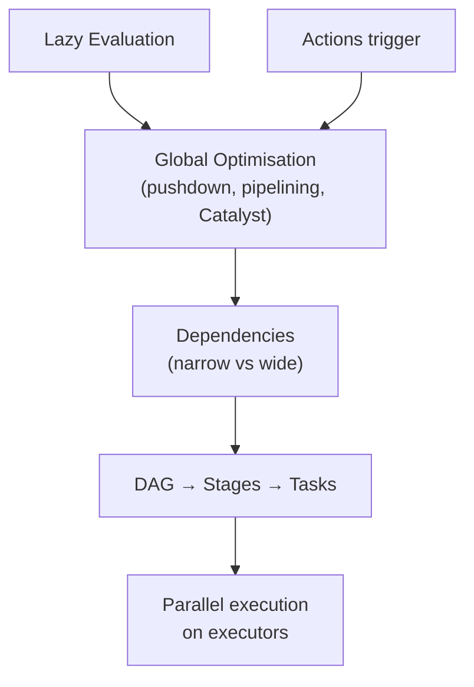
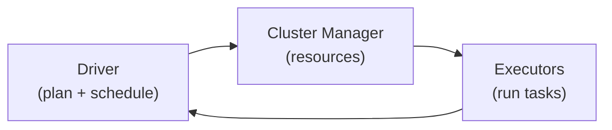

# Module Summary: Spark Execution Model

## Synthesising the Execution Engine

This module moved from writing Spark code to understanding **how Spark thinks** — delaying work, optimising globally, splitting plans at shuffles, and firing parallel tasks across a cluster. Spark is not merely a data processor; it is an **intelligent execution engine** that compiles your logic into an optimised distributed program.

---

## 1. Lazy Evaluation Philosophy

Spark does **not** execute line-by-line. Transformations are **recorded** until an **action** demands a result.

**Why laziness matters:**

| Capability | Enabled by laziness |
|------------|-------------------|
| Predicate pushdown | Filters moved near data source |
| Pipelining | Multiple narrow ops fused in one memory pass |
| Join strategy selection | Optimizer picks broadcast vs shuffle join |
| Whole-plan cost analysis | Catalyst compares physical plans |

Laziness transforms Spark from a naive executor into an **optimising compiler** for distributed data.

---

## 2. Anatomy of a Spark Job

### Driver as the Brain

- Hosts SparkContext / SparkSession.
- Builds **lineage** and the **DAG**.
- Runs DAG Scheduler and Task Scheduler.
- Monitors tasks, handles failures, returns action results.

### Cluster Manager and Executors

- **Cluster manager** allocates CPU/RAM (YARN, Mesos, Standalone, K8s).
- **Executors** run tasks, hold cached partitions, report to driver.

---

## 3. Dependencies: The Performance Map

| Type | Data movement | Stage boundary? | Examples |
|------|---------------|-----------------|----------|
| **Narrow** | Local only | No | `map`, `filter`, `flatMap`, `union` |
| **Wide** | Shuffle across network | **Yes** | `reduceByKey`, `join`, `groupByKey`, `repartition` |

**Wide dependencies are the most critical performance boundaries.** Each one forces Spark to:
1. Stop the current pipeline.
2. Redistribute data by key/partition scheme.
3. Begin a new stage.

Mastering narrow vs wide is the difference between **writing Spark code** and **engineering performant Spark jobs**.

---

## 4. DAG → Stages → Tasks Pipeline

| Layer | What it represents |
|-------|-------------------|
| **Logical plan** | What operations to apply (lineage) |
| **Physical plan** | How to apply them (algorithms, access paths) |
| **Stages** | Maximal pipelined chunks between shuffles |
| **Tasks** | One partition's worth of work in a stage |

**Actions** are the go signal: optimise the DAG, cut stages, launch tasks **now**.

---

## 5. Four Optimisation Pillars (Recap)

1. **Query optimisation** — reorder filters, prune columns, pick efficient joins.
2. **Pipelining** — eliminate intermediate disk I/O within stages.
3. **Fault tolerance** — lineage enables partition-level recomputation.
4. **Catalyst optimizer** — automated physical plan selection for DataFrame/SQL.

---

## 6. Word Count as the Canonical Example

Even minimal code exhibits the full model:

- **Lazy DAG build:** `textFile → flatMap → map → reduceByKey`
- **Two stages:** narrow pipeline, then shuffle, then reduce
- **Action trigger:** `count()` or `save` starts execution

Every `map`, `filter`, or `join` you write is a node in an optimised graph — not an isolated command.

---

## 7. What Comes Next

This module established Spark Core's execution mechanics. The next module deepens **Spark SQL and the Catalyst optimizer** — declarative queries, DataFrames, and advanced optimisation rules built on the same lazy action-triggered foundation.

---

## Common Pitfalls / Exam Traps

- **Treating Spark as eager** — transformations return instantly because nothing ran yet.
- **Underestimating shuffle cost** — wide deps dominate runtime in production jobs.
- **Driver OOM via `collect()`** — actions that pull full datasets to the driver ignore executor scale.
- **Ignoring stage count in exam questions** — count shuffles + 1 for stages in simple pipelines.
- **Re-running expensive pipelines** — multiple actions without `cache()`/`persist()` recompute from scratch.
- **Assuming RDD API gets full Catalyst benefits** — Catalyst is richest for Spark SQL / DataFrame.

---

## Quick Revision Summary

- Spark **waits for actions** before executing — laziness enables global optimisation.
- **Driver** builds lineage/DAG; **executors** run tasks; **cluster manager** allocates resources.
- **Narrow deps** stay local and pipelined; **wide deps** cause shuffles and **new stages**.
- Execution path: logical plan → physical plan (Catalyst) → stages → tasks → executors.
- Four pillars: query optimisation, pipelining, fault tolerance via lineage, Catalyst.
- **Actions** (`count`, `save`, `collect`) trigger the entire engine; transformations do not.
- Spark is an **intelligent execution engine** — every API call builds part of an optimised distributed craft.
- Next: Spark SQL and deeper Catalyst mechanics.
