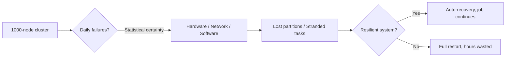
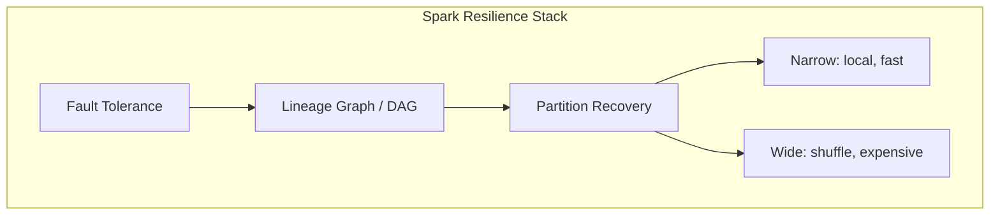

# Why Resilience Matters in Big Data Systems

## 1. The Core Problem: Failure Is the Norm, Not the Exception

In distributed big data processing, the fundamental assumption must be that **hardware will fail**. A cluster with 1,000 nodes experiences failures daily — not occasionally. At scale, probability turns into certainty:

- **Hardware failures**: disks crash, RAM fails, power supplies die, fans overheat
- **Network partitions**: transient outages isolate nodes mid-computation, leaving jobs stranded
- **Software crashes**: JVM out-of-memory, executor timeouts, driver disconnects

A system designed for "happy path only" cannot survive production workloads. Resilience — the ability to **detect failure, recover automatically, and continue processing** — is not an optional feature; it is the foundation of every serious big data platform.

### Why it matters

A multi-hour Spark job processing terabytes of clickstream data cannot afford to restart from scratch every time one executor hiccups. Cloud ML pipelines training on petabyte-scale datasets would never complete. Resilience converts **catastrophic failure** into **localized, recoverable interruption**.

---

## 2. The Distributed Memory Challenge

Traditional storage systems like HDFS keep data on **persistent disk** with replication. Spark's performance advantage comes from processing in **RAM** — but RAM is **volatile**:

| Property | HDFS (disk) | Spark (RAM) |
|----------|-------------|-------------|
| Persistence | Survives node reboot | Lost instantly on failure |
| Speed | Milliseconds per read | Microseconds per read |
| Recovery strategy | Switch to replica | Must **recompute** or reload |
| Cost of failure | Low (replica ready) | High (data gone) |

When a node loses power, every partition held in its memory vanishes. Without a recovery mechanism, the entire computation graph collapses. This is why Spark cannot simply copy HDFS's replication model into memory — replicating terabytes of in-RAM data would consume half the cluster's memory just for safety copies, defeating the purpose of in-memory computing.

---

## 3. What Resilience Enables in Spark

Spark's resilience architecture rests on three pillars explored throughout this module:

1. **Distributed fault tolerance** — maintaining stability across massive clusters without writing intermediate results to disk at every step
2. **RDD lineage graphs** — a logical DAG tracking every transformation, serving as a "recipe" to recreate lost data
3. **Partition recovery** — contrasting recovery complexity between **narrow** and **wide** dependencies

---

## 4. The Business Impact

| Scenario | Without resilience | With resilience |
|----------|-------------------|-----------------|
| E-commerce analytics (nightly batch) | 6-hour job fails at hour 5 → restart from zero | Lost partition recomputed in seconds |
| ML feature engineering (iterative) | One straggler node kills entire pipeline | Only affected stage recomputed |
| Real-time fraud detection (streaming) | Data gap during outage | Seamless failover via lineage |

The cost of downtime in big data is measured in **lost compute hours**, **delayed insights**, and **SLA violations** — not just a single failed task.

---

## Common Pitfalls / Exam Traps

- **Trap**: "Adding more nodes eliminates failures." More nodes actually **increases** the probability of at least one failure occurring during a job.
- **Trap**: "HDFS replication solves Spark's memory problem." HDFS replication protects **disk blocks**, not **in-memory partitions** during active computation.
- **Trap**: "Network partitions are rare." At scale, transient network issues are routine; systems must handle mid-shuffle isolation.
- **Trap**: Confusing **fault tolerance** (system continues) with **fault avoidance** (preventing all failures — impossible at scale).

---

## Quick Revision Summary

- At 1,000+ nodes, hardware failure is a **daily statistical certainty**, not an edge case
- Spark processes in **volatile RAM**, making recovery harder than disk-based systems like HDFS
- Resilience means **self-healing**: detect loss, recover automatically, continue the job
- Three pillars: fault tolerance, lineage graphs, partition recovery (narrow vs wide)
- Without resilience, multi-hour jobs restart from scratch on every node hiccup
- Network partitions can strand data mid-computation — systems must handle isolation
- The goal is **localized recovery**, not cluster-wide restart
