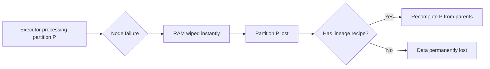
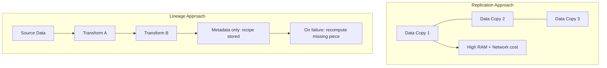

# Challenges of Distributed Memory Recovery

## 1. Volatility and Instant State Loss

The defining challenge of in-memory distributed computing is **volatility**. When a node fails:

- All RAM contents are **wiped instantly** — no graceful shutdown, no flush to disk
- Intermediate computation state vanishes
- Without a metadata-based "recipe" of how data was built, the system has no way to know where computation stopped or how to resume

This is fundamentally different from disk-based systems where data persists across reboots. In Spark, every partition living only in executor memory is a **ticking liability** unless lineage provides a reconstruction path.

---

## 2. The Replication Bandwidth Tax

A natural question: why not just **copy data** like HDFS does? The answer reveals why Spark chose a different path.

### What replication costs in memory

| Factor | Impact |
|--------|--------|
| Data volume | Terabytes in RAM × 3 replicas = 3× memory consumption |
| Network bandwidth | Every write multiplies cross-network traffic by replica count |
| Job speed | Massive copying **slows** the primary computation |
| Memory availability | Half or more of cluster RAM spent on safety copies, not computation |

For a cluster holding 10 TB in RAM across executors, triplicating that data requires 30 TB of memory capacity — most of which sits idle as insurance. This **defeats the purpose** of an in-memory engine whose speed comes from keeping memory lean for actual processing.

**Real-world analogy**: Imagine a kitchen where every chef must maintain three identical copies of every dish in progress. The kitchen runs out of counter space, and chefs spend more time copying than cooking.

---

## 3. Consistency Bottlenecks with Memory Replicas

Even if replication were affordable, keeping memory replicas **perfectly synchronized** across a global cluster introduces:

- **Heavy latency** — every write must propagate to all replicas before proceeding
- **Complex locking** — coordinating concurrent updates across nodes
- **Split-brain scenarios** — network partitions leave replicas inconsistent
- **Coordination overhead** — a central authority must track which replica is authoritative

These consistency mechanisms work tolerably for small-scale databases but collapse under the throughput demands of big data pipelines processing millions of records per second.

---

## 4. Spark's Alternative: Lineage Over Replication

Spark's revolutionary insight: instead of copying **data**, store the **recipe** (lineage DAG).

| Approach | What's stored | Recovery method | Memory footprint |
|----------|--------------|-----------------|------------------|
| Replication | Full data copies | Switch to replica | Grows with data size |
| Lineage | Metadata (kilobytes) | Recompute from source | Grows with logic complexity |

This lineage-based approach enables Spark to be **orders of magnitude faster** than Hadoop MapReduce while remaining fully fault tolerant. On failure, Spark spends **CPU cycles** (cheap, abundant) instead of **network bandwidth and RAM** (expensive, scarce).

---

## Common Pitfalls / Exam Traps

- **Trap**: "Replication is always better for recovery speed." True for **instant** failover, but at terabyte scale in RAM, replication's bandwidth tax makes it impractical.
- **Trap**: "Spark has no fault tolerance because it doesn't replicate." Spark is fault tolerant via **recomputation**, not replication.
- **Trap**: Confusing **volatility** (RAM loses data on crash) with **immutability** (RDDs never change once created — these are complementary, not contradictory).
- **Trap**: Assuming consistency is "free" — keeping replicas synced globally adds latency that negates in-memory speed gains.

---

## Quick Revision Summary

- RAM is **volatile** — node failure instantly wipes all in-memory state
- Replicating terabytes in RAM creates a **bandwidth tax** that slows jobs and wastes memory
- Memory replica synchronization introduces **locking, latency, and consistency** bottlenecks
- Spark stores **metadata recipes** (lineage) instead of data copies — kilobytes vs terabytes
- Recovery uses **CPU recomputation** instead of network replication — trading compute for bandwidth
- This design enables ~100× speedup over Hadoop while maintaining fault tolerance
- Lineage footprint grows with **logic complexity**, not data size
