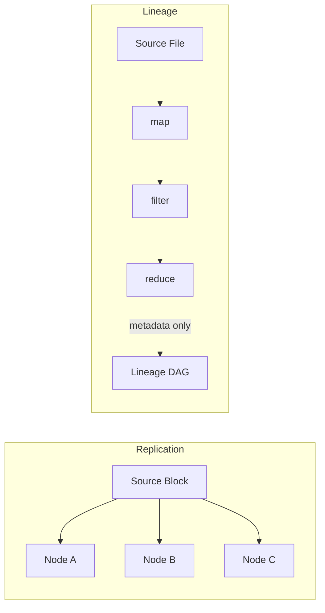
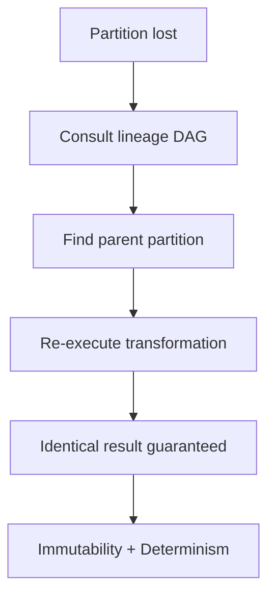

# Recomputing vs Replicating Data: Two Fault-Tolerance Philosophies

## 1. Two Primary Strategies for Handling Failures

Distributed systems recover from failure through one of two fundamental approaches:

1. **Data replication** — copy the data itself to multiple nodes
2. **Lineage-based recomputation** — store the transformation recipe and rebuild lost data on demand

Understanding why Spark chose recomputation requires contrasting these strategies across every dimension that matters in production.

---

## 2. Storage Strategy Comparison

### Replication (HDFS model)

- **Strategy**: Copy each data block to multiple nodes (typically 3 replicas)
- **Storage**: Node A, Node B, Node C each hold an identical copy
- **Recovery**: If Node A fails, immediately read from Node B's replica
- **Analogy**: Photocopying every document and filing copies in three offices

### Lineage / Recomputation (Spark model)

- **Strategy**: Store a **DAG** (Directed Acyclic Graph) describing how to recreate data from its source
- **Storage**: Only metadata — the "recipe" of transformations applied
- **Recovery**: Trace the lineage backward and re-execute transformations on source data
- **Analogy**: Storing a recipe card instead of pre-cooked meals in three kitchens

---

## 3. IO Overhead: Where the Cost Lives

| Dimension | Replication | Lineage |
|-----------|-------------|---------|
| Write overhead | 3× network + disk traffic per write | Metadata logging only (kilobytes) |
| Read overhead | Low (local replica) | Zero until failure occurs |
| Steady-state cost | Continuous, every write | Near-zero during normal execution |
| Failure cost | Near-zero (switch replica) | Proportional to DAG depth |

Replication is **IO-heavy by design** — every write multiplies traffic. In a high-speed RAM environment, this becomes a massive bottleneck. Spark's lineage logs only instructions, not data: moving terabytes vs recording a few kilobytes of metadata.

---

## 4. Recovery Speed Trade-off

| Scenario | Replication | Recomputation |
|----------|-------------|---------------|
| Node failure | **Nearly instantaneous** — switch to replica | Depends on DAG depth |
| Shallow DAG (1–2 transforms) | Fast | Fast (nearly instant) |
| Deep DAG (50+ transforms) | Fast | Slow — must replay all stages |
| Mid-shuffle failure | Fast | Must re-execute entire preceding stage |

Replication wins on **recovery latency** for any DAG depth. Recomputation wins on **steady-state performance** because it avoids continuous copying.

---

## 5. Scalability: The Decisive Factor

| Factor | Replication | Lineage |
|--------|-------------|---------|
| Storage footprint | 3× data size (or more) | Metadata only — grows with logic, not data |
| 1 GB data | Needs 3 GB across cluster | Needs ~KB of lineage metadata |
| 1 PB data | Needs 3 PB of storage | Still ~KB–MB of metadata |
| Network during normal ops | High (continuous replication) | Minimal |

For large-scale datasets, lineage's footprint **does not grow with data size** — only with transformation complexity. This is the scalability advantage that makes Spark practical at petabyte scale.

---

## 6. The Cost of Volatility: Spark's Design Promise

Spark's in-memory speed (often cited as ~100× faster than MapReduce) comes from RAM processing. But RAM's volatility demands a recovery plan built on a specific promise: **re-execution instead of replication**.

### Why this promise works

Three properties guarantee correct recomputation:

1. **Immutability** — RDDs never change once created; each transformation produces a new fixed snapshot
2. **Determinism** — rerunning the same code on the same input always yields the exact same output
3. **Lean memory** — no safety copies consuming half the cluster's RAM

On failure, Spark uses **CPU** to recompute the specific missing partition — saving network bandwidth and storage that replication would consume.

---

## Common Pitfalls / Exam Traps

- **Trap**: "Replication is always superior." Superior for instant recovery, but **prohibitively expensive** at in-memory scale.
- **Trap**: "Spark has no recovery cost." Recovery cost is **zero during normal execution** but **proportional to DAG depth** on failure.
- **Trap**: "Lineage stores data." Lineage stores **transformation history**, not data values.
- **Trap**: Forgetting that determinism is required — without it, recomputation could produce different results than what was lost.
- **Trap**: Claiming Spark is "100× faster" in all scenarios — the speedup applies to iterative/in-memory workloads, not all workloads.

---

## Quick Revision Summary

- **Replication** copies data (HDFS: 3× storage, instant recovery); **lineage** stores recipes (metadata only, computed recovery)
- Replication multiplies IO on every write; lineage has near-zero steady-state overhead
- Replication recovers instantly; recomputation cost grows with **DAG depth**
- Lineage footprint scales with **logic complexity**, not data size — critical for petabyte workloads
- Spark's promise: **re-execute** lost partitions using CPU, keeping RAM lean for computation
- Immutability + determinism guarantee recomputation produces identical results
- Choosing compute-over-replicate is the foundation of Spark's speed advantage
