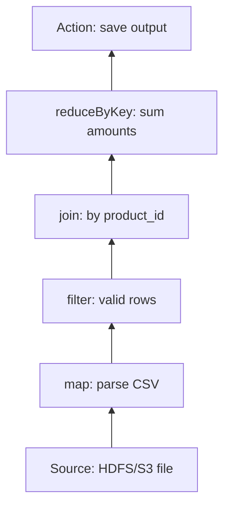
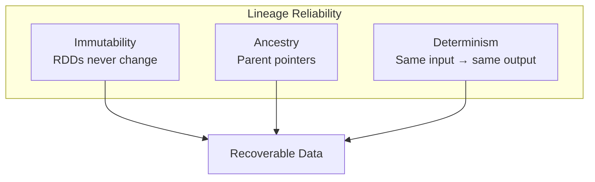

# Anatomy of an RDD Lineage Graph

## 1. What Is a Lineage Graph?

When Spark loses a partition, it must know **exactly what to recompute**. The lineage graph is the logical map that answers this question. It is a **Directed Acyclic Graph (DAG)** that records every transformation applied to data — not the data itself, but the **history of how data was built**.

Think of it as a recipe book: if a cake (partition) is ruined, you don't need the ruined cake — you need the recipe to bake a new one from ingredients (source data).

When partition C2 is lost, Spark traces backward: C2 came from B2 → A2 → source block 2, then re-executes only that chain.

---

## 2. Recovery Cost Formula

The time to recover a lost partition equals the sum of execution times for each operation in that partition's history, starting from the last checkpoint or source:

$\text{Recovery Cost} = \sum_{i=1}^{N} T_i$

Where:
- $N$ = number of transformation steps in the lineage chain for that partition
- $T_i$ = execution time of the $i$-th operation

**Critical insight**: recovery time is **proportional to graph depth**. A simple filter on a text file recovers nearly instantly; a 50-stage ML pipeline may take minutes to replay.

| DAG Depth | Recovery Time | Example |
|-----------|--------------|---------|
| 1–2 stages | Milliseconds | `textFile → filter` |
| 10–20 stages | Seconds | Multi-join ETL pipeline |
| 100+ stages | Minutes–hours | Iterative PageRank, ALS |

---

## 3. Three Architectural Pillars

The lineage graph's reliability rests on three non-negotiable properties:

### Pillar 1: Immutability

- Once an RDD is created, it is a **fixed, read-only snapshot**
- Transformations never modify existing RDDs — they produce **new** RDDs
- No risk of data changing midstream during recovery
- Each node in the DAG represents an immutable state

### Pillar 2: Ancestry (Parent References)

- Every RDD maintains a pointer to its **parent RDD**
- This creates a chain of custody: RDD_B knows it came from RDD_A
- On partition loss, the child knows exactly which parent to ask for input
- The DAG is built by linking these parent-child references recursively

### Pillar 3: Determinism

- Rerunning the same transformation on the same input **always** produces the same output
- Without determinism, the lineage recipe is useless — recomputation might yield different data
- Non-deterministic operations (e.g., `sample` without fixed seed) break this guarantee
- Determinism is the "secret sauce" that makes recomputation trustworthy

| Pillar | What it prevents | What it enables |
|--------|-----------------|-----------------|
| Immutability | Mid-computation corruption | Safe parallel reads |
| Ancestry | Guessing parent data | Targeted partition recovery |
| Determinism | Inconsistent recomputation | Trustworthy fault tolerance |

---

## 4. How the Driver Uses Lineage

The Spark **driver** holds the complete lineage graph in memory:

1. User defines transformations (lazy — no execution yet)
2. Driver builds the DAG by recording parent-child RDD relationships
3. An **action** triggers the DAG scheduler to break the graph into **stages**
4. On failure, driver consults lineage to determine which tasks to reschedule

The lineage graph is the **brain** of Spark's fault tolerance — every recovery decision flows from this metadata structure.

---

## Common Pitfalls / Exam Traps

- **Trap**: "Lineage stores actual data values." It stores **transformation metadata** only.
- **Trap**: "Recovery is always fast because Spark is in-memory." Recovery speed depends on **DAG depth** — deep graphs are expensive.
- **Trap**: Forgetting determinism — operations like `randomSplit()` without a seed can break fault tolerance guarantees.
- **Trap**: "Immutability means data can't be updated." Data can be transformed into **new** RDDs; existing RDDs are never modified.
- **Trap**: Confusing lineage graph (logical DAG of RDDs) with execution graph (physical stages sent to executors).

---

## Quick Revision Summary

- Lineage graph = DAG tracking **how** data was built, not the data itself
- Recovery cost = sum of operation times from source/checkpoint to lost partition
- Recovery time grows **linearly** with DAG depth ($N$ transformations)
- Three pillars: **immutability** (fixed snapshots), **ancestry** (parent pointers), **determinism** (reproducible results)
- Driver holds the lineage graph and uses it to reschedule failed tasks
- Shallow DAGs recover in milliseconds; deep iterative DAGs can take minutes
- Non-deterministic operations undermine the entire lineage-based recovery model
