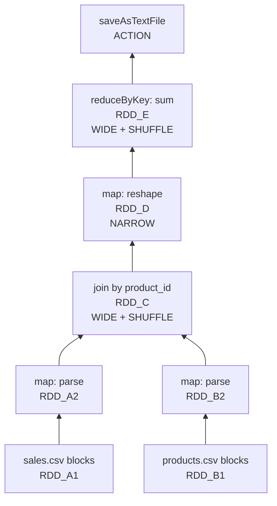

# RDD Lineage Graph Walkthrough: Sales Analysis by Category

## 1. Scenario Setup

Consider a distributed sales analysis pipeline with two input datasets:

| File | Columns | Role |
|------|---------|------|
| `sales.csv` | `tracking_id`, `product_id`, `amount` | Transaction records |
| `products.csv` | `product_id`, `category` | Product metadata |

**Goal**: Calculate total sales amount per product category.

```python
sales = sc.textFile("sales.csv").map(parse_sales)
products = sc.textFile("products.csv").map(parse_products)
joined = sales.join(products)          # wide dependency
remapped = joined.map(reshape_tuple)   # narrow dependency
totals = remapped.reduceByKey(add)     # wide dependency
totals.saveAsTextFile("output/")
```

---

## 2. Step-by-Step Lineage Construction

### Step 1: Data Ingestion (Leaf Nodes)

Spark creates **base RDDs** representing file blocks in storage. These are the **leaf nodes** of the lineage graph:

- `RDD_A1` ← blocks from `sales.csv`
- `RDD_B1` ← blocks from `products.csv`

Each file block maps to one partition on one executor. No dependencies — data comes directly from HDFS/S3.

### Step 2: Parsing (Narrow Dependency)

```python
sales_parsed = sales.map(parse_sales)    # RDD_A2
products_parsed = products.map(parse_products)  # RDD_B2
```

- **Narrow dependency**: each input row maps to exactly one output row (1:1)
- No data moves between machines — each executor processes its local partition independently
- `RDD_A2` sits on the same executor as `RDD_A1`; `RDD_B2` on its own executor

### Step 3: Join by Key (Wide Dependency)

```python
joined = sales_parsed.join(products_parsed)  # RDD_C
```

- **Wide dependency**: records with the same key must land on the **same machine**
- Triggers a **shuffle** — data physically moves across the network
- All `product_id = 42` records from both RDDs converge on one partition
- This is the most expensive step in the pipeline

### Step 4: Remapping (Narrow Dependency)

```python
remapped = joined.map(lambda x: (x[1][1], x[1][0]))  # (category, amount)
```

- Reshapes tuples from `(product_id, (amount, category))` to `(category, amount)`
- **Narrow dependency**: happens locally on already-shuffled data
- No cross-network movement — single-machine operation

### Step 5: Aggregation (Wide Dependency)

```python
totals = remapped.reduceByKey(lambda a, b: a + b)
```

- **Wide dependency**: all records with the same category must be on the same partition
- Requires another **shuffle** to group categories together
- Different categories may sit on different partitions across the cluster

### Step 6: Save Output (Action)

```python
totals.saveAsTextFile("output/")
```

- Triggers actual execution of the entire DAG
- Results written to distributed storage



---

## 3. Narrow vs Wide Dependencies in This Pipeline

| Step | Operation | Dependency | Shuffle? | Recovery Cost |
|------|-----------|------------|----------|---------------|
| 1 | `textFile` | None (leaf) | No | Read from source |
| 2 | `map` (parse) | Narrow (1:1) | No | Recompute local partition |
| 3 | `join` | Wide (N:N) | **Yes** | Recompute all parents + reshuffle |
| 4 | `map` (reshape) | Narrow (1:1) | No | Recompute local partition |
| 5 | `reduceByKey` | Wide (N:1) | **Yes** | Recompute all parents + reshuffle |
| 6 | `saveAsTextFile` | Action | No | Triggers execution |

---

## 4. Parallel Execution Insight

The DAG scheduler recognizes that the **sales branch** and **products branch** are independent:

- `RDD_A1 → RDD_A2` and `RDD_B1 → RDD_B2` run **in parallel**
- Both branches only converge at the `join` step
- This maximizes cluster utilization — two sets of tasks execute simultaneously before the shuffle barrier

---

## Common Pitfalls / Exam Traps

- **Trap**: "All `map` operations are narrow." True for 1:1 maps, but `mapPartitions` with side effects can behave differently.
- **Trap**: "Join always requires shuffle." A **broadcast join** (small table) avoids shuffle by sending a copy to every node.
- **Trap**: Forgetting that `reduceByKey` is wide — students often classify it as narrow because it "reduces" data.
- **Trap**: "The lineage graph equals the execution plan." Lineage is logical; the DAG scheduler creates **stages** by cutting at shuffle boundaries.
- **Trap**: Assuming both branches must finish before **any** work begins — only the join stage requires both inputs.

---

## Quick Revision Summary

- Sales analysis pipeline: ingest → parse (narrow) → join (wide/shuffle) → reshape (narrow) → aggregate (wide/shuffle) → save
- Leaf nodes are base RDDs from file blocks; each transformation adds a DAG node
- Narrow dependencies (map, filter): 1:1 mapping, local recovery, no shuffle
- Wide dependencies (join, reduceByKey): N:N mapping, shuffle required, expensive recovery
- Independent branches (sales vs products) execute in parallel until a shuffle barrier
- Two shuffles in this pipeline: join and reduceByKey — both are recovery bottlenecks
- Actions trigger execution; transformations before them are lazy
