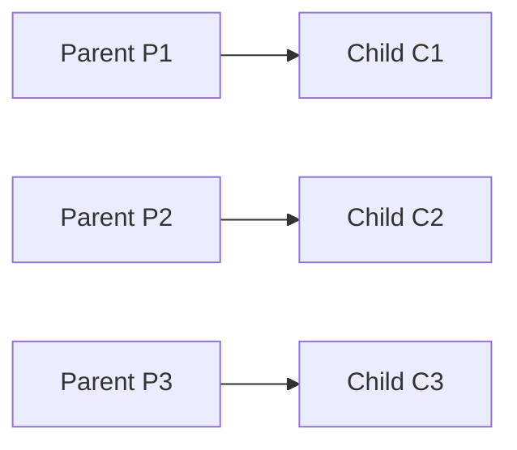
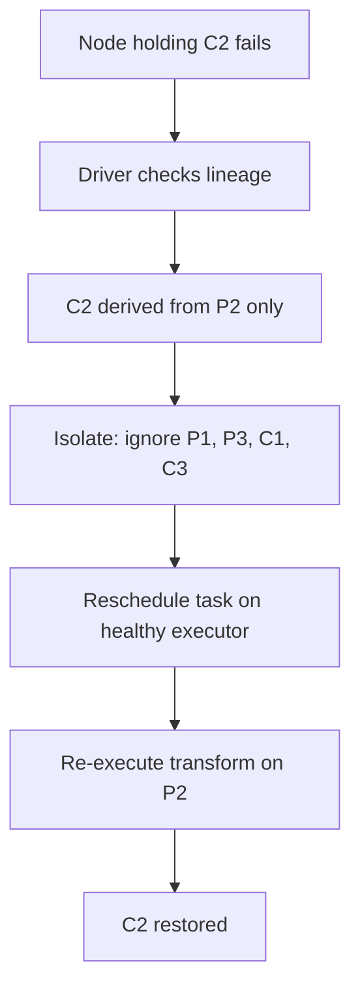

# Recovery in Narrow Dependencies: Fast, Local, Isolated

## 1. What Is a Narrow Dependency?

A narrow dependency occurs when each parent partition maps to **exactly one** child partition — a 1:1 relationship. Common operations:

- `map` — transform each element
- `filter` — keep or discard each element
- `flatMap` — 1:1 or 1:many, but still local
- `mapPartitions` — process partition locally



No data crosses machine boundaries. Each child partition depends on **one and only one** parent partition.

---

## 2. Recovery Scenario: Lost Partition C2

Suppose the node holding child partition **C2** fails. Here is exactly what happens:

1. **Driver detects failure** — executor heartbeat timeout or task failure notification
2. **Driver consults lineage** — sees that C2 was derived solely from parent P2
3. **Isolated recovery** — only P2 needs to be recomputed; P1, P3, C1, C3 are untouched
4. **Task rescheduled** — Spark schedules a new task on a healthy executor to rerun the transformation on P2
5. **C2 restored** — the missing partition is recreated without affecting the rest of the cluster



---

## 3. Two Key Advantages

### Advantage 1: Isolation (Failure Containment)

| Property | Narrow Recovery | Wide Recovery |
|----------|----------------|---------------|
| Partitions affected | 1 child + 1 parent | 1 child + **all** parents |
| Other partitions | Unaffected | May cascade |
| Cluster impact | Minimal | Potentially global |

The failure is **contained** to a single parent-child pair. The rest of the cluster continues processing unaffected.

### Advantage 2: No Shuffle During Recovery

- No data moves across the network
- Recovery is a **local recomputation** on one executor
- Spark simply reruns the transformation logic on the parent partition already available (or recomputed from its own parent)
- Recovery cost = $T_{\text{transform}}$ — a single operation's execution time

---

## 4. Why Narrow Chains Are Preferred

Production Spark pipelines deliberately chain narrow transformations:

```python
# Good: all narrow — fast recovery at every step
result = data.map(parse).filter(is_valid).map(extract_fields).filter(non_null)
```

Each step in this chain has isolated, local recovery. If any partition is lost at any stage, recovery touches only one parent partition.

**Pipelining bonus**: Spark fuses consecutive narrow transformations into a **single stage**, executing them in one pass per record without intermediate disk I/O. This means recovery of a fused stage replays all narrow ops together — still local, still fast.

---

## 5. Recovery Cost for Narrow Dependencies

$\text{Recovery Cost}_{\text{narrow}} = T_{\text{single transform}}$

This is the **lower bound** of recovery cost in Spark. Compare with wide dependencies where cost can cascade across the entire cluster. Narrow recovery is why Spark can "heal itself partition by partition without interrupting the rest of the cluster."

---

## Common Pitfalls / Exam Traps

- **Trap**: "Narrow means no failure can occur." Narrow means recovery is **cheap**, not that failures are impossible.
- **Trap**: "flatMap is always narrow." `flatMap` is narrow for lineage purposes (each parent partition produces child partitions locally), but output size can vary wildly.
- **Trap**: Confusing narrow dependency with narrow transformation naming — the technical definition is the 1:1 parent-child partition mapping.
- **Trap**: "Recovery always uses cached data." If the parent partition is also lost from memory, Spark recursively recomputes parents too (still narrow chain, still local).
- **Trap**: Assuming pipelined narrow ops create separate recovery steps — they are fused into one stage and recovered as a unit.

---

## Quick Revision Summary

- Narrow dependency = 1 parent partition → 1 child partition (map, filter)
- Lost partition C2 → driver traces lineage → finds sole parent P2 → recomputes locally
- **Isolation**: failure contained to one partition pair; rest of cluster unaffected
- **No shuffle**: recovery requires zero network data movement
- Chaining narrow transformations minimizes recovery cost at every pipeline stage
- Pipelining fuses consecutive narrow ops into one stage — still local recovery
- Recovery cost = single transformation time — the cheapest possible recovery in Spark
