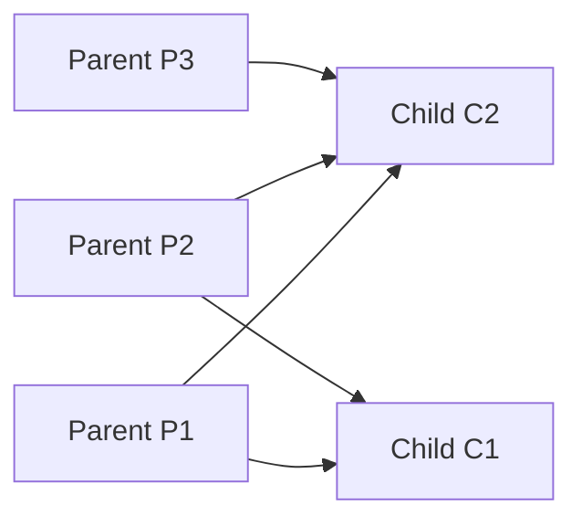
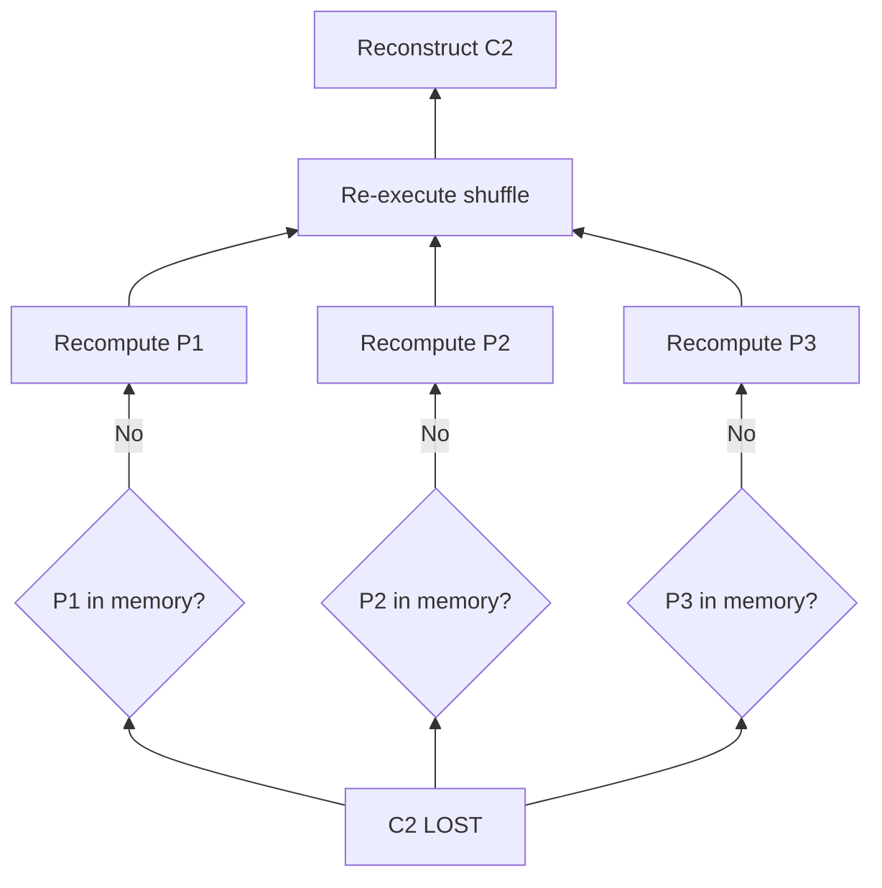
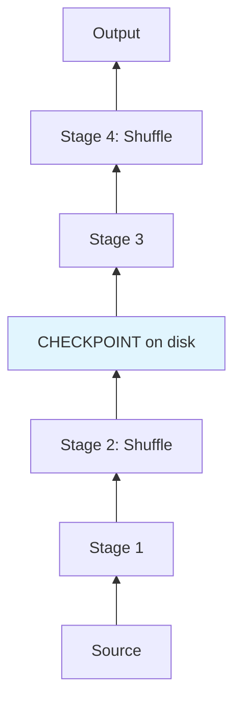

# The Complexity of Wide Dependency Failures

## 1. What Makes Wide Dependencies Different?

Wide dependencies create **many-to-many** mappings between parent and child partitions. Operations that trigger them:

- `groupByKey` / `reduceByKey` — aggregate by key
- `join` — combine two datasets by key
- `repartition` / `coalesce` (with shuffle) — redistribute partitions
- `sortByKey` — global sort requires shuffle

Child partition C2 contains data from **multiple** parent partitions (P1, P2, P3). This many-to-many relationship is the root of recovery complexity.

---

## 2. Cascading Recovery

When partition C2 is lost in a wide dependency:

1. Driver cannot rerun a single local task — C2 needs data from P1, P2, **and** P3
2. Spark must fetch relevant data from **every parent partition** across the cluster
3. If parent partitions are no longer in memory, the failure **cascades upward**
4. Spark must recompute **all parent partitions** before it can even begin fixing C2

**Cascading recovery** means a single lost partition can trigger recomputation of an entire upstream stage — potentially every partition in the preceding stage.

---

## 3. Shuffle Interruption

Shuffles are the **most expensive** operation in Spark because they physically move data across the network to group keys together. When failure occurs mid-shuffle:

- Partially shuffled data may be inconsistent or incomplete
- The system must **re-execute the entire preceding stage** to ensure data being shuffled is consistent and complete
- Network bandwidth is consumed again for the full shuffle
- All tasks in the failed stage are rescheduled, not just the lost partition

| Failure Point | Recovery Scope | Cost |
|--------------|----------------|------|
| During narrow transform | 1 partition | Low |
| After shuffle completes | 1 partition + shuffle re-read | Medium |
| Mid-shuffle | Entire preceding stage + full reshuffle | **High** |

---

## 4. Checkpointing as Mitigation

Because wide dependency failures are so expensive, Spark provides **checkpointing** to break the lineage chain:

- Save the state of an RDD after a shuffle to **reliable disk storage** (HDFS/S3)
- This creates a **save point** — a new leaf node in the DAG
- On failure, Spark recovers from the checkpoint instead of cascading all the way to the source
- Prevents a single partition loss from replaying the entire job history

Without checkpoint: losing a partition at Stage 4 cascades back through Stage 3 → Stage 2 (shuffle) → Stage 1 → Source.
With checkpoint: recovery starts from the checkpoint file on disk.

---

## 5. Narrow vs Wide Recovery Comparison

| Dimension | Narrow | Wide |
|-----------|--------|------|
| Parent partitions needed | 1 | Multiple (all contributors) |
| Network traffic during recovery | None | Full shuffle replay |
| Failure scope | Isolated partition | Entire upstream stage |
| Recovery cost | $T_{\text{one op}}$ | $\sum T_{\text{all parents}} + T_{\text{shuffle}}$ |
| Mitigation | Chain narrow ops | Checkpoint after shuffles |

---

## Common Pitfalls / Exam Traps

- **Trap**: "Wide dependency recovery is the same as narrow, just slower." Wide recovery is **qualitatively different** — it requires **all** parent partitions and may replay entire stages.
- **Trap**: "Checkpointing eliminates shuffle cost." Checkpointing reduces **recovery** cost; the shuffle still happens during normal execution.
- **Trap**: "Only the lost partition is recomputed in wide deps." All contributing parent partitions must be available — cascading recomputation is common.
- **Trap**: Forgetting that mid-shuffle failure forces **full stage replay**, not partial recovery.
- **Trap**: "Persistence/cache solves wide dependency recovery." Cache preserves lineage; if cached data is lost, lineage-based recomputation still cascades.

---

## Quick Revision Summary

- Wide dependencies (join, groupByKey) create many-to-many parent-child mappings
- Losing one child partition requires data from **all** contributing parent partitions
- **Cascading recovery**: if parents are gone from memory, entire upstream stages recompute
- Mid-shuffle failures force **full preceding stage replay** — the most expensive recovery scenario
- Shuffles move data across the network; replaying them dominates recovery time
- **Checkpointing** after expensive shuffles creates save points that truncate cascading recovery
- Design principle: chain narrow ops freely; checkpoint strategically after wide/shuffle stages
