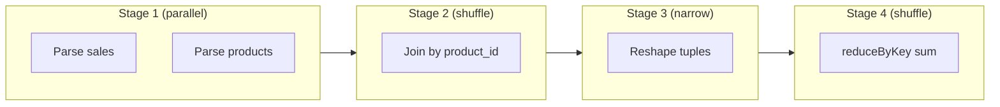
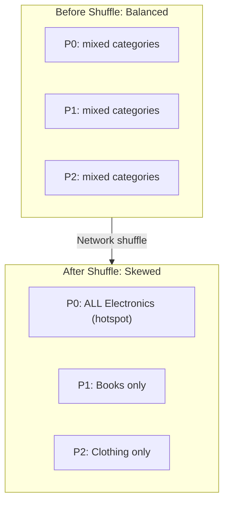

# Spark Execution Mechanics: Stages, Pipelining, and Shuffle Skew

## 1. Fault Tolerance in Practice

When a partition is lost in a real Spark cluster, the recovery flow is:

1. Executor failure detected (heartbeat timeout)
2. Driver consults the lineage graph for the failed task's partition
3. Driver identifies the exact parent data needed
4. Only the **failed task set** is requeued — the entire job does **not** restart
5. A healthy executor recomputes the missing partition

This surgical recovery is what makes Spark production-viable. A 6-hour job losing one partition does not become a 6-hour restart.

---

## 2. Stage Construction and Pipelining

### How stages are formed

The DAG scheduler cuts the lineage graph at **shuffle boundaries** (wide dependencies). Each segment between shuffles becomes one **stage**:



### Pipelining narrow operations

Within a single stage, consecutive narrow transformations (`map`, `filter`) are **fused** into one pass:

- Spark executes `map → filter → map` as a single task per partition
- No intermediate materialization to disk
- One record flows through all transformations before the next record is processed
- This minimizes I/O and maximizes throughput

### Parallel branch execution

The DAG scheduler recognizes independent branches:

- Sales parsing and products parsing have **no dependency** on each other
- Both branches launch tasks **in parallel** to maximize cluster utilization
- They only synchronize at the join (shuffle barrier)

---

## 3. The Shuffle: Why Wide Dependencies Are Expensive

A shuffle physically **moves data across the network** so all records with the same key end up on the same partition.

### Before shuffle (Stage 1)

```
Partition 0: [Electronics, $100], [Books, $50]
Partition 1: [Electronics, $200], [Clothing, $75]
Partition 2: [Books, $30], [Electronics, $150]
```

Each partition has a roughly equal mix of categories — work is balanced.

### After shuffle (Stage 2)

```
Partition 0: [Electronics, $100], [Electronics, $200], [Electronics, $150]  ← SKEWED
Partition 1: [Books, $50], [Books, $30]
Partition 2: [Clothing, $75]
```

All "Electronics" records converge on one partition. If Electronics is the most popular category, **Partition 0 becomes a hotspot** — it holds far more data than the others.



---

## 4. Data Skew and the Straggler Problem

**Data skew** occurs when one key has disproportionately more records than others. In the real world, keys are rarely uniformly distributed:

- E-commerce: a few bestselling SKUs dominate sales
- Social media: celebrity accounts have millions of followers
- Finance: major trading days concentrate volume

When skewed data lands on one partition after a shuffle:

- That partition's task becomes a **straggler** — takes 10× longer than others
- The entire stage waits for the slowest task (barrier synchronization)
- 99 tasks finish in 1 minute; the straggler takes 10 minutes → **stage takes 10 minutes**

This is why wide dependencies are costly not just for recovery, but for **normal execution performance** too.

---

## 5. DAG Scheduler Optimizations

| Optimization | What it does | Benefit |
|-------------|-------------|---------|
| Stage fusion | Combines narrow ops in one stage | Fewer task launches, less I/O |
| Parallel branches | Runs independent DAG branches simultaneously | Maximizes cluster utilization |
| Task requeue on failure | Reschedules only failed tasks | Surgical recovery, not full restart |
| Speculative execution | Launches backup task for stragglers | Mitigates skew impact |

---

## Common Pitfalls / Exam Traps

- **Trap**: "Spark restarts the entire job on failure." Only the **failed task set** is requeued.
- **Trap**: "Each transformation is a separate stage." Only **shuffle boundaries** create new stages; narrow ops are fused.
- **Trap**: "Shuffle balances partitions." Shuffle groups by key, which often **creates** imbalance (hotspots).
- **Trap**: Confusing data skew (uneven key distribution) with partition skew (uneven partition sizes before shuffle).
- **Trap**: "Pipelining means parallel execution across partitions." Pipelining fuses ops **within** a single partition's task; parallel execution is across partitions.

---

## Quick Revision Summary

- On failure, Spark requeues only the **failed task set** — not the entire job
- Stages are created at **shuffle boundaries**; narrow ops within a stage are pipelined (fused)
- Independent DAG branches execute **in parallel** until a shuffle barrier synchronizes them
- Shuffles move data across the network to co-locate keys — the most expensive operation
- Post-shuffle **data skew** creates hotspots where one partition holds most of a popular key
- Stragglers (slowest task) determine stage completion time — the job waits for the slowest partition
- Real-world key distributions are rarely uniform; skew is a production reality, not an edge case
