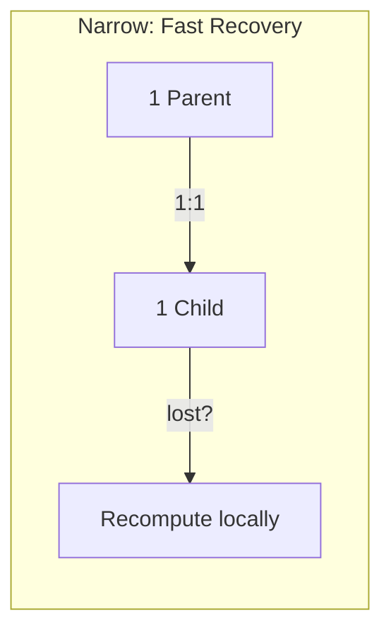
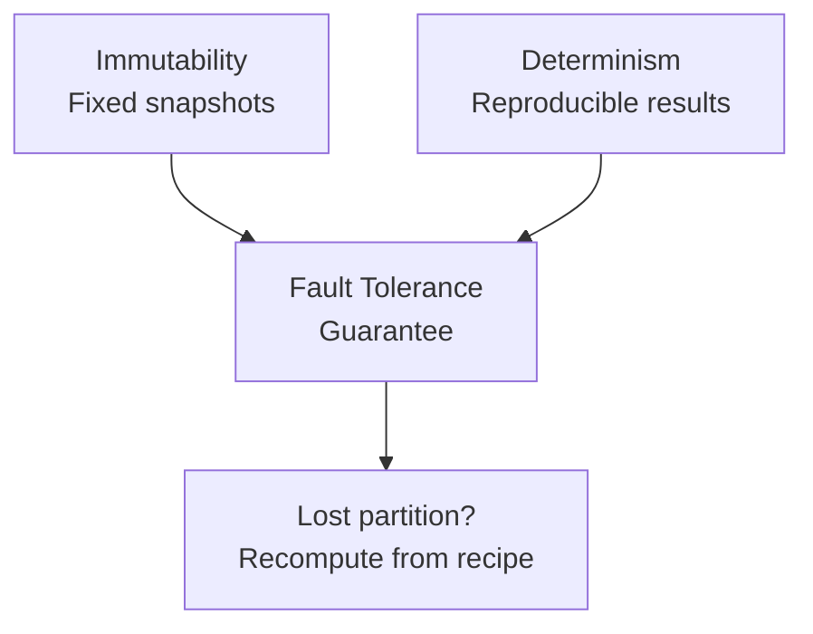
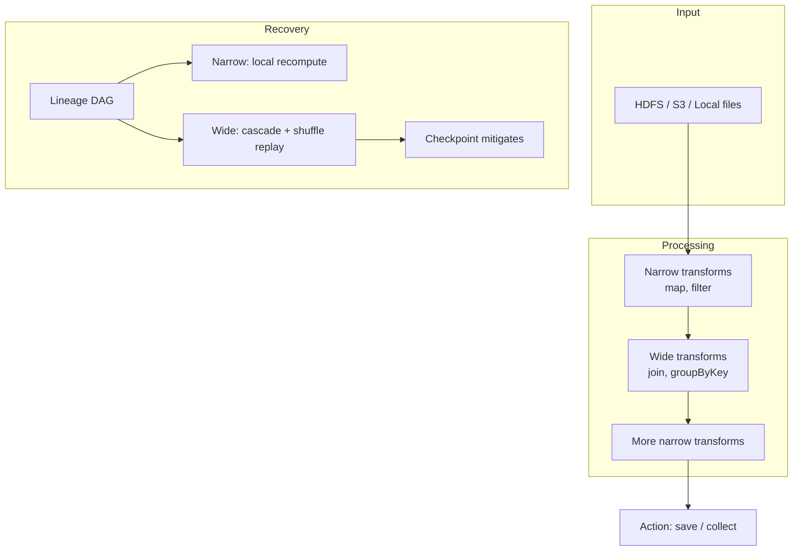

# Spark Resilience: Module Summary and Key Takeaways

## 1. Lineage vs Replication — The Fundamental Shift

Spark's core architectural decision: prioritize **metadata over data**.

| Aspect | Replication (HDFS) | Lineage (Spark) |
|--------|-------------------|-----------------|
| What's stored | Full data copies (3×) | Transformation recipe (DAG) |
| Memory cost | Grows with data size | Grows with logic complexity |
| Network cost | Continuous, every write | Only on failure (recomputation) |
| Recovery speed | Instant (switch replica) | Proportional to DAG depth |
| Best for | Durable storage | In-memory computation |

This shift enabled the move away from replication-heavy systems like HDFS toward lean, fast in-memory processing.

---

## 2. Narrow Dependencies — The Efficiency Building Blocks

Transformations like `map` and `filter` form the backbone of high-performance pipelines:

- **1:1 mapping**: each parent partition → exactly one child partition
- **Fast local recovery**: recompute only the lost partition on one executor
- **No shuffle**: zero network traffic during recovery
- **Pipelining**: consecutive narrow ops fused into single-stage tasks

**Design principle**: chain as many narrow transformations as possible between shuffle boundaries.

---

## 3. Wide Dependencies — Necessary but Expensive

Shuffles (`join`, `groupByKey`, `reduceByKey`) are necessary for aggregation and combination but carry recovery penalties:

- **Many-to-many mapping**: child partitions depend on multiple parents
- **Cascading recovery**: losing one partition may force recomputation of entire upstream stages
- **Shuffle replay**: mid-shuffle failures require full stage re-execution
- **Data skew**: popular keys create hotspots and stragglers

**Design principle**: use persistence or checkpointing after expensive shuffle stages to protect against cascading failures.

---

## 4. The Twin Foundations: Immutability and Determinism

Spark's resilience guarantee rests on two properties:

### Immutability
- RDDs never change once created
- Each transformation produces a new, fixed snapshot
- No risk of concurrent modification during recovery

### Determinism
- Same input + same transformation = same output, always
- Makes the lineage "recipe" trustworthy for recomputation
- Non-deterministic ops (unseeded random) break this guarantee

Together: **if the recipe never changes, the result can always be recreated.**

---

## 5. When to Use Persistence and Checkpointing

| Mechanism | Preserves lineage? | Storage | Best for |
|-----------|-------------------|---------|----------|
| `cache()` / `persist()` | Yes | Memory / local disk | Reusing data within a session |
| `checkpoint()` | No (truncates) | HDFS / S3 | Long iterative pipelines |

Use persistence after expensive computations you'll reuse. Use checkpointing when lineage depth threatens stability (covered in Module 8).

---

## 6. End-to-End Resilience Architecture

---

## Common Pitfalls / Exam Traps

- **Trap**: "Spark doesn't need fault tolerance because it's fast." Speed comes **from** in-memory processing, which **requires** fault tolerance.
- **Trap**: "All recovery is equally fast in Spark." Narrow = milliseconds; wide = potentially entire stage replay.
- **Trap**: "Caching and checkpointing are interchangeable." Caching preserves lineage; checkpointing **truncates** it.
- **Trap**: Forgetting that determinism is a prerequisite — without it, lineage-based recovery produces wrong results.
- **Trap**: "More transformations always mean slower recovery." Only the chain **leading to the lost partition** matters, not the entire DAG.

---

## Quick Revision Summary

- Spark stores **lineage (recipes)**, not data copies — saving RAM and network bandwidth
- **Narrow deps** (map, filter): 1:1 mapping, local recovery, no shuffle — the efficiency building blocks
- **Wide deps** (join, groupByKey): many-to-many, cascading recovery, shuffle replay — necessary but expensive
- Resilience rests on **immutability** (fixed snapshots) and **determinism** (reproducible results)
- Use **persistence** for reuse within a session; **checkpointing** for long iterative pipelines
- Design pipelines: chain narrow ops freely, checkpoint after expensive shuffles
- The recipe (lineage) never expires — lost data can always be recreated from source + transformations
