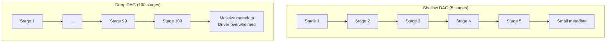
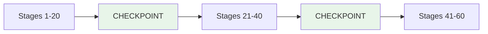

# When Lineage Becomes a Liability

## 1. Lineage: Asset or Liability?

RDD lineage is Spark's greatest resilience asset — until it isn't. In shallow DAGs (a few transformations), lineage enables near-instant recovery with minimal metadata overhead. But as graphs grow deeper through iterative algorithms, machine learning pipelines, or complex ETL chains, lineage transforms from an asset into a **liability**.

The tipping point arrives when the cost of **tracking** and **recovering** through deep lineage exceeds the cost of simply writing intermediate results to disk.

---

## 2. Three Critical Issues with Deep Lineage

### Issue 1: Linear Cost Increase

Recovery time grows **linearly** with DAG depth:

$\text{Recovery Time} \propto N \quad \text{(number of stages)}$

| DAG Depth | Recovery on Failure |
|-----------|-------------------|
| Stage 5 | Replay 4 transformations |
| Stage 50 | Replay 49 transformations |
| Stage 100 | Replay 99 transformations |

Losing a partition at stage 100 means recomputing 99 previous steps. For iterative algorithms running hundreds of iterations, this is catastrophic.

### Issue 2: Driver Bottleneck

Every transformation step must be tracked by the Spark **driver**:

- Each RDD object holds a reference to its parent, which holds a reference to its parent, and so on
- Metadata for the entire "family tree" lives in driver memory
- As graph complexity grows, driver memory and CPU are consumed by **dependency tracking** rather than task scheduling
- Eventually, the driver becomes the bottleneck — slowing down the entire cluster

### Issue 3: The Reliability Paradox

Lineage provides reliability — but a very long chain creates **more points of failure**:

- Longer pipeline = higher statistical probability that recomputation will be triggered
- Each recomputation event is more expensive (deeper replay)
- The system designed for fault tolerance becomes **more likely to need** fault recovery, and each recovery is costlier

This paradox: the longer the lineage, the more "reliable" the system claims to be, but the more painful each failure becomes.

---

## 3. When Does Lineage Tip from Asset to Liability?

| Signal | Shallow DAG (Asset) | Deep DAG (Liability) |
|--------|--------------------|--------------------|
| Recovery time | Milliseconds | Minutes to hours |
| Driver memory | Stable | Growing, approaching OOM |
| Iteration count | < 10 | 100+ (PageRank, ALS, ML) |
| Failure impact | Localized | Cascading across stages |
| Metadata size | Kilobytes | Megabytes |

**Common triggers for deep lineage:**
- Iterative graph algorithms (PageRank: 100+ iterations)
- Alternating Least Squares (ALS) for recommendation systems
- Gradient descent loops in distributed ML
- Multi-stage ETL with 50+ transformation steps

---

## 4. The Solution Preview: Breaking the Chain

The question this module answers: **How do we break long lineage chains to ensure stability without losing Spark's functional model?**

The answer is **checkpointing** — strategically truncating the DAG by saving intermediate state to reliable storage and severing parent references. This converts a 100-stage recovery into a 1-stage recovery.

---

## Common Pitfalls / Exam Traps

- **Trap**: "Lineage is always beneficial." Lineage is beneficial up to a depth threshold; beyond that, metadata and recovery costs dominate.
- **Trap**: "Driver bottleneck only happens with large data." Driver bottleneck is about **metadata volume** (number of RDD objects), not data size.
- **Trap**: "More stages always means better parallelism." More stages mean deeper lineage and higher recovery cost on failure.
- **Trap**: Confusing the reliability paradox — longer lineage doesn't mean more reliable recovery; it means more expensive recovery.
- **Trap**: "Only iterative algorithms have deep lineage." Complex ETL pipelines with many joins and aggregations also create deep graphs.

---

## Quick Revision Summary

- Lineage is an asset in shallow DAGs but becomes a **liability** in deep ones (100+ stages)
- Recovery time grows **linearly** with DAG depth — stage 100 failure replays 99 steps
- Driver stores entire family tree in memory — deep graphs cause **driver bottleneck**
- **Reliability paradox**: longer chains mean more failure points and costlier recoveries
- Iterative algorithms (PageRank, ALS, gradient descent) are primary deep-lineage triggers
- Solution: **checkpointing** truncates the DAG at strategic points
- The tipping point is when metadata/recovery cost exceeds the cost of disk writes
