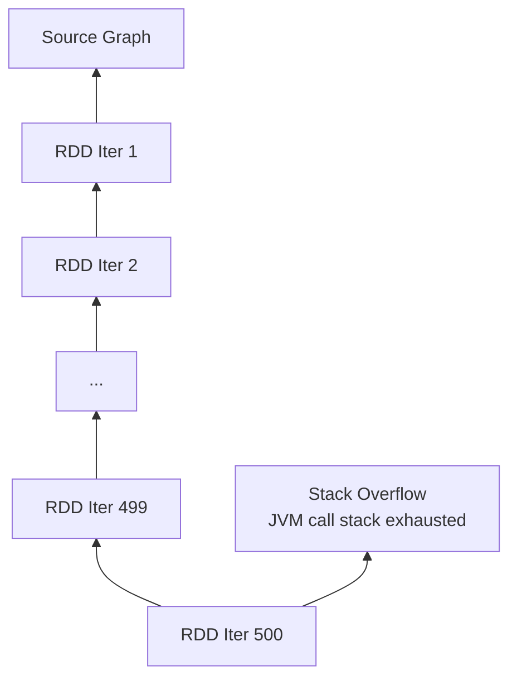

# Stack Overflow and Performance Degradation from Deep Lineage

## 1. The Technical "Why" Behind Deep Lineage Failures

When lineage chains grow beyond ~100 stages, Spark doesn't just slow down — the system can **crash**. Two failure modes emerge: hard crashes (stack overflow) and soft degradation (latency spikes). Both stem from the same root cause: **recursive dependency tracking**.

---

## 2. Stack Overflow: The Hard Crash

### How serialization triggers the crash

When the Spark driver sends a task to an executor, it must **serialize** the RDD object. Because each RDD holds a reference to its parent, which holds a reference to its parent, serialization is inherently **recursive**:

```
RDD_100 → parent: RDD_99 → parent: RDD_98 → ... → parent: RDD_1 → parent: Source
```

The JVM traverses this chain recursively during serialization. At lineage depth of 100+, the JVM's **call stack runs out of space** before it can finish describing the RDD's history.

### Algorithms most at risk

| Algorithm | Typical Iterations | Lineage Depth |
|-----------|-------------------|---------------|
| PageRank | 100–500 | 100–500 stages |
| ALS (recommendations) | 50–200 | 50–200 stages |
| Gradient descent | 100–1000 | 100–1000 stages |
| k-means (distributed) | 20–100 | 20–100 stages |

Each iteration adds a new layer to the lineage. PageRank updating state 500 times creates a 500-deep recursive chain — a guaranteed stack overflow without checkpointing.



---

## 3. Performance Degradation: The Soft Failure

Even without a hard crash, deep lineage causes severe performance problems:

### Excessive CPU overhead on the driver

- Every task failure requires traversing the **entire family tree** to find the root
- Driver spends more time calculating dependencies than scheduling actual work
- Task scheduling latency increases with lineage depth

### Recovery latency spikes

| Lineage Depth | Normal Task Recovery | Deep Lineage Recovery |
|--------------|---------------------|----------------------|
| 5 stages | < 1 second | < 1 second |
| 50 stages | < 1 second | 30–60 seconds |
| 200 stages | < 1 second | 5–30 minutes |
| 500 stages | N/A (crashed) | Hours or crash |

What should be a quick fix (recompute one partition) becomes a **massive recomputation effort** stalling the entire pipeline for minutes or hours.

---

## 4. The Metadata Memory Problem

Deep lineage doesn't just threaten the call stack — it consumes **driver memory**:

- Each RDD in the chain is a Java object with parent references, partition info, and dependency metadata
- 500 iterations = 500 RDD objects linked in a chain, all held in driver memory
- These objects cannot be garbage collected because the chain maintains references
- Driver memory fills with metadata, leaving less room for scheduling and coordination

$\text{Driver Memory Pressure} \propto \text{Lineage Depth} \times \text{Metadata per RDD}$

This is not about how much **data** you store — it's about how much **metadata** the system must manage.

---

## 5. The Ticking Time Bomb Pattern

A job with deep lineage that runs successfully for 50 iterations may:

1. Iterations 1–50: runs fine, lineage grows silently
2. Iteration 51: first task failure triggers deep recomputation — noticeable slowdown
3. Iteration 80: driver memory pressure causes GC pauses — scheduling delays
4. Iteration 99: stack overflow crash — job fails completely

The job appears healthy until it suddenly isn't. This is why checkpointing is **mandatory** for iterative workloads, not optional.

---

## Common Pitfalls / Exam Traps

- **Trap**: "Stack overflow is a data size problem." It's a **lineage depth** problem — metadata recursion, not data volume.
- **Trap**: "The job runs fine for 90 iterations, so checkpointing is unnecessary." Iteration 99 crashes without it — the failure is sudden, not gradual.
- **Trap**: "Performance degradation is only during recovery." Driver CPU overhead from dependency tracking affects **normal scheduling** too.
- **Trap**: Confusing executor OOM (too much data in memory) with driver stack overflow (too deep lineage chain).
- **Trap**: "Serialization happens only once." Serialization occurs **every time** a task is sent to an executor — deep chains make every task launch expensive.

---

## Quick Revision Summary

- Deep lineage (100+ stages) causes **stack overflow** via recursive RDD serialization on the JVM
- PageRank, ALS, and gradient descent are primary victims — each iteration adds a lineage layer
- Even without crashing, deep lineage causes **driver CPU overhead** and **recovery latency spikes**
- Driver memory fills with RDD metadata objects that cannot be garbage collected
- Jobs appear healthy until sudden failure at high iteration counts — a "ticking time bomb"
- Solution: **checkpointing** breaks the recursive chain at strategic intervals
- The limit is metadata manageability, not data storage capacity
