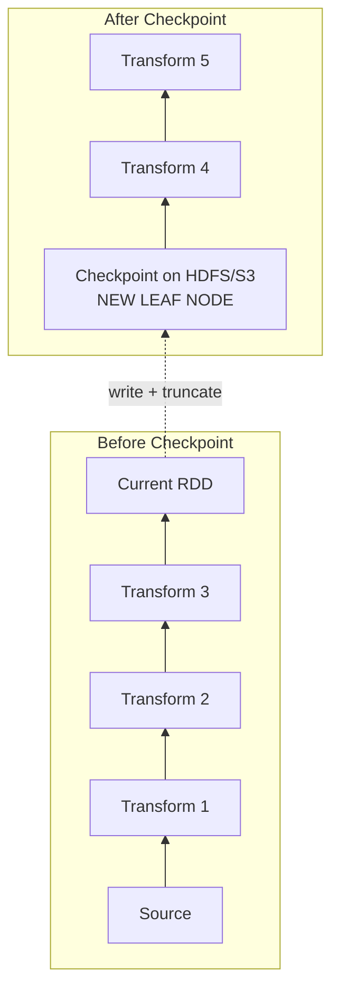
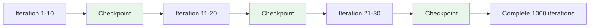

# Breaking the Family Tree: Strategic Truncation via Checkpointing

## 1. The Problem and the Solution

A lineage family tree that grows too long is the problem. **Checkpointing** is the solution — strategic truncation of the DAG that converts an unstable deep graph into a series of manageable segments.

If lineage is a recipe book growing one page per transformation, checkpointing is **photographing the finished dish** and throwing away the earlier recipe pages. You can always start again from the photograph.

---

## 2. What Checkpointing Does

When you checkpoint an RDD, three things happen:

1. **Physical save**: Spark writes the RDD's data partitions to reliable storage (HDFS or S3)
2. **Lineage truncation**: Spark removes all references to parent RDDs — the checkpointed RDD becomes a new **leaf node**
3. **Stability anchor**: The checkpointed RDD is a fresh starting point with no history

In the driver's eyes, the checkpointed RDD **no longer has a history**. The entire family tree behind it is pruned away.

---

## 3. Checkpointing vs Caching: The Critical Difference

| Property | Caching (`cache()` / `persist()`) | Checkpointing (`checkpoint()`) |
|----------|--------------------------------|------------------------------|
| Stores data copy | Yes (in memory / local disk) | Yes (on HDFS / S3) |
| Preserves lineage | **Yes** — parents still referenced | **No** — parents severed |
| On cache loss | Recompute from lineage (full chain) | Read from checkpoint file |
| Recovery depth | Full DAG replay | From checkpoint only |
| Purpose | Speed and reuse | Stability and lineage management |

Caching keeps a copy but preserves the recipe. Checkpointing keeps a copy and **destroys the recipe** — replacing it with a saved snapshot.

---

## 4. Recovery Transformation

Without checkpointing, losing a partition at stage 100 requires replaying 99 stages. With checkpointing at stage 20 and stage 40:

| Failure at | Without checkpoint | With checkpoint |
|-----------|-------------------|-----------------|
| Stage 25 | Replay 24 stages | Replay 5 stages (from checkpoint at 20) |
| Stage 50 | Replay 49 stages | Replay 10 stages (from checkpoint at 40) |
| Stage 100 | Replay 99 stages | Replay 10 stages (from checkpoint at 40) |

Recovery time resets from **linear growth** to a **bounded constant** determined by checkpoint frequency.

$\text{Recovery Time}_{\text{with checkpoint}} \leq \text{stages since last checkpoint}$

---

## 5. Mandatory for Iterative Algorithms

Checkpointing is not optional for iterative workloads — it is **mandatory**:

- **PageRank**: state updated hundreds of times; without checkpointing, lineage depth = iteration count → stack overflow
- **ALS**: matrix factorization with 50–200 iterations; each adds a lineage layer
- **Gradient descent**: convergence loops create unbounded lineage growth

Without checkpointing, these jobs **will eventually fail** — not might fail, **will fail**. Checkpointing is the only mechanism that keeps metadata small enough for the driver to manage.

---

## Common Pitfalls / Exam Traps

- **Trap**: "Checkpointing is the same as caching to disk." Caching preserves lineage; checkpointing **severs** it.
- **Trap**: "Checkpoint once at the start is enough." Checkpointing must be **periodic** in iterative loops — one checkpoint doesn't help iteration 200.
- **Trap**: "Checkpointing makes jobs faster." Checkpointing adds IO cost; it makes jobs **more stable**, not faster.
- **Trap**: Forgetting that checkpointing is **eager** (executes immediately) while caching is **lazy** (executes on action).
- **Trap**: "Any storage works for checkpoints." Must use **reliable distributed storage** (HDFS/S3), not local executor disk.

---

## Quick Revision Summary

- Checkpointing = write RDD to reliable storage + **sever all parent references**
- Checkpointed RDD becomes a new **leaf node** — no history, no cascading recovery
- Unlike caching, checkpointing **truncates lineage** — the defining difference
- Recovery time becomes **bounded** by stages since last checkpoint, not total DAG depth
- **Mandatory** for iterative algorithms (PageRank, ALS) — without it, jobs WILL fail
- Checkpointing is a **stability strategy**, not a performance optimization
- Think of it as "photographing the dish" and discarding earlier recipe pages
