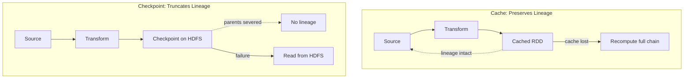

# Caching vs Checkpointing: Two Critical Resilience Mechanisms

## 1. Why Both Exist

Spark provides two mechanisms to avoid recomputing data — caching and checkpointing. Both store data copies, but they serve fundamentally different purposes and behave differently under failure. Choosing the wrong one can leave a pipeline unstable or wastefully slow.

---

## 2. Side-by-Side Comparison

| Dimension | Caching / Persistence | Checkpointing |
|-----------|----------------------|---------------|
| **Lineage** | Preserved | **Truncated (destroyed)** |
| **Storage** | Memory or local executor disk | HDFS or S3 (distributed) |
| **Execution** | Lazy (on first action) | **Eager** (immediate background job) |
| **Session scope** | Dies with Spark session | **Persists across sessions** |
| **On executor failure** | Lost — must recompute from lineage | Safe — read from distributed storage |
| **Driver memory** | Lineage still held | Lineage freed (GC eligible) |
| **Primary purpose** | Speed and reuse | Stability and lineage management |
| **Best for** | Short pipelines, reused intermediates | Long iterative pipelines |

---

## 3. Lineage Handling: The Defining Difference

### Caching preserves lineage

```python
data = sc.textFile("input.txt").map(parse).filter(valid)
data.cache()  # stores computed data in memory
```

- Spark keeps a copy of the computed data **and** the full lineage graph
- If the cached data is lost (executor failure), Spark uses the preserved lineage to **recompute from the original source**
- Recovery may cascade through the entire DAG — caching does not limit recovery depth

### Checkpointing destroys lineage

```python
sc.setCheckpointDir("/hdfs/checkpoints")
data = sc.textFile("input.txt").map(parse).filter(valid)
data.checkpoint()  # writes to HDFS, severs parents
```

- Spark writes data to reliable storage, then **removes all parent references**
- The checkpointed RDD becomes a leaf node — no history exists
- On failure, Spark reads from the checkpoint file — recovery depth = stages since checkpoint only



---

## 4. Storage and Lifecycle Differences

### Caching: fast but fragile

- Lives in **executor memory** or local disk — bound to specific nodes
- **Lazy**: data is materialized only when an action first accesses the cached RDD
- **Session-bound**: when the Spark session ends, all cached data is gone
- Fast to access (microseconds from RAM) but vulnerable to node failure

### Checkpointing: durable but IO-heavy

- Writes to **HDFS or S3** — distributed, replicated, durable
- **Eager**: triggers an immediate background job to write data
- **Session-independent**: checkpoint files survive session termination
- A new Spark session can resume by reading checkpoint files
- Higher latency for writes (network + disk IO) but survives any single-node failure

---

## 5. Decision Framework

| Scenario | Use Caching | Use Checkpointing |
|----------|------------|-------------------|
| Reusing an intermediate result multiple times in one job | Yes | No |
| Iterative algorithm (PageRank, ALS, k-means) | No | **Yes** |
| DAG depth < 20 stages | Yes | Optional |
| DAG depth > 50 stages | Risky | **Yes** |
| Need data to survive session restart | No | **Yes** |
| Interactive exploration / ad-hoc queries | Yes | No |
| Driver approaching memory limits | No | **Yes** |

**Rule of thumb**: Cache for speed in reuse. Checkpoint for stability in long iterative pipelines.

---

## Common Pitfalls / Exam Traps

- **Trap**: "Caching and checkpointing are interchangeable." They solve different problems — caching for speed, checkpointing for stability.
- **Trap**: "Caching protects against deep lineage." Caching preserves lineage; if cache is lost, full DAG replay still occurs.
- **Trap**: "Checkpointing is lazy like caching." Checkpointing is **eager** — it writes immediately when called.
- **Trap**: "Cached data survives executor failure." Cached data on a failed executor is **lost**; only checkpointed data on HDFS/S3 survives.
- **Trap**: Using `cache()` in a 200-iteration loop — lineage still grows 200 deep; only `checkpoint()` truncates it.

---

## Quick Revision Summary

- **Caching**: preserves lineage, stores in memory/local disk, lazy, session-scoped — for **speed and reuse**
- **Checkpointing**: truncates lineage, stores on HDFS/S3, eager, cross-session — for **stability**
- On cache loss: recompute from full lineage chain; on checkpoint loss: read from distributed storage
- Caching does **not** solve deep lineage problems — only checkpointing severs the chain
- Decision: cache for short pipelines with reuse; checkpoint for iterative/long pipelines
- Checkpointing frees driver memory by making parent RDDs eligible for garbage collection
