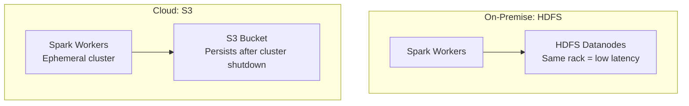

# Writing Checkpoints to Reliable Storage: HDFS and S3

## 1. Why Reliable Storage Matters

Checkpointing only works if the saved data survives failures. Writing to a single executor's local disk is insufficient — if that node dies, the checkpoint is lost and lineage was already truncated. Checkpoints must go to **reliable distributed storage** that outlives any single node or session.

The two dominant backends: **HDFS** (on-premise) and **S3** (cloud-native).

---

## 2. HDFS: On-Premise Strategy

### Strengths

| Property | Benefit |
|----------|---------|
| Data locality | Co-located with Spark workers — low network IO |
| Consistent access speed | Predictable throughput on dedicated hardware |
| High throughput | Optimized for large sequential writes |
| Integrated with Hadoop ecosystem | Native support in on-premise clusters |

### Best for

- On-premise Hadoop clusters where Spark workers and HDFS datanodes share the same rack
- Workloads where **write speed** for checkpoints is critical
- Environments with dedicated hardware and stable infrastructure

### Limitation

- Tied to the **lifecycle of the compute cluster** — if the Hadoop cluster is decommissioned, checkpoints are lost
- Not portable across different infrastructure setups

---

## 3. Amazon S3: Cloud-Native Strategy

### Strengths

| Property | Benefit |
|----------|---------|
| Global durability | 99.999999999% (11 nines) object durability |
| Decoupled from compute | Cluster can be shut down; checkpoints persist |
| Cost efficiency | Pay only for storage; spin down compute between jobs |
| Cloud-native integration | Native on EMR, Databricks, GCP Dataproc |

### Best for

- Cloud-native Spark deployments (EMR, Databricks)
- Ephemeral clusters that spin up/down for cost savings
- Cross-session recovery — start a new cluster and resume from checkpoints
- Long-term persistence of intermediate computation state

### Limitation

- Slightly **higher write latency** compared to local HDFS (network hop to object store)
- No data locality — every checkpoint read/write crosses the network

---

## 4. HDFS vs S3 Comparison

| Dimension | HDFS | S3 |
|-----------|------|-----|
| Deployment | On-premise | Cloud |
| Write latency | Lower (locality) | Higher (network) |
| Durability | Rack-level replication | 11-nines object durability |
| Cluster coupling | Tied to cluster lifecycle | Independent of compute |
| Cost model | Fixed hardware | Pay-per-GB storage |
| Cross-session recovery | Requires cluster to persist | Natural — data outlives cluster |
| Best for | Fast writes, stable clusters | Durability, ephemeral clusters |



---

## 5. Mandatory Setup: Configuring the Checkpoint Directory

Before calling `RDD.checkpoint()`, you **must** configure the checkpoint directory:

```python
# Required setup — must precede any checkpoint() call
sc.setCheckpointDir("hdfs:///checkpoints/my-app")
# or
sc.setCheckpointDir("s3://my-bucket/checkpoints/my-app")

# Now checkpointing will work
result = long_pipeline.compute()
result.checkpoint()
```

Without `setCheckpointDir()`, Spark has no destination for checkpoint files and the call **will fail**. This is a mandatory one-time configuration per SparkContext.

### What happens during checkpoint

1. Spark initiates a background job to materialize the RDD
2. Data partitions are written to the configured directory on HDFS/S3
3. Once write completes, parent references are severed
4. The checkpoint directory contains one folder per checkpointed RDD with partition files

---

## Common Pitfalls / Exam Traps

- **Trap**: "Checkpointing works without configuration." `setCheckpointDir()` is **mandatory** — without it, checkpoint fails.
- **Trap**: "Local disk is fine for checkpoints." Local executor disk is **not** reliable — node failure loses both data and truncated lineage.
- **Trap**: "HDFS is always faster than S3." HDFS is faster for writes due to locality, but S3 wins on durability and decoupled persistence.
- **Trap**: "S3 checkpoints are lost when the cluster shuts down." That is S3's primary advantage — checkpoints **survive** cluster termination.
- **Trap**: Forgetting that checkpoint directory should be **unique per application** to avoid overwriting checkpoints from different jobs.

---

## Quick Revision Summary

- Checkpoints must go to **reliable distributed storage** — not local executor disk
- **HDFS**: on-premise, data locality, fast writes, tied to cluster lifecycle
- **S3**: cloud-native, 11-nines durability, decoupled from compute, survives cluster shutdown
- `sc.setCheckpointDir(path)` is **mandatory** before any `checkpoint()` call
- HDFS for fast on-premise writes; S3 for cloud durability and ephemeral clusters
- Checkpoint directory should be unique per application/job
- The choice depends on infrastructure: on-premise → HDFS; cloud → S3
