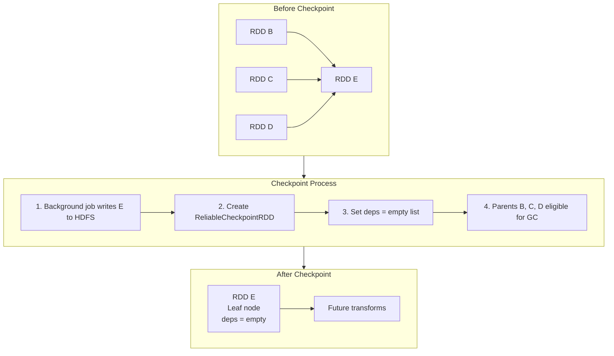

# Internal Mechanics: How Spark Truncates the DAG During Checkpointing

## 1. What Happens Under the Hood

Understanding the internal checkpointing process reveals why it is so much more effective than caching for managing driver memory and job stability. The process involves four precise steps executed by the Spark driver and executors.

---

## 2. The Four-Step Checkpoint Process

### Step 1: Mark for Checkpointing

When `RDD.checkpoint()` is called, Spark marks the RDD but does **not** immediately truncate lineage. The truncation only happens after data is safely persisted.

### Step 2: Background Materialization Job

Spark initiates an **eager background job**:

- Purpose: materialize the RDD and write all partitions to configured reliable storage (HDFS/S3)
- This is **not lazy** — unlike caching, checkpointing triggers immediate execution
- Spark ensures data is **physically safe on disk** before proceeding to truncation
- All partitions are written as files in the checkpoint directory

### Step 3: Create ReliableCheckpointRDD

Once the write completes, Spark performs the critical transformation:

- Creates a `ReliableCheckpointRDD` object to replace the original RDD
- Updates the internal `deps` field (dependency list) to an **empty list**
- The RDD no longer references any parent RDDs

### Step 4: Garbage Collection of Parents

- Parent RDDs (B, C, D) are no longer referenced by the checkpointed RDD (E)
- If no other RDD in the active DAG references them, they become **eligible for garbage collection**
- Driver memory previously occupied by thousands of metadata objects is **reclaimed**

---

## 3. The Dependency List (`deps` Field)

Every RDD internally maintains a `deps` field — a list of parent dependencies:

| State | `deps` contents | Meaning |
|-------|----------------|---------|
| Normal RDD | `[NarrowDependency(B), WideDependency(C)]` | Knows its parents |
| After checkpoint | `[]` (empty list) | No parents — leaf node |

This is not a cosmetic change. The empty `deps` list is what makes the checkpointed RDD a true leaf node. Spark's DAG scheduler, lineage traversal, and serialization all use this field. An empty list means:

- Serialization depth = 0 (no recursive parent chain)
- Lineage traversal stops immediately
- Recovery reads from checkpoint files, not parent recomputation

---

## 4. Memory Reclamation Impact

| Metric | Before Checkpoint (100 iterations) | After Checkpoint |
|--------|-----------------------------------|-----------------|
| RDD objects in driver | 100 linked objects | 1 leaf object + new transforms |
| Serialization depth | 100 (stack overflow risk) | 0 for checkpointed RDD |
| GC-eligible objects | 0 (all referenced) | 99 (parents dereferenced) |
| Driver memory for metadata | Growing linearly | Reset to baseline |

The family tree isn't just hidden — it is **physically removed** from driver memory. This is the mechanism that solves the driver bottleneck and stack overflow problems from Module 8's earlier lessons.

---

## 5. Checkpointing vs Caching: Internal Behavior

| Internal Action | `cache()` | `checkpoint()` |
|----------------|-----------|----------------|
| Materialize data | On first action (lazy) | Immediately (eager) |
| Write destination | Executor memory/disk | HDFS/S3 |
| Update `deps` field | No change | **Set to empty** |
| Parent GC eligibility | No — parents still referenced | **Yes** — parents dereferenced |
| Create new RDD type | Same RDD, marked cached | `ReliableCheckpointRDD` |

---

## Common Pitfalls / Exam Traps

- **Trap**: "Checkpointing hides the lineage." Lineage is not hidden — it is **physically removed** and parents are garbage collected.
- **Trap**: "Checkpoint happens instantly." The background write job must **complete** before truncation occurs — checkpointing is not atomic.
- **Trap**: "Caching also clears the deps field." Only checkpointing sets `deps = []`; caching leaves the full parent chain intact.
- **Trap**: "Parent RDDs are deleted immediately." They become **eligible** for GC — actual collection depends on JVM GC timing.
- **Trap**: Confusing `ReliableCheckpointRDD` (post-checkpoint type) with the original RDD type.

---

## Quick Revision Summary

- Checkpointing: write data to HDFS/S3 → create `ReliableCheckpointRDD` → set `deps = []` → parents eligible for GC
- The `deps` field going empty is what makes the RDD a true **leaf node**
- Background job is **eager** — data must be safely on disk before truncation
- Parent RDD metadata is **physically removed** from driver memory, not just hidden
- This solves driver bottleneck (metadata growth) and stack overflow (serialization depth)
- Caching does none of this — it preserves the full parent chain and deps field
- GC reclaims thousands of metadata objects, resetting driver memory to baseline
