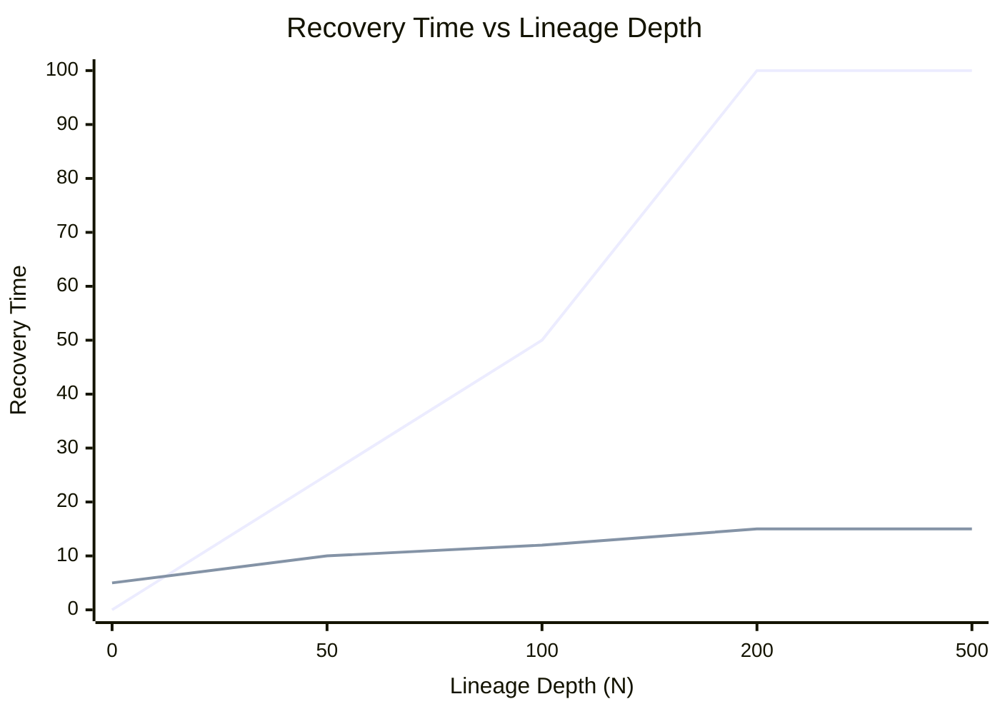

# Recomputation Cost vs Storage IO Latency: The Checkpointing Trade-off

## 1. No Free Lunch in Engineering

Checkpointing is a lifesaver for long-running Spark jobs — but every truncation and disk write carries a price. Understanding the trade-off between **recomputation cost** (no checkpoint) and **storage IO latency** (with checkpoint) is essential for deciding when and how often to checkpoint.

---

## 2. The Recovery Cost Curves

Two curves describe failure recovery behavior:

### Red curve: Raw lineage (no checkpointing)

- Recovery time grows **linearly** with lineage depth $N$
- At $N = 100$: must replay 100 stages of logic
- At $N = 500$: recovery may take longer than the job's total runtime
- Formula: $\text{Recovery Time} = \sum_{i=1}^{N} T_i$

### Blue curve: With periodic checkpointing

- Starts **slightly higher** than red (fixed IO cost per checkpoint)
- As lineage depth increases, recovery time **levels off**
- At $N = 500$ with checkpoints every 20 stages: recovery requires at most 20 stages of replay
- Formula: $\text{Recovery Time} \leq \sum_{i=1}^{K} T_i$ where $K$ = stages since last checkpoint

---

## 3. The Two Costs

### Write cost (paying for checkpointing)

Every checkpoint incurs:

- **Disk IO**: writing all partitions to HDFS/S3
- **Network bandwidth**: data movement from executors to storage
- **Compute time**: materializing the RDD before writing
- **Driver coordination**: scheduling the background checkpoint job

This is a **fixed upfront cost** paid during normal execution, whether or not a failure occurs.

### Risk cost (paying for NOT checkpointing)

If a failure occurs without checkpointing:

- **Recomputation time**: replaying all stages from source or last checkpoint
- **Cascading recovery**: wide dependencies amplify the replay scope
- **Pipeline stall**: the entire job waits for recovery to complete
- **Potential crash**: stack overflow if lineage is too deep

This is a **probabilistic cost** — zero if no failure occurs, catastrophic if one does.

---

## 4. Finding the Tipping Point

The optimal checkpoint frequency balances write cost against risk cost:

| Factor | Favor more frequent checkpointing | Favor less frequent checkpointing |
|--------|----------------------------------|--------------------------------|
| Iteration count | High (100+) | Low (< 20) |
| Failure probability | High (unstable cluster) | Low (stable cluster) |
| Stage compute cost | Expensive stages | Cheap stages |
| IO bandwidth | Abundant | Constrained |
| Driver memory pressure | High (deep lineage) | Low (shallow lineage) |

### Rule of thumb for iterative algorithms

**Checkpoint every 10–20 iterations.**

- Frequent enough to keep recovery time predictable and driver memory safe
- Not so frequent that IO overhead slows the job to a crawl
- At 10–20 iteration intervals, recovery replays at most 10–20 stages

---

## 5. The Insurance Analogy

Checkpointing is **insurance against failure**:

- **Premium** = IO cost of writing checkpoints during normal execution
- **Coverage** = bounded recovery time if failure occurs
- **Deductible** = stages since last checkpoint that must be replayed

The more expensive the recomputation (deeper lineage, costlier stages), the more you should be willing to pay the IO premium.

| Job Type | Recommended Checkpoint Interval | Rationale |
|----------|-------------------------------|-----------|
| PageRank (100+ iter) | Every 10 iterations | Deep lineage, expensive graph ops |
| ALS (50–200 iter) | Every 10–20 iterations | Matrix ops are costly to replay |
| ETL pipeline (no loop) | After major shuffles only | Shallow lineage, shuffle is the bottleneck |
| Interactive query | No checkpointing needed | Shallow DAG, cache instead |

---

## Common Pitfalls / Exam Traps

- **Trap**: "Checkpointing is free." Every checkpoint costs IO time during normal execution — it's insurance, not a gift.
- **Trap**: "More checkpoints are always better." Too-frequent checkpointing can slow the job more than the recovery it prevents.
- **Trap**: "Recovery time is exponential without checkpointing." It is **linear**, not exponential — but linear at $N = 500$ is still catastrophic.
- **Trap**: "Checkpoint once at the beginning." A single early checkpoint doesn't help failures at iteration 200.
- **Trap**: Confusing write cost (predictable, upfront) with risk cost (unpredictable, potentially huge).

---

## Quick Revision Summary

- Without checkpointing: recovery time grows **linearly** with lineage depth
- With checkpointing: recovery time is **bounded** by stages since last checkpoint
- Checkpointing adds a fixed **IO write cost** during normal execution (the "premium")
- Not checkpointing risks catastrophic **recomputation cost** on failure (the "risk")
- Rule of thumb: checkpoint every **10–20 iterations** for iterative algorithms
- Balance write cost (IO overhead) against risk cost (recovery time on failure)
- In large-scale systems, **stability is often more valuable than raw speed**
