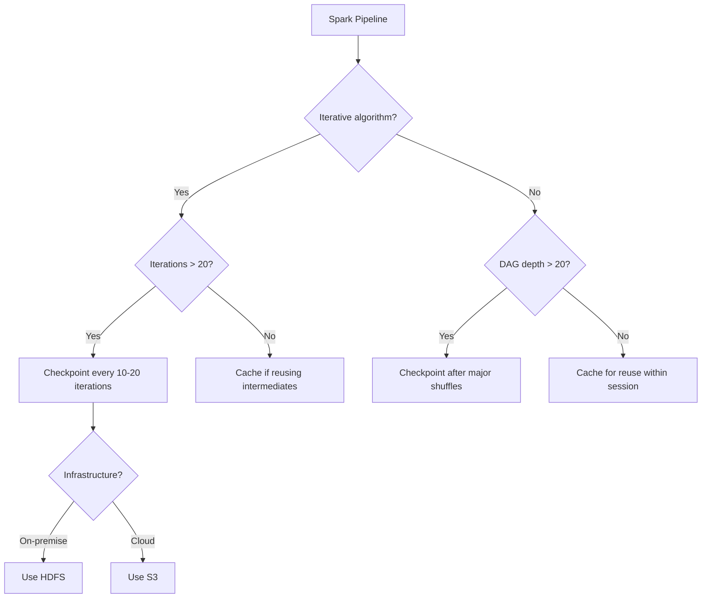

# Advanced Resilience Strategies: Module Summary

## 1. From Basic to Advanced Fault Tolerance

This module moved beyond Spark's default lineage-based fault tolerance to explore the advanced resilience strategies required for complex, real-world big data processing — particularly iterative algorithms and long-running pipelines.

---

## 2. Key Findings

### When lineage becomes a liability

| Depth | Behavior | Risk |
|-------|----------|------|
| < 20 stages | Near-instant recovery, minimal metadata | Low |
| 20–100 stages | Noticeable recovery latency, driver pressure | Medium |
| 100+ stages | Stack overflow, minutes-long recovery | **Critical** |

Lineage is the backbone of Spark resilience, but depth creates driver bottlenecks, stack overflow errors, and the reliability paradox.

### Strategic truncation via checkpointing

- Physically cuts the lineage graph by writing RDD data to HDFS/S3
- Severed RDD becomes a new leaf node — parents eligible for garbage collection
- Recovery time resets from linear growth to a bounded constant
- **Mandatory** for iterative algorithms (PageRank, ALS, gradient descent)

### Internal mechanics

- Background eager job materializes and writes data
- `ReliableCheckpointRDD` replaces original RDD with `deps = []`
- Parent metadata physically removed from driver memory
- Garbage collector reclaims thousands of lineage objects

### Caching vs checkpointing

| | Caching | Checkpointing |
|---|---------|---------------|
| Purpose | Speed and reuse | Stability and lineage management |
| Lineage | Preserved | Truncated |
| Scope | Within session | Across sessions |
| Solves deep lineage? | No | **Yes** |

### The trade-off curve

- Raw lineage: recovery time $\propto N$ (linear growth)
- With checkpoints: recovery time bounded by checkpoint interval
- Optimal frequency: every 10–20 iterations for iterative workloads
- Checkpointing is insurance — pay IO premium to cap recovery cost

---

## 3. Decision Framework

---

## 4. The Central Takeaway

**Checkpointing is not just for recovery — it is a stability strategy for large-scale iterative processing.**

| Without checkpointing | With checkpointing |
|----------------------|-------------------|
| Job crashes at iteration 99 | Job completes iteration 1000 |
| Stack overflow at depth 100+ | Driver memory stays bounded |
| Recovery takes hours | Recovery takes minutes |
| Driver overwhelmed by metadata | Parents garbage collected |

Whether building ML pipelines, graph traversals, or complex ETL, checkpointing is the tool that ensures a job doesn't just run — it **finishes reliably**.

---

## Common Pitfalls / Exam Traps

- **Trap**: "Module 7's lineage is sufficient for all workloads." Lineage works for shallow DAGs; deep/iterative workloads require checkpointing (Module 8).
- **Trap**: "Checkpointing makes Spark faster." It makes Spark **more stable** — it adds IO cost during normal execution.
- **Trap**: "Cache and checkpoint are interchangeable resilience tools." They serve different purposes and behave differently on failure.
- **Trap**: Claiming recovery without checkpointing is exponential — it is **linear**, which is bad enough at $N = 500$.
- **Trap**: "Checkpointing is optional for PageRank." It is **mandatory** — the job will fail without it.

---

## Quick Revision Summary

- Deep lineage (100+ stages) causes stack overflow, driver bottleneck, and expensive recovery
- **Checkpointing** truncates the DAG: write to HDFS/S3, sever parents, create leaf node
- Internal mechanics: eager write → `ReliableCheckpointRDD` → `deps = []` → GC parents
- **Caching** = speed/reuse (preserves lineage); **Checkpointing** = stability (truncates lineage)
- Recovery curve: raw lineage grows linearly; checkpointed recovery is bounded
- Checkpoint every **10–20 iterations** for iterative algorithms
- Checkpointing is a **stability strategy**, not just a recovery mechanism
- The difference between a job that crashes at iteration 99 and one that completes iteration 1000
