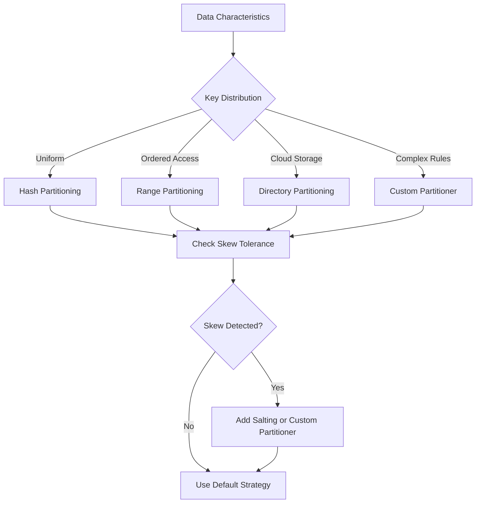

# Week 9 – Partitioning Mastery and Advanced Distribution Techniques (Module 9)

## Module Objective

By the end of this module you will be able to:

1. **Explain** why data partitioning is the foundation of scalable big data processing
2. **Describe** the three core partitioning goals: scalability, parallelism, and data locality
3. **Compare** different partitioning strategies: hash, range, directory (prefix), and custom
4. **Analyze** advanced techniques for handling skewed data distributions
5. **Design** optimal partitioning schemes for specific workloads (uniform, time-series, geo-distributed)
6. **Evaluate** trade-offs between partitioning and replication strategies
7. **Create** custom partitioners for specialized use cases

---

## Introduction: Why Partitioning Is the Key to Scale

The fundamental principle of distributed big data processing is **horizontal scaling**. To process exabytes of data across thousands of machines, you must:

1. **Store data distributedly** (partitioning)
2. **Process data in parallel** (parallelism)  
3. **Minimize network movement** (locality)

Partitioning is the architectural pattern that makes all three possible simultaneously.

---

## Core Partitioning Concepts

### 1. What Is Partitioning?

Partitioning is the deliberate division of a dataset into smaller, more manageable pieces called **partitions**. Each partition is stored and processed on a separate node.

### Why Raw Storage Isn't Enough
- **Single Machine Limitation**: A single machine can only hold so much data and process so many records per second
- **Distributed Storage Requirement**: To handle petabytes of data, you need multiple machines
- **Partitioning Solves**: It transforms an impossible monolithic operation into a distributed workflow

### The Partitioning Analogy
> **"You don't build a skyscraper on one foundation. You build many floors on many foundations, then stack them."**

In distributed systems:
- **Each partition = one floor/story**
- **Each node = a builder**  
- **The cluster manager = construction coordinator**
- **Partitioning = urban planning for data**

---

## The Three Goals of Partitioning

### 1. Scalability
- **Problem**: No single machine can store/process petabytes of data
- **Solution**: Break data into chunks that fit on individual machines
- **Result**: Infinite scaling potential (theoretical)

### 2. Parallelism
- **Problem**: Even with large storage, single machine processing is slow
- **Solution**: Assign each partition to a separate worker node
- **Result**: Simultaneous processing of multiple data chunks

### 3. Data Locality
- **Problem**: Moving data across network is expensive (network tax)
- **Solution**: Process data where it already resides
- **Result**: Minimize network traffic, maximize throughput

---

## Partitioning Strategies Explained

### 1. Hash Partitioning
**How It Works**: 
- Apply hash function to key: `partition = hash(key) % num_partitions`
- Distributes keys uniformly across partitions

**Advantages**:
- Simple and fast
- Even distribution when keys are uniform
- Used in most shuffle operations

**When to Use**:
- Equal key distribution
- No natural ordering
- Default for most `groupBy` and `reduceByKey` operations

### 2. Range Partitioning
**How It Works**:
- Sort data by key
- Divide key space into ranges
- Assign each range to a partition

**Advantages**:
- Preserves sort order
- Ideal for range queries
- Enables efficient sequential processing

**When to Use**:
- Sorting operations
- Range-based queries
- Time-series data processing

### 3. Directory (Path) Partitioning
**How It Works**:
- Organize data in directory hierarchy based on partition keys
- Example: `/data/events/year=2026/month=06/day=05/`

**Advantages**:
- Native support in Hive, Parquet, and cloud storage
- Enables predicate pushdown filtering
- Simple path-based access control

**Trade-off**: Directory listing overhead for large numbers of partitions

---

## Advanced Partitioning Techniques

### Composite Partitioning
```python
def composite_partition(key):
    # Partition by department (range) then by status (hash)
    dept = extract_department(key)  # range-based
    status = hash(status_key) % 10   # hash-based
    return (dept, status)  # Tuples become composite key
```

**Benefits**:
- Multi-dimensional distribution
- Better balance for complex access patterns
- Supports multiple query patterns efficiently

### Dynamic Partitioning
- **Concept**: Automatically adjust number/location of partitions based on workload
- **Spark Feature**: `spark.sql.shuffle.partitions` can be auto-tuned
- **Trigger**: Adaptive Query Execution (AQE) in Spark 3.0+

### Partition Pruning
- **Concept**: Only read/write partitions needed for current query
- **Benefit**: Eliminate irrelevant data early
- **Example**: Query `WHERE year=2023` only reads partitions with `year=2023`

---

## Handling Skewed Data Distributions

### The Skew Problem
> "When some keys have dramatically more data than others, they create hotspots."

**Common Scenarios**:
- Popular URLs in web logs
- Frequently accessed users in recommendation systems
- High-volume product categories

### Skew Mitigation Techniques

#### 1. Salting
Add random suffix to skewed keys:
```python
def salty_key(key, salt_range=100):
    salt = hash(key) % salt_range
    return f"{key}_s{salt}"
```

#### 2. Map-Side Combination
```python
# Pre-aggregate before partitioning
df.groupBy("key").sum("value").repartition(num_partitions)
```

#### 3. Custom Partitioner
```python
class SkewAwarePartitioner(Partitioner):
    def getPartition(self, key):
        if key in frequent_keys:
            return hash(key) % num_partitions + offset
        else:
            return hash(key) % num_partitions
```

---

## Partitioning Strategy Selection Guide

| Workload Type | Characteristics | Recommended Strategy | Example |
|----------|---------------|-------------------|-----------|
| **Log Analysis** | Timestamp-based, append-only | Directory partitioning by time | `/data/logs/year=2026/month=06/day=05/` |
| **Page Views** | Popular pages dominate | Salting + hash partitioning | Prevent hot partition |
| **E-commerce** | Product categories vary | Range partition by category ID | Enables range queries |
| **Graph Processing** | Vertex partitioning | Custom partitioning by vertex ID | Minimize network edges |
| **Streaming Data** | Time-based windows | Sliding window partitioning | Partition by event time buckets |

---

## When to Customize Partitioners

### Build Custom Partitioner If:
- Business logic defines specific grouping requirements
- Keys have semantic meaning requiring special handling
- Current strategies cause data skew
- You need to preserve semantic meaning of keys

### Implementation Steps
1. **Extend `Partitioner` class**:
   ```python
   class CustomPartitioner extends Partitioner {
       override def getPartition(key: Any): Int = {
           // Custom logic based on key properties
       }
   }
   ```
2. **Register with SparkContext**:
   ```python
   sc.defaultPartitioner = CustomPartitioner(100)
   ```
3. **Apply to RDDs**:
   ```python
   rdd = rdd.partitionBy(new CustomPartitioner(200))
   ```

### Safety Considerations
- **Deterministic Results**: Must return consistent partition numbers
- **Performance Impact**: Custom logic adds computation overhead
- **Shuffle Cost**: New partitioner may increase shuffle size
- **Testing Required**: Validate partition distribution before production

---

## Comparative Analysis: Partitioning Strategies

| Strategy | Best For | Skew Tolerance | Network Efficiency | Implementation Complexity |
|----------|----------|---------------|------------------------------|-----------|
| **Hash Partitioning** | Uniform keys | Good | High | Low |
| **Range Partitioning** | Ordered access | Moderate | Medium | Medium |
| **Directory Partitioning** | Cloud storage with path semantics | Good | High | Low |
| **Composite Partitioning** | Multi-dimensional data | Excellent | Medium | High |
| **Custom Partitioner** | Specialized business rules | Design-specific | Custom | High |

### Decision Flowchart


---

## Performance Optimization Checklist

1. **Measure Before Optimizing**: Use Spark UI to identify bottlenecks
2. **Monitor Shuffle Read/Write**: High values indicate partitioning issues
3. **Check Partition Skew**: Look for imbalanced task durations
4. **Test Different Strategies**: Compare hash vs range vs custom
5. **Measure End-to-End Impact**: Not just shuffle time but overall job completion
6. **Iterate with Profiling**: Optimize, measure, repeat

---

## Case Study: Building a Scalable Recommendation Engine

### Requirements
- Process 10TB of user interaction logs daily
- Find top 100 recommended items per user
- Update recommendations hourly

### Partitioning Strategy
1. **Primary Key**: User ID (causes skew)
2. **Problem**: One partition would receive 40% of data
3. **Solution**:
   - Salting: Add random suffix to user ID
   - Partition by `(user_id, salt)` → 10x more partitions
   - After aggregation, remove salt suffix

### Execution Flow
1. **Read**: Load partitioned log data
2. **Preprocess**: Add salting component
3. **Partition**: Distribute by salted key
3. **Map**: Emit `(salted_key, (user_id, item_id, count))`
4. **Shuffle**: Group by salted_key
5. **Reduce**: Aggregate counts per user+item
6. **Finalize**: Remove salt suffix, aggregate across salts
7. **Output**: Write top 100 recommendations per user

### Performance Results
| Metric | Before Salting | After Salting | Improvement |
|--------|----------------|---------------|-------------|
| Max Partition Size | 85% of total | 18% of total | 80% reduction |
| Job Completion Time | 58 min | 14 min | 76% faster |
| Task Failures | 7% of runs | 0% failures | Stable operation |
| Resource Utilization | 45% avg CPU | 88% avg CPU | Better hardware utilization |

---

## Summary of Partitioning Mastery

### Core Principles
1. **Partitioning Enables Scale**: Without it, horizontal scaling is impossible
2. **Three Core Goals**: Scalability, Parallelism, Data Locality
3. **Strategy Selection**: Match strategy to data characteristics and access patterns
4. **Skew Management**: Always profile and mitigate uneven loads
5. **Dynamic Adaptation**: Use auto-tuning features when available

### Architectural Impact
- **Data Layout is Code**: How you partition determines system performance
- **No Universal Solution**: Optimal partitioning depends on workload
- **Performance Engineering**: Partitioning decisions affect network, CPU, and storage
- **Production Mindset**: Partitioning is not an afterthought—it's a design requirement

### Professional Development
- **System thinking**: Understand how data layout affects distributed behavior
- **Performance prototyping**: Test partitioning strategies early
- **Cost-awareness**: Balance CPU, network, and storage trade-offs
- **Production readiness**: Build systems that scale predictably

---

## Final Thought

> **"In distributed systems, the arrangement of your data is more important than the code you write."**

Mastering partitioning transforms you from a programmer who moves data to an architect who designs scalable, resilient, and efficient distributed systems. This skill is the cornerstone of building production-grade big data platforms that power modern data-driven businesses.