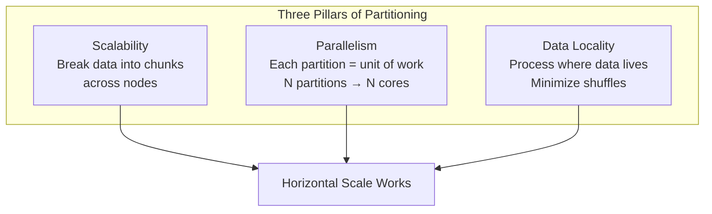

# Why Partitioning Is the Secret to Horizontal Scale

## 1. Adding Machines Is Not Enough

The naive scaling intuition: "My database is slow, so I'll buy more servers." In distributed systems like Spark and Hadoop, simply adding machines does **not** automatically make jobs faster. Without a strategy for how data is physically arranged across nodes, you get a cluster where one node does 90% of the work while the rest sit idle.

**Partitioning** is the architectural mechanism that makes horizontal scaling actually work. It answers the question: *where does each piece of data live, and how is work divided across the cluster?*

---

## 2. The Single-Machine Limit

Even the most powerful server has finite disk space and memory. A 100 TB dataset cannot fit on one machine. Partitioning breaks massive datasets into smaller, manageable **chunks** distributed across multiple nodes:

- A 100 TB file → 1,000 partitions of ~100 GB each → spread across 100 nodes
- No single machine's capacity is the bottleneck
- Storage and processing capacity grow linearly with cluster size

---

## 3. Three Pillars of Partitioning

### Pillar 1: Scalability

- Overcome the single-machine storage and compute limit
- Distribute data chunks across the cluster
- Process datasets larger than any one computer could hold
- Scale out by adding nodes, each holding unique data partitions

### Pillar 2: Parallelism

- Each partition is a **unit of work** in Spark
- 100 partitions + 100 CPU cores = theoretical 100× throughput vs single core
- Multiple CPUs process different partitions simultaneously
- Partitioning is the bridge between a static dataset and parallel execution

### Pillar 3: Data Locality

- The network is the biggest bottleneck in distributed systems
- Moving data between servers (shuffle) is expensive in time and resources
- Effective partitioning keeps processing logic close to the physical data
- Minimizing network shuffles maximizes cluster throughput



| Pillar | Problem it solves | Without it |
|--------|------------------|------------|
| Scalability | Dataset exceeds single machine | Cannot store or process |
| Parallelism | Single-threaded bottleneck | One core does all work |
| Data locality | Network shuffle overhead | Data constantly crossing network |

---

## 4. Partitioning Strategies Preview

This module covers the major strategies, each balancing the three pillars differently:

| Strategy | How it works | Best for |
|----------|-------------|----------|
| Hash partitioning | $P = \text{hash}(\text{key}) \mod N$ | Uniform distribution, point lookups, joins |
| Range partitioning | Continuous ranges on sortable key | Range queries, chronological data |
| Custom partitioning | Domain-specific logic | Skewed data, geographic, hierarchical IDs |

Every strategy is designed to balance scalability, parallelism, and data locality — but each excels in different scenarios and fails in others.

---

## 5. The Idle Cluster Anti-Pattern

Without partitioning strategy:

```
Node 1: ████████████████████ 90% of data, 90% of work
Node 2: ██ 5%
Node 3: ██ 5%
Node 4: (idle)
Node 5: (idle)
```

With proper partitioning:

```
Node 1: ████████ 20%
Node 2: ████████ 20%
Node 3: ████████ 20%
Node 4: ████████ 20%
Node 5: ████████ 20%
```

The difference between a cluster that wastes 80% of its hardware and one that delivers linear scale-out.

---

## Common Pitfalls / Exam Traps

- **Trap**: "More nodes = faster jobs." Without partitioning, adding nodes does nothing — data may still sit on one machine.
- **Trap**: "Partitioning and replication are the same thing." Partitioning splits data for speed; replication copies data for safety (covered next).
- **Trap**: "Any partition count works." Too few partitions underutilize the cluster; too many create scheduling overhead.
- **Trap**: "Data locality happens automatically." It requires deliberate partitioning strategy aligned with access patterns.
- **Trap**: Confusing partitions (logical data chunks) with executors (compute resources) — they are related but not identical.

---

## Quick Revision Summary

- Adding machines without partitioning strategy leaves most nodes idle
- Partitioning breaks datasets into chunks distributed across the cluster
- Three pillars: **scalability** (exceed single-machine limits), **parallelism** (N partitions → N cores), **data locality** (minimize shuffles)
- Each partition is a unit of work in Spark — partition count sets the parallelism ceiling
- Strategies: hash (scatter), range (organize), custom (domain-specific)
- Poor partitioning creates hotspots where one node does 90% of the work
- Partitioning is the architectural prerequisite for horizontal scale-out
