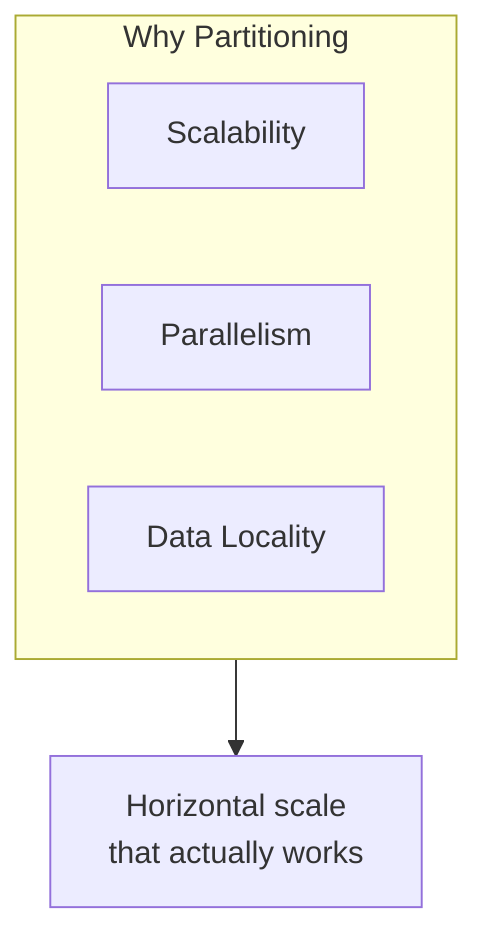
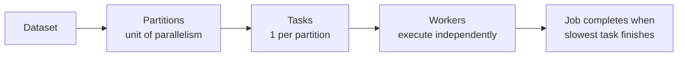

# Data Partitioning Strategies: Module Summary

## 1. The Backbone of Distributed Systems

Data partitioning is the architectural foundation that makes horizontal scaling work in big data platforms. Simply adding machines does not improve performance — a deliberate strategy for dividing data and work across the cluster is required. This module covered the **why**, the **how**, and the **manual control** of data distribution.

---

## 2. Pillar 1: Why Partitioning Matters

### The scaling truth

Adding machines without a partitioning strategy wastes hardware. One node doing 90% of the work while others idle is a common failure mode.

### Three pillars of partitioning

| Pillar | What It Enables |
|--------|----------------|
| **Scalability** | Datasets larger than any single machine |
| **Parallelism** | Each partition = one task = one unit of concurrent work |
| **Data Locality** | Processing near data minimizes expensive network shuffles |

### Partitioning vs replication

| | Partitioning | Replication |
|---|-------------|-------------|
| Purpose | Performance and scale | Safety and fault tolerance |
| Data per node | Unique subset | Identical copy |
| Analogy | Engine | Insurance policy |

Without proper partitioning, clusters suffer from **stragglers** and **hot spots** that waste hardware potential.

---

## 3. Pillar 2: How — Hash vs Range

### Hash partitioning: the shuffler

- Formula: $P = \text{hash}(\text{key}) \mod N$
- Scatters data pseudorandomly for uniform distribution
- **Strengths**: point lookups, co-located joins, high-cardinality keys
- **Weakness**: range scans (`BETWEEN`, `>`, `<`) force full cluster scan

### Range partitioning: the organizer

- Divides data into continuous, non-overlapping ranges on a sortable key
- Data within partitions is sorted — like a library archive
- **Strengths**: chronological queries, alphabetical scans, partition pruning
- **Weakness**: range skew and boundary skew create hot spots

### Strategy comparison

| Dimension | Hash | Range |
|-----------|------|-------|
| Data layout | Scattered | Ordered |
| Point lookup | Direct (one node) | Boundary lookup |
| Range query | Full cluster scan | Targeted node(s) |
| Hot spot type | Key skew | Range/boundary skew |
| Best for | IDs, joins, balance | Time series, sorted scans |

---

## 4. Pillar 3: Manual Control — Custom Partitioners

When defaults fail (~20% of cases):

| Trigger | Custom Approach |
|---------|----------------|
| Geographical data | Geo-hash / map tile grouping |
| Hierarchical business IDs | Prefix-based routing |
| Unpredictable skew | Explicit domain logic |
| Spatial locality needed | Tile-based co-location |

PySpark implementation: `rdd.partitionBy(N, custom_func)` with fail-safe defaults for unknown keys. Verification via `glom()`.

---

## 5. The Partition-to-Task Pipeline

Key principles:
- One partition = one task
- Job speed = slowest task (straggler problem)
- Balanced partitions > many partitions
- Strategy must match query patterns

---

## 6. Skew and Hot Spots: Universal Threat

| Skew Type | Source | Impact |
|-----------|--------|--------|
| Key skew | Duplicate/null keys in hash | One partition overloaded |
| Range skew | Uneven density in fixed ranges | Straggler at query time |
| Boundary skew | All writes to latest date range | Write bottleneck |

Mitigation escalates: analyze distribution → adjust boundaries → salt keys → custom partitioner.

---

## 7. Iterative Process

Data partitioning is **not set-and-forget**. As data grows, distribution shifts, and query patterns evolve, the partitioning strategy must adapt:

1. Start with defaults (hash for general workloads, range for time-series)
2. Monitor partition sizes and task durations for stragglers
3. Adjust partition count, boundaries, or strategy as needed
4. Escalate to custom partitioners when domain structure demands it

---

## Common Pitfalls / Exam Traps

- **Trap**: "Replication and partitioning are interchangeable." Replication = safety; partitioning = speed — complementary, not substitutable.
- **Trap**: "Hash is always the default choice." Range queries, time-series, and skewed keys require different strategies.
- **Trap**: "Range partitioning eliminates hot spots." It introduces **different** hot spots (range skew, boundary skew).
- **Trap**: "More partitions = faster jobs." Unbalanced partitions create stragglers regardless of count.
- **Trap**: "Co-located join works with any hash partitioning." Requires same key, same hash function, **and** same partition count on both datasets.

---

## Quick Revision Summary

- Partitioning enables scalability, parallelism, and data locality — replication does not
- One partition = one task; job finishes when the slowest task (straggler) completes
- **Hash**: $P = \text{hash}(\text{key}) \mod N$ — scatter for balance, point lookups, co-located joins
- **Range**: continuous sorted ranges — fast range queries, vulnerable to skew
- Hash fails on range scans; range fails on write-heavy append workloads (boundary skew)
- **Custom partitioners**: domain-specific routing when defaults cannot handle data shape
- PySpark: `partitionBy(N, func)` + fail-safe defaults + `glom()` for verification
- Partitioning strategy is iterative — evolves as data and queries change
