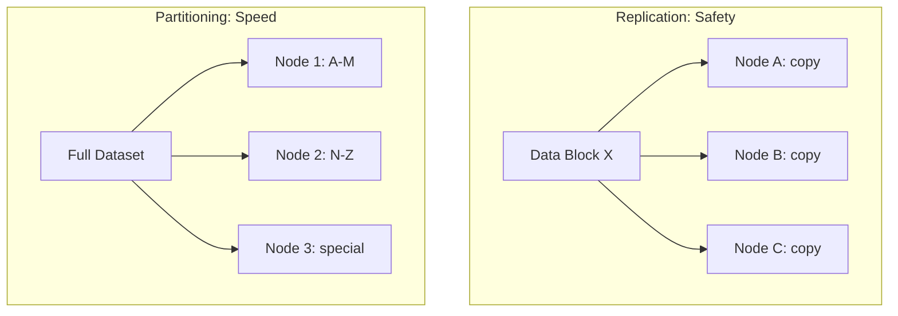

# Partitioning vs Replication: Complementary but Distinct

## 1. Two Terms, Two Purposes

In distributed big data systems, **partitioning** and **replication** are constantly mentioned together — but they serve completely different purposes. Confusing them leads to architectural mistakes. A healthy distributed system requires **both**, but for different reasons.

---

## 2. Replication: The Insurance Policy

### Primary goal: availability and fault tolerance

Replication creates **identical copies** of the same data on different nodes.

| Property | Detail |
|----------|--------|
| What it does | Copies the same data block to Node A, B, and C |
| Why | Hardware failure is a statistical certainty at scale |
| On failure | System switches to a replica — user notices nothing |
| Analogy | Keeping three photocopies of every important document |
| Cost | Storage multiplied by replica count (typically 3×) |

If Node A crashes and was the only machine holding a specific data block, that data is gone. With replicas on Node B and Node C, the system simply redirects reads to a surviving copy.

**Replication is about safety.**

---

## 3. Partitioning: The Engine

### Primary goal: performance and scalability

Partitioning **splits** a dataset into different subsets across nodes — not copies, but **unique pieces**.

| Property | Detail |
|----------|--------|
| What it does | Customer A–M on Node 1, N–Z on Node 2 |
| Why | Enable parallel processing across the cluster |
| On scale-out | Add nodes to hold more unique data partitions |
| Analogy | Dividing a library catalog across multiple buildings by letter range |
| Cost | Requires careful strategy to avoid skew |

Each node holds a **different** portion of the data. Together, all partitions form the complete dataset. No node has the full dataset — they each have their slice.

**Partitioning is about speed and capacity.**

---

## 4. Side-by-Side Comparison

| Dimension | Replication | Partitioning |
|-----------|-------------|--------------|
| Goal | Fault tolerance, durability | Performance, scalability |
| Data on each node | **Identical copy** | **Unique subset** |
| Adds capacity? | No (same data, more copies) | **Yes** (more unique data per node) |
| Adds parallelism? | No | **Yes** (each partition = parallel task) |
| Protects against failure? | **Yes** (switch to replica) | No (partition loss needs recovery) |
| Storage overhead | 3× or more | 1× (no duplication) |
| Analogy | Insurance policy | Engine |



---

## 5. How They Work Together in Production

In real-world Spark/Hadoop environments, both strategies operate in tandem:

1. **Partition** the dataset into N unique chunks for parallel processing
2. **Replicate** each partition 3× across different nodes for fault tolerance

```
Dataset (1 TB) → 100 partitions (10 GB each) → each partition replicated 3×
Total storage: 100 × 10 GB × 3 = 3 TB
Parallelism: 100 partitions → up to 100 parallel tasks
Fault tolerance: any single node failure → replica available
```

This gives you the **performance of partitioning** with the **safety of replication**.

| Layer | Strategy | Benefit |
|-------|----------|---------|
| Logical | Partitioning (100 chunks) | Parallel processing, scale-out |
| Physical | Replication (3× per chunk) | Fault tolerance, durability |

---

## Common Pitfalls / Exam Traps

- **Trap**: "Replication makes the system faster." Replication adds safety, not speed — it multiplies storage without adding parallelism.
- **Trap**: "Partitioning protects against data loss." Partitioning splits data; if the only node holding a partition fails, that data is lost unless **replicated**.
- **Trap**: "You choose one or the other." Production systems use **both** — partition for speed, replicate for safety.
- **Trap**: "More replicas = more parallelism." Replicas are identical copies processed by one task; only unique partitions enable parallelism.
- **Trap**: Confusing HDFS block replication (physical safety) with Spark RDD partitioning (logical parallelism).

---

## Quick Revision Summary

- **Replication** = identical copies for fault tolerance (insurance policy)
- **Partitioning** = unique subsets for parallel processing (engine)
- Replication protects against failure; partitioning enables speed and scale
- Production systems use both: partition for parallelism, replicate for safety
- A single partition is often replicated 3× — performance + durability
- Replication multiplies storage (3×); partitioning divides work (N-way parallelism)
- Confusing the two leads to architectural mistakes in distributed system design
